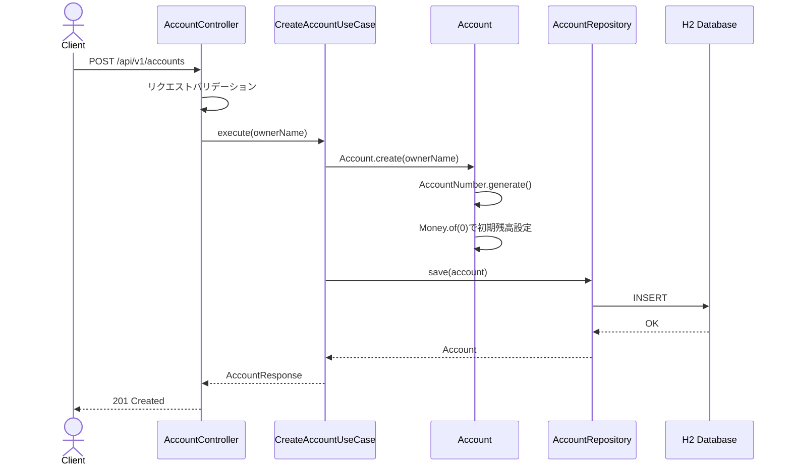
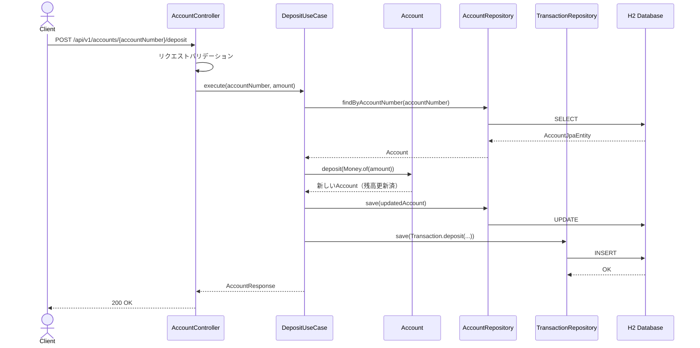
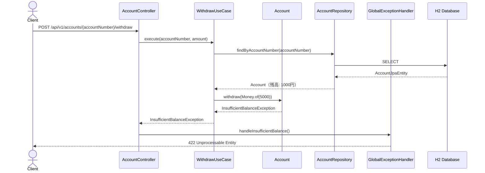
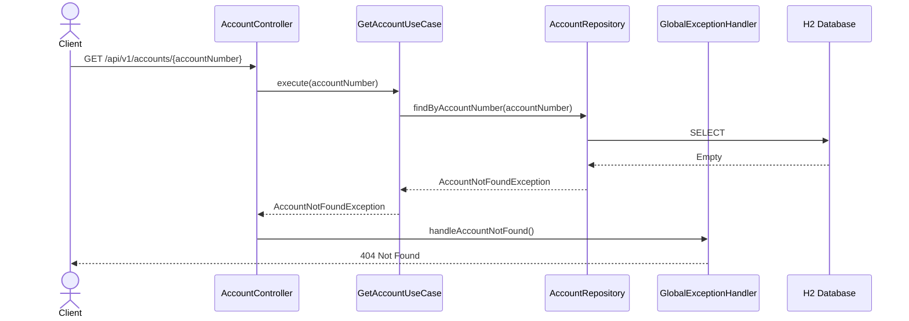
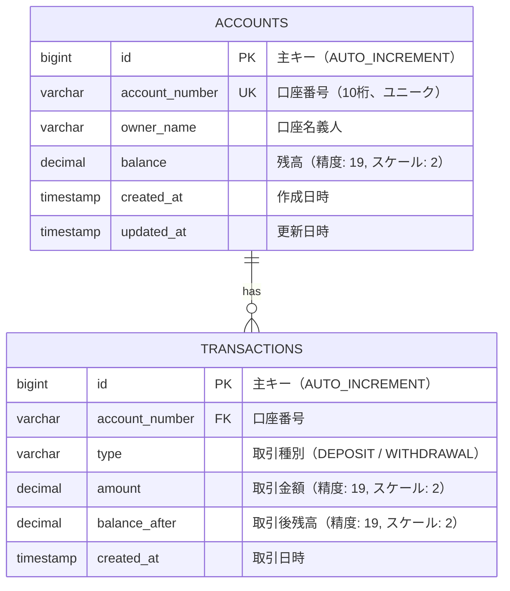
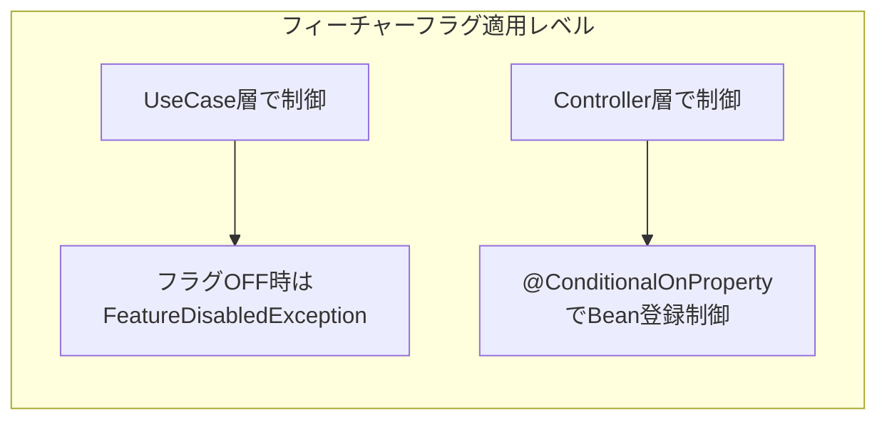

# 銀行システム口座管理 システム設計書

## 1. 概要

### 1.1 目的
DDD＋オニオンアーキテクチャとトランクベース開発（TBD）の実践を学習するためのサンプルプロジェクトとして、銀行システムの口座管理ドメインを設計する。

### 1.2 関連ADR
- [ADR-0001: 銀行システムサンプルプロジェクトのアーキテクチャ](./01-adr.md)

### 1.3 スコープ
- **対象**: 口座開設、残高照会、入金、出金、取引履歴照会のREST API設計・データモデル・フィーチャーフラグ機構
- **対象外**: 認証・認可、口座間送金、利息計算、外部システム連携、バッチ処理

## 2. コンポーネント設計

### 2.1 コンポーネント図

```mermaid
graph TB
    subgraph Presentation["プレゼンテーション層"]
        AccountController["AccountController"]
        TransactionController["TransactionController"]
        GlobalExceptionHandler["GlobalExceptionHandler"]
    end

    subgraph Application["アプリケーション層"]
        CreateAccountUseCase["CreateAccountUseCase"]
        GetAccountUseCase["GetAccountUseCase"]
        DepositUseCase["DepositUseCase"]
        WithdrawUseCase["WithdrawUseCase"]
        GetTransactionHistoryUseCase["GetTransactionHistoryUseCase"]
    end

    subgraph Domain["ドメイン層（Pure Java）"]
        Account["Account\n（エンティティ）"]
        AccountNumber["AccountNumber\n（値オブジェクト）"]
        Money["Money\n（値オブジェクト）"]
        Transaction["Transaction\n（エンティティ）"]
        TransactionType["TransactionType\n（列挙型）"]
        AccountRepository["AccountRepository\n（インターフェース）"]
        TransactionRepository["TransactionRepository\n（インターフェース）"]
        InsufficientBalanceException["InsufficientBalanceException"]
    end

    subgraph Infrastructure["インフラストラクチャ層"]
        AccountRepositoryImpl["AccountRepositoryImpl"]
        TransactionRepositoryImpl["TransactionRepositoryImpl"]
        AccountJpaEntity["AccountJpaEntity"]
        TransactionJpaEntity["TransactionJpaEntity"]
        FeatureFlagConfig["FeatureFlagConfig"]
        DB[(H2 Database)]
    end

    AccountController --> CreateAccountUseCase
    AccountController --> GetAccountUseCase
    AccountController --> DepositUseCase
    AccountController --> WithdrawUseCase
    TransactionController --> GetTransactionHistoryUseCase

    CreateAccountUseCase --> Account
    CreateAccountUseCase --> AccountRepository
    GetAccountUseCase --> AccountRepository
    DepositUseCase --> Account
    DepositUseCase --> AccountRepository
    DepositUseCase --> TransactionRepository
    WithdrawUseCase --> Account
    WithdrawUseCase --> AccountRepository
    WithdrawUseCase --> TransactionRepository
    GetTransactionHistoryUseCase --> TransactionRepository

    AccountRepositoryImpl -.->|implements| AccountRepository
    TransactionRepositoryImpl -.->|implements| TransactionRepository
    AccountRepositoryImpl --> AccountJpaEntity
    TransactionRepositoryImpl --> TransactionJpaEntity
    AccountRepositoryImpl --> DB
    TransactionRepositoryImpl --> DB
```



### 2.2 各コンポーネントの責務

| コンポーネント | 層 | 責務 |
|------------|------|------|
| AccountController | Presentation | 口座関連HTTPリクエストの受付・バリデーション・レスポンス変換 |
| TransactionController | Presentation | 取引履歴関連HTTPリクエストの受付・レスポンス変換 |
| GlobalExceptionHandler | Presentation | 例外の統一的なHTTPレスポンス変換 |
| CreateAccountUseCase | Application | 口座開設のユースケース実行制御 |
| GetAccountUseCase | Application | 残高照会のユースケース実行制御 |
| DepositUseCase | Application | 入金のユースケース実行制御（トランザクション管理） |
| WithdrawUseCase | Application | 出金のユースケース実行制御（トランザクション管理） |
| GetTransactionHistoryUseCase | Application | 取引履歴照会のユースケース実行制御 |
| Account | Domain | 口座エンティティ。残高の増減ロジックを保持 |
| AccountNumber | Domain | 口座番号の値オブジェクト。フォーマット検証を保持 |
| Money | Domain | 金額の値オブジェクト。非負・精度ルールを保持 |
| Transaction | Domain | 取引エンティティ。取引種別・金額・日時を保持 |
| AccountRepository | Domain | 口座の永続化インターフェース |
| TransactionRepository | Domain | 取引の永続化インターフェース |
| AccountRepositoryImpl | Infrastructure | AccountRepositoryのJPA実装 |
| TransactionRepositoryImpl | Infrastructure | TransactionRepositoryのJPA実装 |
| FeatureFlagConfig | Infrastructure | フィーチャーフラグの管理・切替 |

### 2.3 ドメインモデル詳細

#### Account（エンティティ）
```
Account
├── id: AccountId（識別子）
├── accountNumber: AccountNumber（値オブジェクト）
├── ownerName: String
├── balance: Money（値オブジェクト）
├── createdAt: LocalDateTime
└── メソッド:
    ├── deposit(amount: Money): Account  ← 新しいAccountを返す（イミュータブル）
    ├── withdraw(amount: Money): Account ← 残高不足時にInsufficientBalanceException
    └── canWithdraw(amount: Money): boolean
```

#### Money（値オブジェクト）
```
Money
├── amount: BigDecimal（非負、スケール2）
└── メソッド:
    ├── add(other: Money): Money
    ├── subtract(other: Money): Money
    ├── isGreaterThanOrEqual(other: Money): boolean
    └── of(value: long): Money  ← ファクトリメソッド
```

#### AccountNumber（値オブジェクト）
```
AccountNumber
├── value: String（10桁数字）
└── メソッド:
    └── generate(): AccountNumber ← ランダム生成
```

## 3. シーケンス設計

### 3.1 口座開設（正常系）



### 3.2 入金（正常系）



### 3.3 出金（異常系: 残高不足）



### 3.4 口座照会（異常系: 口座不存在）



## 4. API設計

### 4.1 エンドポイント一覧

| メソッド | パス | 説明 | 認証 |
|---------|------|------|------|
| POST | /api/v1/accounts | 口座開設 | 不要 |
| GET | /api/v1/accounts/{accountNumber} | 口座情報・残高照会 | 不要 |
| POST | /api/v1/accounts/{accountNumber}/deposit | 入金 | 不要 |
| POST | /api/v1/accounts/{accountNumber}/withdraw | 出金 | 不要 |
| GET | /api/v1/accounts/{accountNumber}/transactions | 取引履歴照会 | 不要 |

### 4.2 リクエスト/レスポンス仕様

#### POST /api/v1/accounts（口座開設）

**リクエスト:**
```json
{
  "ownerName": "string — 口座名義人（1〜100文字、必須）"
}
```

**レスポンス（201 Created）:**
```json
{
  "accountNumber": "string — 口座番号（10桁）",
  "ownerName": "string — 口座名義人",
  "balance": 0
}
```

#### GET /api/v1/accounts/{accountNumber}（残高照会）

**パスパラメータ:**
- `accountNumber`: string — 口座番号（10桁数字）

**レスポンス（200 OK）:**
```json
{
  "accountNumber": "string — 口座番号",
  "ownerName": "string — 口座名義人",
  "balance": "number — 残高"
}
```

#### POST /api/v1/accounts/{accountNumber}/deposit（入金）

**リクエスト:**
```json
{
  "amount": "number — 入金額（1以上、必須）"
}
```

**レスポンス（200 OK）:**
```json
{
  "accountNumber": "string — 口座番号",
  "ownerName": "string — 口座名義人",
  "balance": "number — 入金後残高"
}
```

#### POST /api/v1/accounts/{accountNumber}/withdraw（出金）

**リクエスト:**
```json
{
  "amount": "number — 出金額（1以上、必須）"
}
```

**レスポンス（200 OK）:**
```json
{
  "accountNumber": "string — 口座番号",
  "ownerName": "string — 口座名義人",
  "balance": "number — 出金後残高"
}
```

#### GET /api/v1/accounts/{accountNumber}/transactions（取引履歴照会）

**クエリパラメータ:**
- `page`: int — ページ番号（0始まり、デフォルト: 0）
- `size`: int — ページサイズ（デフォルト: 20、最大: 100）

**レスポンス（200 OK）:**
```json
{
  "transactions": [
    {
      "id": "string — 取引ID",
      "type": "string — DEPOSIT | WITHDRAWAL",
      "amount": "number — 取引金額",
      "balanceAfter": "number — 取引後残高",
      "createdAt": "string — ISO 8601形式"
    }
  ],
  "page": {
    "number": "int — 現在ページ",
    "size": "int — ページサイズ",
    "totalElements": "long — 総件数",
    "totalPages": "int — 総ページ数"
  }
}
```

### 4.3 エラーレスポンス標準フォーマット

```json
{
  "error": {
    "code": "string — エラーコード",
    "message": "string — ユーザー向けメッセージ"
  }
}
```

## 5. データモデル

### 5.1 ER図



### 5.2 テーブル定義

#### ACCOUNTSテーブル

| カラム名 | 型 | NULL | デフォルト | 説明 |
|---------|------|------|----------|------|
| id | BIGINT | NO | AUTO_INCREMENT | 主キー |
| account_number | VARCHAR(10) | NO | - | 口座番号（ユニーク制約） |
| owner_name | VARCHAR(100) | NO | - | 口座名義人 |
| balance | DECIMAL(19,2) | NO | 0.00 | 残高 |
| created_at | TIMESTAMP | NO | CURRENT_TIMESTAMP | 作成日時 |
| updated_at | TIMESTAMP | NO | CURRENT_TIMESTAMP | 更新日時 |

**インデックス:**
- `UK_account_number`: UNIQUE INDEX on `account_number`

#### TRANSACTIONSテーブル

| カラム名 | 型 | NULL | デフォルト | 説明 |
|---------|------|------|----------|------|
| id | BIGINT | NO | AUTO_INCREMENT | 主キー |
| account_number | VARCHAR(10) | NO | - | 口座番号（外部キー） |
| type | VARCHAR(20) | NO | - | 取引種別 |
| amount | DECIMAL(19,2) | NO | - | 取引金額 |
| balance_after | DECIMAL(19,2) | NO | - | 取引後残高 |
| created_at | TIMESTAMP | NO | CURRENT_TIMESTAMP | 取引日時 |

**インデックス:**
- `IDX_transactions_account_number`: INDEX on `account_number`
- `IDX_transactions_created_at`: INDEX on `account_number, created_at DESC`

## 6. エラーハンドリング

### 6.1 エラー分類

| エラーコード | HTTPステータス | 説明 | リトライ可否 |
|------------|--------------|------|------------|
| ACCOUNT_NOT_FOUND | 404 | 指定された口座番号が存在しない | 不可 |
| INSUFFICIENT_BALANCE | 422 | 残高不足で出金できない | 不可（残高が増えるまで） |
| INVALID_AMOUNT | 400 | 金額が不正（0以下、負数） | 不可（リクエスト修正が必要） |
| INVALID_REQUEST | 400 | リクエストボディの必須項目不足・形式不正 | 不可（リクエスト修正が必要） |
| DUPLICATE_ACCOUNT_NUMBER | 409 | 口座番号が重複（生成リトライ） | 可（内部で自動リトライ） |
| INTERNAL_ERROR | 500 | 予期しない内部エラー | 可 |

### 6.2 例外クラスの配置

| 例外クラス | 層 | 説明 |
|-----------|------|------|
| InsufficientBalanceException | Domain | 残高不足 |
| AccountNotFoundException | Domain | 口座不存在 |
| InvalidAmountException | Domain | 不正金額 |

ドメイン例外はPure Javaで定義し、`GlobalExceptionHandler`（Presentation層）でHTTPステータスにマッピングする。

## 7. 非機能要件

### 7.1 パフォーマンス
- 目標レスポンスタイム: 200ms以内（学習用のため参考値）
- 目標スループット: 学習用のため規定なし

### 7.2 セキュリティ
- 認証方式: なし（学習用サンプル。Spring Security追加可能な構造とする）
- 認可方式: なし
- データ暗号化: なし（H2インメモリDB）

## 8. フィーチャーフラグ設計

### 8.1 フィーチャーフラグ管理方式

`application.yml` のプロパティとSpringの `@ConditionalOnProperty` を組み合わせて管理する。

```yaml
# application.yml
feature:
  account:
    withdrawal: true    # 出金機能の有効/無効
    transaction-history: true  # 取引履歴機能の有効/無効
```

### 8.2 フィーチャーフラグ適用パターン



| フラグ名 | 対象機能 | 適用レベル | OFF時の動作 |
|---------|---------|-----------|------------|
| feature.account.withdrawal | 出金 | UseCase | 501 Not Implemented を返却 |
| feature.account.transaction-history | 取引履歴 | UseCase | 501 Not Implemented を返却 |

### 8.3 フィーチャーフラグの段階的リリースフロー

```
1. フラグOFFでmainにマージ（コードは存在するが無効）
2. テスト環境でフラグONにして検証
3. 本番でフラグON（リリース）
4. 安定稼働確認後、フラグとガード条件を削除（クリーンアップ）
```

### 8.4 FeatureFlagService

```
FeatureFlagService（Infrastructure層）
├── isEnabled(featureName: String): boolean
└── Spring Environment から application.yml のプロパティを読み取る
```

UseCase層では `FeatureFlagService` のインターフェースを `application` パッケージに定義し、`infrastructure` 層で実装する。これによりオニオンアーキテクチャの依存ルールを維持する。

## 9. テスト戦略

### 9.1 テストピラミッド

| テスト種別 | 対象層 | テスト内容 | フレームワーク |
|-----------|--------|-----------|--------------|
| ユニットテスト | Domain | Money, Account, AccountNumberのロジック検証 | JUnit 5 |
| ユニットテスト | Application | UseCase のロジック検証（Repository をモック） | JUnit 5 + Mockito |
| インテグレーションテスト | Infrastructure | リポジトリ実装のDB操作検証 | @DataJpaTest + H2 |
| APIテスト | Presentation | エンドポイントの結合テスト | @SpringBootTest + MockMvc |
| アーキテクチャテスト | 全体 | 依存関係ルールの検証 | ArchUnit |

### 9.2 フィーチャーフラグのテスト

- フラグON/OFFの両方でテストを実行する
- `@TestPropertySource` で `feature.account.withdrawal=false` を設定し、501レスポンスを検証する
