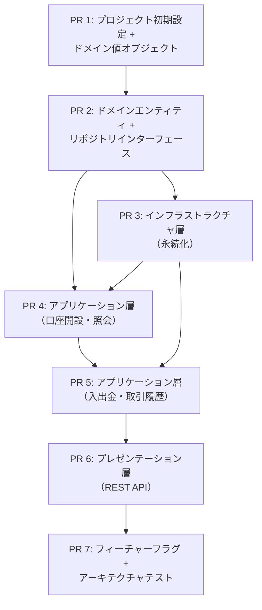

# 銀行システム口座管理 実装計画書

## 1. 概要

### 1.1 関連ドキュメント
- ADR: [ADR-0001: 銀行システムサンプルプロジェクトのアーキテクチャ](./01-adr.md)
- 仕様書: [銀行システム口座管理 システム設計書](./02-spec.md)

### 1.2 実装目標
DDD＋オニオンアーキテクチャとトランクベース開発（TBD）の実践を学習するためのサンプルプロジェクトとして、銀行システムの口座管理ドメインをスタックPR方式で段階的に構築する。

### 1.3 前提条件
- Java 17 / Spring Boot 3.5 / Gradle / H2（ADR-0001で決定）
- プロジェクトはグリーンフィールド（既存コードなし）
- テストフレームワーク: JUnit 5 + Mockito + ArchUnit
- 検証コマンド: `./gradlew test`（個別テスト: `./gradlew test --tests "{TestClass}"`）

## 2. スタックPR構成

### 2.1 PR依存関係



### 2.2 PR一覧

| PR | 名称 | 親PR | 対象層 | 推定規模 |
|----|------|------|--------|---------|
| PR 1 | プロジェクト初期設定 + ドメイン値オブジェクト | main | Domain | M |
| PR 2 | ドメインエンティティ + リポジトリインターフェース | PR 1 | Domain | S |
| PR 3 | インフラストラクチャ層（永続化） | PR 2 | Infrastructure | M |
| PR 4 | アプリケーション層（口座開設・照会） | PR 3 | Application | S |
| PR 5 | アプリケーション層（入出金・取引履歴） | PR 4 | Application | M |
| PR 6 | プレゼンテーション層（REST API） | PR 5 | Presentation | M |
| PR 7 | フィーチャーフラグ + アーキテクチャテスト | PR 6 | Infrastructure / 横断 | M |

## 3. 実装フェーズ

---

### Phase 1（PR 1）: プロジェクト初期設定 + ドメイン値オブジェクト

**目標**: Gradleプロジェクトの初期構成と、ドメイン層の値オブジェクト（Money, AccountNumber）およびドメイン例外を実装する
**親ブランチ**: `main`
**推定規模**: M

#### Task 1.1: Gradleプロジェクト初期設定

**TDDステップ:**

1. **RED** - テスト作成
   - テストファイル: `src/test/java/com/example/bank/BankSystemApplicationTests.java`
   - テストケース:
     - [ ] Spring Bootアプリケーションコンテキストがロードされること
   ```pseudo
   // Given: Spring Bootアプリケーションが構成されている
   // When: コンテキストをロードする
   // Then: エラーなくロードされること
   ```

2. **GREEN** - 最小実装
   - 実装ファイル:
     - `build.gradle` — Spring Boot 3.5, Java 17, 依存関係（spring-boot-starter-web, spring-boot-starter-data-jpa, h2, lombok, spring-boot-starter-test, mockito, archunit）
     - `settings.gradle` — プロジェクト名設定
     - `src/main/java/com/example/bank/BankSystemApplication.java` — メインクラス
     - `src/main/resources/application.yml` — H2設定、フィーチャーフラグ初期設定
   - 実装内容:
     - [ ] Gradleビルドファイルを作成する（Spring Boot 3.5 + Java 17）
     - [ ] Spring Bootメインクラスを作成する
     - [ ] application.yml を作成する（H2インメモリDB設定）
     - [ ] Gradle Wrapperを配置する

3. **REFACTOR** - リファクタリング
   - [ ] なし（初期設定のため）

**検証コマンド:**
```bash
./gradlew test --tests "com.example.bank.BankSystemApplicationTests"
```

#### Task 1.2: Money 値オブジェクト

**TDDステップ:**

1. **RED** - テスト作成
   - テストファイル: `src/test/java/com/example/bank/domain/model/MoneyTest.java`
   - テストケース:
     - [ ] 正の金額でMoneyを生成できること
     - [ ] 0の金額でMoneyを生成できること
     - [ ] 負の金額ではIllegalArgumentExceptionがスローされること
     - [ ] add() で2つのMoneyを加算できること
     - [ ] subtract() で減算できること
     - [ ] subtract() で結果が負になる場合はエラーになること
     - [ ] isGreaterThanOrEqual() が正しく判定すること
     - [ ] of(long) ファクトリメソッドで生成できること
     - [ ] 同値のMoneyがequals/hashCodeで等しいこと（値オブジェクト）
   ```pseudo
   // Given: Money.of(1000)
   // When: add(Money.of(500))
   // Then: Money.of(1500) と等しい

   // Given: Money.of(1000)
   // When: subtract(Money.of(300))
   // Then: Money.of(700) と等しい

   // Given: Money.of(100)
   // When: isGreaterThanOrEqual(Money.of(100))
   // Then: true
   ```

2. **GREEN** - 最小実装
   - 実装ファイル: `src/main/java/com/example/bank/domain/model/Money.java`
   - 実装内容:
     - [ ] BigDecimal（非負、スケール2）をフィールドに持つイミュータブルクラス
     - [ ] add(), subtract(), isGreaterThanOrEqual() メソッド
     - [ ] of(long) ファクトリメソッド
     - [ ] equals(), hashCode() のオーバーライド

3. **REFACTOR** - リファクタリング
   - [ ] BigDecimalの生成ロジックを統一する

**検証コマンド:**
```bash
./gradlew test --tests "com.example.bank.domain.model.MoneyTest"
```

#### Task 1.3: AccountNumber 値オブジェクト

**TDDステップ:**

1. **RED** - テスト作成
   - テストファイル: `src/test/java/com/example/bank/domain/model/AccountNumberTest.java`
   - テストケース:
     - [ ] 10桁の数字文字列で生成できること
     - [ ] 10桁未満の文字列ではエラーになること
     - [ ] 10桁超の文字列ではエラーになること
     - [ ] 数字以外の文字を含む場合はエラーになること
     - [ ] generate() でランダムな10桁の口座番号が生成されること
     - [ ] 同じ値のAccountNumberがequals/hashCodeで等しいこと
   ```pseudo
   // Given: "1234567890"（10桁数字）
   // When: new AccountNumber("1234567890")
   // Then: 正常に生成される

   // Given: "12345"（5桁）
   // When: new AccountNumber("12345")
   // Then: IllegalArgumentException
   ```

2. **GREEN** - 最小実装
   - 実装ファイル: `src/main/java/com/example/bank/domain/model/AccountNumber.java`
   - 実装内容:
     - [ ] String value（10桁数字）をフィールドに持つイミュータブルクラス
     - [ ] コンストラクタでフォーマット検証
     - [ ] generate() 静的ファクトリメソッド
     - [ ] equals(), hashCode() のオーバーライド

3. **REFACTOR** - リファクタリング
   - [ ] バリデーションロジックを整理する

**検証コマンド:**
```bash
./gradlew test --tests "com.example.bank.domain.model.AccountNumberTest"
```

#### Task 1.4: ドメイン例外クラス

**TDDステップ:**

1. **RED** - テスト作成
   - テストファイル: `src/test/java/com/example/bank/domain/model/DomainExceptionTest.java`
   - テストケース:
     - [ ] InsufficientBalanceExceptionがメッセージを保持すること
     - [ ] AccountNotFoundExceptionが口座番号をメッセージに含むこと
     - [ ] InvalidAmountExceptionが不正金額をメッセージに含むこと
   ```pseudo
   // Given: 残高不足の状況
   // When: new InsufficientBalanceException(currentBalance, withdrawAmount)
   // Then: 適切なメッセージを持つ例外が生成される
   ```

2. **GREEN** - 最小実装
   - 実装ファイル:
     - `src/main/java/com/example/bank/domain/model/InsufficientBalanceException.java`
     - `src/main/java/com/example/bank/domain/model/AccountNotFoundException.java`
     - `src/main/java/com/example/bank/domain/model/InvalidAmountException.java`
   - 実装内容:
     - [ ] RuntimeExceptionを継承する3つのドメイン例外クラス
     - [ ] 各例外にコンテキスト情報（口座番号、金額等）を含むメッセージ

3. **REFACTOR** - リファクタリング
   - [ ] なし

**検証コマンド:**
```bash
./gradlew test --tests "com.example.bank.domain.model.DomainExceptionTest"
```

**Phase 1 品質チェックポイント:**
- [x] Money, AccountNumberが完全にイミュータブルであること
- [x] ドメイン層にSpring Framework関連のimportがないこと（Pure Java）
- [x] すべてのテストがグリーンであること
- [x] `./gradlew test` が成功すること

---

### Phase 2（PR 2）: ドメインエンティティ + リポジトリインターフェース

**目標**: Account、Transactionエンティティとリポジトリインターフェースを実装する
**親ブランチ**: PR 1のブランチ
**推定規模**: S

#### Task 2.1: Account エンティティ

**TDDステップ:**

1. **RED** - テスト作成
   - テストファイル: `src/test/java/com/example/bank/domain/model/AccountTest.java`
   - テストケース:
     - [ ] Accountを生成できること（ownerName, accountNumber, 初期残高0）
     - [ ] deposit() で新しいAccountが返されること（イミュータブル）
     - [ ] deposit() で元のAccountの残高が変わらないこと
     - [ ] withdraw() で新しいAccountが返されること
     - [ ] withdraw() で残高不足時にInsufficientBalanceExceptionがスローされること
     - [ ] canWithdraw() が正しく判定すること
     - [ ] deposit() に0以下の金額を渡すとエラーになること
   ```pseudo
   // Given: Account(balance=1000)
   // When: deposit(Money.of(500))
   // Then: 新しいAccount(balance=1500)が返される && 元のAccountは1000のまま

   // Given: Account(balance=1000)
   // When: withdraw(Money.of(5000))
   // Then: InsufficientBalanceException
   ```

2. **GREEN** - 最小実装
   - 実装ファイル: `src/main/java/com/example/bank/domain/model/Account.java`
   - 実装内容:
     - [ ] id, accountNumber, ownerName, balance, createdAt フィールド
     - [ ] create(ownerName) 静的ファクトリメソッド
     - [ ] deposit(Money): Account — 新しいインスタンスを返す
     - [ ] withdraw(Money): Account — 残高不足時に例外スロー
     - [ ] canWithdraw(Money): boolean

3. **REFACTOR** - リファクタリング
   - [ ] ファクトリメソッドのロジックを整理する

**検証コマンド:**
```bash
./gradlew test --tests "com.example.bank.domain.model.AccountTest"
```

#### Task 2.2: Transaction エンティティ + TransactionType

**TDDステップ:**

1. **RED** - テスト作成
   - テストファイル: `src/test/java/com/example/bank/domain/model/TransactionTest.java`
   - テストケース:
     - [ ] 入金トランザクションを生成できること
     - [ ] 出金トランザクションを生成できること
     - [ ] トランザクションが口座番号・金額・取引後残高・日時を保持すること
   ```pseudo
   // Given: accountNumber, DEPOSIT, Money.of(1000), balanceAfter=Money.of(1000)
   // When: Transaction.deposit(accountNumber, amount, balanceAfter)
   // Then: type=DEPOSIT, 正しいフィールド値
   ```

2. **GREEN** - 最小実装
   - 実装ファイル:
     - `src/main/java/com/example/bank/domain/model/Transaction.java`
     - `src/main/java/com/example/bank/domain/model/TransactionType.java`
   - 実装内容:
     - [ ] TransactionType列挙型（DEPOSIT, WITHDRAWAL）
     - [ ] Transaction: id, accountNumber, type, amount, balanceAfter, createdAt
     - [ ] deposit(), withdrawal() 静的ファクトリメソッド

3. **REFACTOR** - リファクタリング
   - [ ] なし

**検証コマンド:**
```bash
./gradlew test --tests "com.example.bank.domain.model.TransactionTest"
```

#### Task 2.3: リポジトリインターフェース

**TDDステップ:**

1. **RED** - テスト作成
   - テストファイル: なし（インターフェース定義のみ — 実装テストはPR 3で実施）
   - 注: インターフェースの契約はJavadocで明示し、実装のインテグレーションテストで検証する

2. **GREEN** - 最小実装
   - 実装ファイル:
     - `src/main/java/com/example/bank/domain/repository/AccountRepository.java`
     - `src/main/java/com/example/bank/domain/repository/TransactionRepository.java`
   - 実装内容:
     - [ ] AccountRepository: save(Account), findByAccountNumber(AccountNumber) — Optional返却
     - [ ] TransactionRepository: save(Transaction), findByAccountNumber(AccountNumber, Pageable)

3. **REFACTOR** - リファクタリング
   - [ ] なし

**検証コマンド:**
```bash
./gradlew test
```

**Phase 2 品質チェックポイント:**
- [ ] Accountのdeposit/withdrawがイミュータブル（新しいインスタンスを返す）であること
- [ ] ドメイン層にSpring Framework関連のimportがないこと
- [ ] リポジトリインターフェースがドメイン層に配置されていること
- [ ] すべてのテストがグリーンであること

---

### Phase 3（PR 3）: インフラストラクチャ層（永続化）

**目標**: JPA Entityとリポジトリ実装を作成し、永続化レイヤーを構築する
**親ブランチ**: PR 2のブランチ
**推定規模**: M

#### Task 3.1: JPA Entity（AccountJpaEntity）

**TDDステップ:**

1. **RED** - テスト作成
   - テストファイル: `src/test/java/com/example/bank/infrastructure/persistence/AccountJpaEntityTest.java`
   - テストケース:
     - [ ] AccountからAccountJpaEntityに変換できること
     - [ ] AccountJpaEntityからAccountに変換できること
     - [ ] 変換の往復でデータが保持されること
   ```pseudo
   // Given: Account(ownerName="田中太郎", balance=1000)
   // When: AccountJpaEntity.fromDomain(account)
   // Then: JpaEntityのフィールドが正しく設定される

   // Given: AccountJpaEntity
   // When: entity.toDomain()
   // Then: Accountのフィールドが正しく復元される
   ```

2. **GREEN** - 最小実装
   - 実装ファイル: `src/main/java/com/example/bank/infrastructure/persistence/AccountJpaEntity.java`
   - 実装内容:
     - [ ] @Entity, @Table(name = "accounts") アノテーション
     - [ ] id, accountNumber, ownerName, balance, createdAt, updatedAt フィールド
     - [ ] fromDomain(Account), toDomain() 変換メソッド

3. **REFACTOR** - リファクタリング
   - [ ] なし

**検証コマンド:**
```bash
./gradlew test --tests "com.example.bank.infrastructure.persistence.AccountJpaEntityTest"
```

#### Task 3.2: JPA Entity（TransactionJpaEntity）

**TDDステップ:**

1. **RED** - テスト作成
   - テストファイル: `src/test/java/com/example/bank/infrastructure/persistence/TransactionJpaEntityTest.java`
   - テストケース:
     - [ ] TransactionからTransactionJpaEntityに変換できること
     - [ ] TransactionJpaEntityからTransactionに変換できること
   ```pseudo
   // Given: Transaction(type=DEPOSIT, amount=1000)
   // When: TransactionJpaEntity.fromDomain(transaction)
   // Then: JpaEntityのフィールドが正しく設定される
   ```

2. **GREEN** - 最小実装
   - 実装ファイル: `src/main/java/com/example/bank/infrastructure/persistence/TransactionJpaEntity.java`
   - 実装内容:
     - [ ] @Entity, @Table(name = "transactions") アノテーション
     - [ ] id, accountNumber, type, amount, balanceAfter, createdAt フィールド
     - [ ] fromDomain(Transaction), toDomain() 変換メソッド

3. **REFACTOR** - リファクタリング
   - [ ] なし

**検証コマンド:**
```bash
./gradlew test --tests "com.example.bank.infrastructure.persistence.TransactionJpaEntityTest"
```

#### Task 3.3: AccountRepositoryImpl（インテグレーションテスト）

**TDDステップ:**

1. **RED** - テスト作成
   - テストファイル: `src/test/java/com/example/bank/infrastructure/persistence/AccountRepositoryImplTest.java`
   - テストケース:
     - [ ] save() でAccountが永続化されること
     - [ ] findByAccountNumber() で保存したAccountを取得できること
     - [ ] findByAccountNumber() で存在しない口座番号の場合はOptional.empty()が返ること
     - [ ] save() で既存Accountの残高が更新されること
   ```pseudo
   // @DataJpaTest + @Import(AccountRepositoryImpl.class)
   // Given: Account.create("田中太郎")
   // When: save(account) → findByAccountNumber(account.accountNumber)
   // Then: 保存したAccountが取得できる
   ```

2. **GREEN** - 最小実装
   - 実装ファイル:
     - `src/main/java/com/example/bank/infrastructure/persistence/AccountRepositoryImpl.java`
     - `src/main/java/com/example/bank/infrastructure/persistence/AccountJpaRepository.java`（Spring Data JPA）
   - 実装内容:
     - [ ] AccountJpaRepository（Spring Data JPAインターフェース）
     - [ ] AccountRepositoryImpl: AccountRepositoryを実装し、JpaEntityとの変換を行う

3. **REFACTOR** - リファクタリング
   - [ ] 変換ロジックの重複を整理する

**検証コマンド:**
```bash
./gradlew test --tests "com.example.bank.infrastructure.persistence.AccountRepositoryImplTest"
```

#### Task 3.4: TransactionRepositoryImpl（インテグレーションテスト）

**TDDステップ:**

1. **RED** - テスト作成
   - テストファイル: `src/test/java/com/example/bank/infrastructure/persistence/TransactionRepositoryImplTest.java`
   - テストケース:
     - [ ] save() でTransactionが永続化されること
     - [ ] findByAccountNumber() で口座の取引履歴が取得できること
     - [ ] findByAccountNumber() でページネーションが正しく動作すること
     - [ ] findByAccountNumber() で取引が作成日時の降順で返されること
   ```pseudo
   // @DataJpaTest + @Import(TransactionRepositoryImpl.class)
   // Given: 複数のTransactionをsave
   // When: findByAccountNumber(accountNumber, page=0, size=2)
   // Then: 2件の取引が日時降順で返される
   ```

2. **GREEN** - 最小実装
   - 実装ファイル:
     - `src/main/java/com/example/bank/infrastructure/persistence/TransactionRepositoryImpl.java`
     - `src/main/java/com/example/bank/infrastructure/persistence/TransactionJpaRepository.java`（Spring Data JPA）
   - 実装内容:
     - [ ] TransactionJpaRepository（Spring Data JPAインターフェース）
     - [ ] TransactionRepositoryImpl: TransactionRepositoryを実装

3. **REFACTOR** - リファクタリング
   - [ ] なし

**検証コマンド:**
```bash
./gradlew test --tests "com.example.bank.infrastructure.persistence.TransactionRepositoryImplTest"
```

**Phase 3 品質チェックポイント:**
- [ ] JPA EntityとドメインEntityの変換が正しく動作すること
- [ ] インテグレーションテストが実際のH2 DBで動作すること
- [ ] インフラ層がドメイン層のインターフェースを実装していること（依存方向が内側）
- [ ] すべてのテストがグリーンであること

---

### Phase 4（PR 4）: アプリケーション層（口座開設・照会）

**目標**: CreateAccountUseCaseとGetAccountUseCaseを実装する
**親ブランチ**: PR 3のブランチ
**推定規模**: S

#### Task 4.1: CreateAccountUseCase

**TDDステップ:**

1. **RED** - テスト作成
   - テストファイル: `src/test/java/com/example/bank/application/usecase/CreateAccountUseCaseTest.java`
   - テストケース:
     - [ ] 口座名義人を指定して口座を開設できること
     - [ ] 作成された口座の初期残高が0であること
     - [ ] 口座番号が10桁で生成されること
     - [ ] 口座がリポジトリに保存されること
   ```pseudo
   // Mockito: AccountRepository をモック
   // Given: ownerName = "田中太郎"
   // When: useCase.execute("田中太郎")
   // Then: AccountRepository.save() が呼ばれ、balance=0のAccountが保存される
   ```

2. **GREEN** - 最小実装
   - 実装ファイル: `src/main/java/com/example/bank/application/usecase/CreateAccountUseCase.java`
   - 実装内容:
     - [ ] AccountRepositoryを注入
     - [ ] execute(ownerName): Account を返す
     - [ ] Account.create(ownerName) でエンティティ生成 → save

3. **REFACTOR** - リファクタリング
   - [ ] なし

**検証コマンド:**
```bash
./gradlew test --tests "com.example.bank.application.usecase.CreateAccountUseCaseTest"
```

#### Task 4.2: GetAccountUseCase

**TDDステップ:**

1. **RED** - テスト作成
   - テストファイル: `src/test/java/com/example/bank/application/usecase/GetAccountUseCaseTest.java`
   - テストケース:
     - [ ] 存在する口座番号で口座情報を取得できること
     - [ ] 存在しない口座番号でAccountNotFoundExceptionがスローされること
   ```pseudo
   // Mockito: AccountRepository をモック
   // Given: AccountRepository.findByAccountNumber() が Account を返す
   // When: useCase.execute(accountNumber)
   // Then: Accountが返される

   // Given: AccountRepository.findByAccountNumber() が Optional.empty() を返す
   // When: useCase.execute(accountNumber)
   // Then: AccountNotFoundException
   ```

2. **GREEN** - 最小実装
   - 実装ファイル: `src/main/java/com/example/bank/application/usecase/GetAccountUseCase.java`
   - 実装内容:
     - [ ] AccountRepositoryを注入
     - [ ] execute(accountNumber): Account を返す
     - [ ] 口座が見つからない場合はAccountNotFoundExceptionをスロー

3. **REFACTOR** - リファクタリング
   - [ ] なし

**検証コマンド:**
```bash
./gradlew test --tests "com.example.bank.application.usecase.GetAccountUseCaseTest"
```

**Phase 4 品質チェックポイント:**
- [ ] UseCaseがドメイン層とリポジトリインターフェースのみに依存していること
- [ ] UseCaseにビジネスロジック（残高計算等）が漏れていないこと
- [ ] すべてのテストがグリーンであること

---

### Phase 5（PR 5）: アプリケーション層（入出金・取引履歴）

**目標**: DepositUseCase、WithdrawUseCase、GetTransactionHistoryUseCaseを実装する
**親ブランチ**: PR 4のブランチ
**推定規模**: M

#### Task 5.1: DepositUseCase

**TDDステップ:**

1. **RED** - テスト作成
   - テストファイル: `src/test/java/com/example/bank/application/usecase/DepositUseCaseTest.java`
   - テストケース:
     - [ ] 正常に入金できること（残高が増加すること）
     - [ ] 入金後にAccountが更新保存されること
     - [ ] 入金の取引履歴（Transaction）が保存されること
     - [ ] 存在しない口座番号でAccountNotFoundExceptionがスローされること
   ```pseudo
   // Given: Account(balance=1000), amount=500
   // When: useCase.execute(accountNumber, 500)
   // Then: Account(balance=1500)がsaveされ、
   //       Transaction(type=DEPOSIT, amount=500, balanceAfter=1500)がsaveされる
   ```

2. **GREEN** - 最小実装
   - 実装ファイル: `src/main/java/com/example/bank/application/usecase/DepositUseCase.java`
   - 実装内容:
     - [ ] AccountRepository, TransactionRepositoryを注入
     - [ ] execute(accountNumber, amount): Account を返す
     - [ ] account.deposit() → save → Transaction.deposit() → save
     - [ ] @Transactional でトランザクション管理

3. **REFACTOR** - リファクタリング
   - [ ] なし

**検証コマンド:**
```bash
./gradlew test --tests "com.example.bank.application.usecase.DepositUseCaseTest"
```

#### Task 5.2: WithdrawUseCase

**TDDステップ:**

1. **RED** - テスト作成
   - テストファイル: `src/test/java/com/example/bank/application/usecase/WithdrawUseCaseTest.java`
   - テストケース:
     - [ ] 正常に出金できること（残高が減少すること）
     - [ ] 出金後にAccountが更新保存されること
     - [ ] 出金の取引履歴（Transaction）が保存されること
     - [ ] 残高不足時にInsufficientBalanceExceptionがスローされること
     - [ ] 存在しない口座番号でAccountNotFoundExceptionがスローされること
   ```pseudo
   // Given: Account(balance=1000), amount=500
   // When: useCase.execute(accountNumber, 500)
   // Then: Account(balance=500)がsaveされ、
   //       Transaction(type=WITHDRAWAL, amount=500, balanceAfter=500)がsaveされる

   // Given: Account(balance=1000), amount=5000
   // When: useCase.execute(accountNumber, 5000)
   // Then: InsufficientBalanceException
   ```

2. **GREEN** - 最小実装
   - 実装ファイル: `src/main/java/com/example/bank/application/usecase/WithdrawUseCase.java`
   - 実装内容:
     - [ ] AccountRepository, TransactionRepositoryを注入
     - [ ] execute(accountNumber, amount): Account を返す
     - [ ] account.withdraw() → save → Transaction.withdrawal() → save
     - [ ] @Transactional でトランザクション管理

3. **REFACTOR** - リファクタリング
   - [ ] DepositUseCaseとの共通パターンを確認する（過度な抽象化はしない）

**検証コマンド:**
```bash
./gradlew test --tests "com.example.bank.application.usecase.WithdrawUseCaseTest"
```

#### Task 5.3: GetTransactionHistoryUseCase

**TDDステップ:**

1. **RED** - テスト作成
   - テストファイル: `src/test/java/com/example/bank/application/usecase/GetTransactionHistoryUseCaseTest.java`
   - テストケース:
     - [ ] 口座の取引履歴をページネーション付きで取得できること
     - [ ] ページサイズとページ番号が正しく渡されること
   ```pseudo
   // Given: TransactionRepository が取引リストを返す
   // When: useCase.execute(accountNumber, page=0, size=20)
   // Then: 取引リストが返される
   ```

2. **GREEN** - 最小実装
   - 実装ファイル: `src/main/java/com/example/bank/application/usecase/GetTransactionHistoryUseCase.java`
   - 実装内容:
     - [ ] TransactionRepositoryを注入
     - [ ] execute(accountNumber, page, size): ページネーション結果を返す

3. **REFACTOR** - リファクタリング
   - [ ] なし

**検証コマンド:**
```bash
./gradlew test --tests "com.example.bank.application.usecase.GetTransactionHistoryUseCaseTest"
```

**Phase 5 品質チェックポイント:**
- [ ] 入出金のトランザクション管理が適切であること（@Transactional）
- [ ] 残高不足の検証がドメイン層（Account.withdraw）で行われていること
- [ ] UseCaseにドメインロジックが漏れていないこと
- [ ] すべてのテストがグリーンであること

---

### Phase 6（PR 6）: プレゼンテーション層（REST API）

**目標**: REST APIコントローラー、レスポンスDTO、例外ハンドラーを実装する
**親ブランチ**: PR 5のブランチ
**推定規模**: M

#### Task 6.1: レスポンス/リクエストDTO

**TDDステップ:**

1. **RED** - テスト作成
   - テストファイル: `src/test/java/com/example/bank/presentation/response/AccountResponseTest.java`
   - テストケース:
     - [ ] AccountからAccountResponseに変換できること
   ```pseudo
   // Given: Account(accountNumber="1234567890", ownerName="田中", balance=1000)
   // When: AccountResponse.from(account)
   // Then: accountNumber, ownerName, balance が正しく設定される
   ```

2. **GREEN** - 最小実装
   - 実装ファイル:
     - `src/main/java/com/example/bank/presentation/response/AccountResponse.java`
     - `src/main/java/com/example/bank/presentation/response/TransactionResponse.java`
     - `src/main/java/com/example/bank/presentation/response/TransactionPageResponse.java`
     - `src/main/java/com/example/bank/presentation/response/ErrorResponse.java`
     - `src/main/java/com/example/bank/presentation/request/CreateAccountRequest.java`
     - `src/main/java/com/example/bank/presentation/request/AmountRequest.java`
   - 実装内容:
     - [ ] AccountResponse: accountNumber, ownerName, balance + from(Account) ファクトリ
     - [ ] TransactionResponse: id, type, amount, balanceAfter, createdAt
     - [ ] TransactionPageResponse: transactions, page(number, size, totalElements, totalPages)
     - [ ] ErrorResponse: error(code, message)
     - [ ] CreateAccountRequest: ownerName（@NotBlank, @Size(max=100)）
     - [ ] AmountRequest: amount（@NotNull, @Positive）

3. **REFACTOR** - リファクタリング
   - [ ] なし

**検証コマンド:**
```bash
./gradlew test --tests "com.example.bank.presentation.response.AccountResponseTest"
```

#### Task 6.2: AccountController（APIテスト）

**TDDステップ:**

1. **RED** - テスト作成
   - テストファイル: `src/test/java/com/example/bank/presentation/controller/AccountControllerTest.java`
   - テストケース:
     - [ ] POST /api/v1/accounts — 口座開設が201 Createdを返すこと
     - [ ] POST /api/v1/accounts — ownerNameが空の場合400を返すこと
     - [ ] GET /api/v1/accounts/{accountNumber} — 口座情報を200で返すこと
     - [ ] GET /api/v1/accounts/{accountNumber} — 存在しない口座で404を返すこと
     - [ ] POST /api/v1/accounts/{accountNumber}/deposit — 入金が200を返すこと
     - [ ] POST /api/v1/accounts/{accountNumber}/deposit — 金額が0以下で400を返すこと
     - [ ] POST /api/v1/accounts/{accountNumber}/withdraw — 出金が200を返すこと
     - [ ] POST /api/v1/accounts/{accountNumber}/withdraw — 残高不足で422を返すこと
   ```pseudo
   // @SpringBootTest + MockMvc
   // Given: POST /api/v1/accounts with {"ownerName": "田中太郎"}
   // When: perform(post(...))
   // Then: status 201, body contains accountNumber, ownerName, balance=0
   ```

2. **GREEN** - 最小実装
   - 実装ファイル: `src/main/java/com/example/bank/presentation/controller/AccountController.java`
   - 実装内容:
     - [ ] @RestController, @RequestMapping("/api/v1/accounts")
     - [ ] POST / — createAccount（@Valid @RequestBody）
     - [ ] GET /{accountNumber} — getAccount
     - [ ] POST /{accountNumber}/deposit — deposit（@Valid @RequestBody）
     - [ ] POST /{accountNumber}/withdraw — withdraw（@Valid @RequestBody）

3. **REFACTOR** - リファクタリング
   - [ ] なし

**検証コマンド:**
```bash
./gradlew test --tests "com.example.bank.presentation.controller.AccountControllerTest"
```

#### Task 6.3: TransactionController（APIテスト）

**TDDステップ:**

1. **RED** - テスト作成
   - テストファイル: `src/test/java/com/example/bank/presentation/controller/TransactionControllerTest.java`
   - テストケース:
     - [ ] GET /api/v1/accounts/{accountNumber}/transactions — 取引履歴を200で返すこと
     - [ ] ページネーションパラメータが正しく処理されること
   ```pseudo
   // @SpringBootTest + MockMvc
   // Given: 口座に複数の取引がある
   // When: GET /api/v1/accounts/{accountNumber}/transactions?page=0&size=20
   // Then: status 200, transactions配列とpageオブジェクトが返される
   ```

2. **GREEN** - 最小実装
   - 実装ファイル: `src/main/java/com/example/bank/presentation/controller/TransactionController.java`
   - 実装内容:
     - [ ] @RestController, @RequestMapping("/api/v1/accounts/{accountNumber}/transactions")
     - [ ] GET / — getTransactions（@RequestParam page, size）

3. **REFACTOR** - リファクタリング
   - [ ] なし

**検証コマンド:**
```bash
./gradlew test --tests "com.example.bank.presentation.controller.TransactionControllerTest"
```

#### Task 6.4: GlobalExceptionHandler

**TDDステップ:**

1. **RED** - テスト作成
   - テストファイル: `src/test/java/com/example/bank/presentation/controller/GlobalExceptionHandlerTest.java`
   - テストケース:
     - [ ] AccountNotFoundException → 404レスポンス（エラーコード: ACCOUNT_NOT_FOUND）
     - [ ] InsufficientBalanceException → 422レスポンス（エラーコード: INSUFFICIENT_BALANCE）
     - [ ] InvalidAmountException → 400レスポンス（エラーコード: INVALID_AMOUNT）
     - [ ] MethodArgumentNotValidException → 400レスポンス（エラーコード: INVALID_REQUEST）
   ```pseudo
   // Given: AccountNotFoundException("1234567890")
   // When: handleAccountNotFound(exception)
   // Then: ErrorResponse(code="ACCOUNT_NOT_FOUND", message="...")
   ```

2. **GREEN** - 最小実装
   - 実装ファイル: `src/main/java/com/example/bank/presentation/controller/GlobalExceptionHandler.java`
   - 実装内容:
     - [ ] @RestControllerAdvice
     - [ ] @ExceptionHandler で各ドメイン例外をHTTPステータスにマッピング
     - [ ] ErrorResponse形式で統一的にレスポンスを返す

3. **REFACTOR** - リファクタリング
   - [ ] なし

**検証コマンド:**
```bash
./gradlew test --tests "com.example.bank.presentation.controller.GlobalExceptionHandlerTest"
```

**Phase 6 品質チェックポイント:**
- [ ] 全APIエンドポイントが仕様書のパス・メソッド・レスポンス形式と一致すること
- [ ] バリデーションが適切に機能すること（@Valid, Bean Validation）
- [ ] エラーレスポンスが統一フォーマットであること
- [ ] すべてのテストがグリーンであること

---

### Phase 7（PR 7）: フィーチャーフラグ + アーキテクチャテスト

**目標**: フィーチャーフラグ機構を実装し、アーキテクチャテスト（ArchUnit）でオニオンアーキテクチャの依存ルールを検証する
**親ブランチ**: PR 6のブランチ
**推定規模**: M

#### Task 7.1: FeatureFlagService

**TDDステップ:**

1. **RED** - テスト作成
   - テストファイル: `src/test/java/com/example/bank/infrastructure/feature/FeatureFlagServiceImplTest.java`
   - テストケース:
     - [ ] フラグがONの場合 isEnabled() が true を返すこと
     - [ ] フラグがOFFの場合 isEnabled() が false を返すこと
   ```pseudo
   // @SpringBootTest(properties = "feature.account.withdrawal=false")
   // Given: withdrawal フラグが OFF
   // When: featureFlagService.isEnabled("account.withdrawal")
   // Then: false
   ```

2. **GREEN** - 最小実装
   - 実装ファイル:
     - `src/main/java/com/example/bank/application/port/FeatureFlagService.java`（インターフェース — application層）
     - `src/main/java/com/example/bank/infrastructure/feature/FeatureFlagServiceImpl.java`（実装 — infrastructure層）
   - 実装内容:
     - [ ] FeatureFlagService インターフェース: isEnabled(featureName): boolean
     - [ ] FeatureFlagServiceImpl: Spring Environment から application.yml のプロパティを読み取る

3. **REFACTOR** - リファクタリング
   - [ ] なし

**検証コマンド:**
```bash
./gradlew test --tests "com.example.bank.infrastructure.feature.FeatureFlagServiceImplTest"
```

#### Task 7.2: UseCaseへのフィーチャーフラグ統合

**TDDステップ:**

1. **RED** - テスト作成
   - テストファイル: `src/test/java/com/example/bank/application/usecase/WithdrawUseCaseFeatureFlagTest.java`
   - テストケース:
     - [ ] フラグONの場合、出金が正常に実行されること
     - [ ] フラグOFFの場合、FeatureDisabledExceptionがスローされること
   - テストファイル: `src/test/java/com/example/bank/application/usecase/GetTransactionHistoryUseCaseFeatureFlagTest.java`
   - テストケース:
     - [ ] フラグONの場合、取引履歴が正常に取得できること
     - [ ] フラグOFFの場合、FeatureDisabledExceptionがスローされること
   ```pseudo
   // Given: feature.account.withdrawal = false
   // When: withdrawUseCase.execute(accountNumber, 500)
   // Then: FeatureDisabledException
   ```

2. **GREEN** - 最小実装
   - 実装ファイル:
     - `src/main/java/com/example/bank/domain/model/FeatureDisabledException.java`
     - WithdrawUseCase, GetTransactionHistoryUseCase を修正 — FeatureFlagServiceをチェック
   - 実装内容:
     - [ ] FeatureDisabledException（ドメイン例外）
     - [ ] WithdrawUseCase: execute() の先頭でフラグチェック
     - [ ] GetTransactionHistoryUseCase: execute() の先頭でフラグチェック
     - [ ] GlobalExceptionHandler: FeatureDisabledException → 501 Not Implemented

3. **REFACTOR** - リファクタリング
   - [ ] フラグチェックのパターンを統一する

**検証コマンド:**
```bash
./gradlew test --tests "*FeatureFlagTest"
```

#### Task 7.3: ArchUnit アーキテクチャテスト

**TDDステップ:**

1. **RED** - テスト作成
   - テストファイル: `src/test/java/com/example/bank/ArchitectureTest.java`
   - テストケース:
     - [ ] domain層がapplication, infrastructure, presentationに依存していないこと
     - [ ] domain層にSpring Frameworkのimportがないこと
     - [ ] application層がinfrastructure, presentationに依存していないこと
     - [ ] オニオンアーキテクチャの依存ルール全体が守られていること
   ```pseudo
   // ArchUnit
   // noClasses().that().resideInAPackage("..domain..")
   //   .should().dependOnClassesThat()
   //   .resideInAnyPackage("..infrastructure..", "..presentation..")
   ```

2. **GREEN** - 最小実装
   - 注: アーキテクチャテストは既存コードを検証するもの。コードが正しければテストはそのまま通る。
   - 実装内容:
     - [ ] ArchUnitテストクラスの作成のみ（既存コードの変更は不要のはず）

3. **REFACTOR** - リファクタリング
   - [ ] アーキテクチャ違反が見つかった場合は修正する

**検証コマンド:**
```bash
./gradlew test --tests "com.example.bank.ArchitectureTest"
```

**Phase 7 品質チェックポイント:**
- [ ] フィーチャーフラグのON/OFFで機能の有効・無効が正しく切り替わること
- [ ] FeatureFlagServiceのインターフェースがapplication層に配置されていること
- [ ] ArchUnitテストがすべてパスすること（依存関係ルール遵守）
- [ ] フラグOFF時に501 Not Implementedが返されること
- [ ] すべてのテストがグリーンであること

---

## 4. 依存関係

```mermaid
graph LR
    subgraph "Phase 1（PR 1）"
        T1_1["Task 1.1<br/>プロジェクト初期設定"]
        T1_2["Task 1.2<br/>Money"]
        T1_3["Task 1.3<br/>AccountNumber"]
        T1_4["Task 1.4<br/>ドメイン例外"]
    end

    subgraph "Phase 2（PR 2）"
        T2_1["Task 2.1<br/>Account"]
        T2_2["Task 2.2<br/>Transaction"]
        T2_3["Task 2.3<br/>Repository I/F"]
    end

    subgraph "Phase 3（PR 3）"
        T3_1["Task 3.1<br/>AccountJpaEntity"]
        T3_2["Task 3.2<br/>TransactionJpaEntity"]
        T3_3["Task 3.3<br/>AccountRepoImpl"]
        T3_4["Task 3.4<br/>TransactionRepoImpl"]
    end

    subgraph "Phase 4（PR 4）"
        T4_1["Task 4.1<br/>CreateAccountUseCase"]
        T4_2["Task 4.2<br/>GetAccountUseCase"]
    end

    subgraph "Phase 5（PR 5）"
        T5_1["Task 5.1<br/>DepositUseCase"]
        T5_2["Task 5.2<br/>WithdrawUseCase"]
        T5_3["Task 5.3<br/>GetTransactionHistoryUseCase"]
    end

    subgraph "Phase 6（PR 6）"
        T6_1["Task 6.1<br/>DTO"]
        T6_2["Task 6.2<br/>AccountController"]
        T6_3["Task 6.3<br/>TransactionController"]
        T6_4["Task 6.4<br/>GlobalExceptionHandler"]
    end

    subgraph "Phase 7（PR 7）"
        T7_1["Task 7.1<br/>FeatureFlagService"]
        T7_2["Task 7.2<br/>フラグ統合"]
        T7_3["Task 7.3<br/>ArchUnit"]
    end

    T1_1 --> T1_2 --> T1_3 --> T1_4
    T1_4 --> T2_1
    T1_2 --> T2_1
    T1_3 --> T2_1
    T2_1 --> T2_2 --> T2_3
    T2_3 --> T3_1 --> T3_3
    T2_3 --> T3_2 --> T3_4
    T3_3 --> T4_1 --> T4_2
    T3_4 --> T5_3
    T4_2 --> T5_1 --> T5_2
    T5_2 --> T6_1 --> T6_2
    T5_3 --> T6_3
    T6_2 --> T6_4
    T6_3 --> T6_4
    T6_4 --> T7_1 --> T7_2 --> T7_3
```



## 5. テスト戦略

### 5.1 テスト種別

| 種別 | 対象 | フレームワーク | カバレッジ目標 |
|------|------|-------------|-------------|
| Unit | Domain（Money, Account, AccountNumber, Transaction） | JUnit 5 | 80%以上 |
| Unit | Application（UseCase）※Repositoryはモック | JUnit 5 + Mockito | 80%以上 |
| Integration | Infrastructure（RepositoryImpl） | @DataJpaTest + H2 | 主要パス |
| API | Presentation（Controller） | @SpringBootTest + MockMvc | 全エンドポイント |
| Architecture | 全体（依存関係ルール） | ArchUnit | 全ルール |

### 5.2 テストデータ
- テストデータ方式: 各テストクラス内でファクトリメソッド or Builderパターンで生成
- テストDB: H2 インメモリ（@DataJpaTest のデフォルト）

## 6. 完了条件

- [ ] すべてのTask（7 Phase, 20 Task）が完了
- [ ] テストカバレッジ80%以上
- [ ] 品質チェックポイントすべてクリア
- [ ] ArchUnitテストがすべてパス
- [ ] フィーチャーフラグのON/OFFテストがパス
- [ ] `./gradlew test` が全テストグリーン
- [ ] 仕様書の全API（5エンドポイント）が実装されている
- [ ] 仕様書の全エラーコード（6種類）が実装されている
