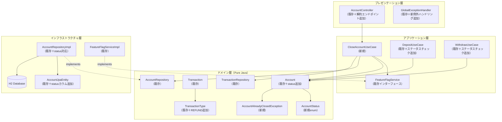
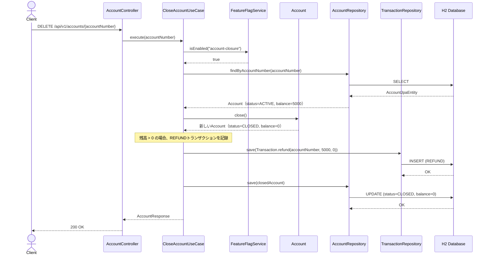
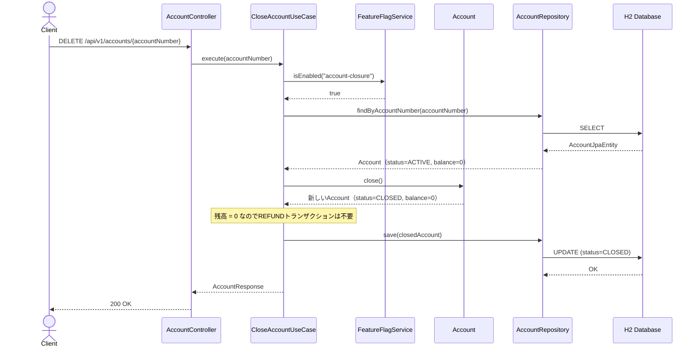
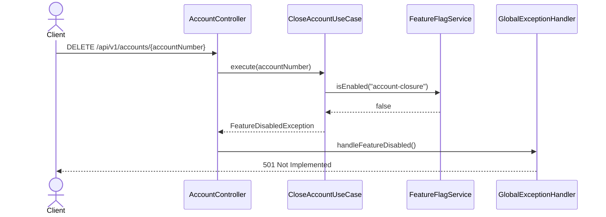
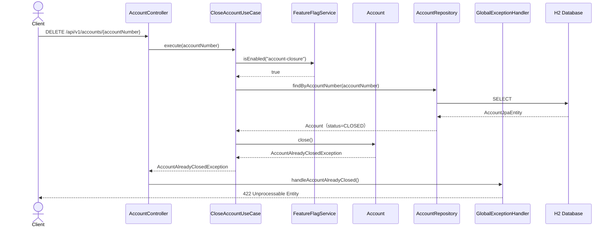
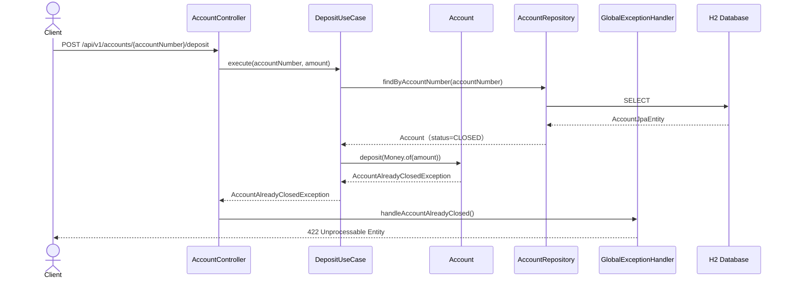
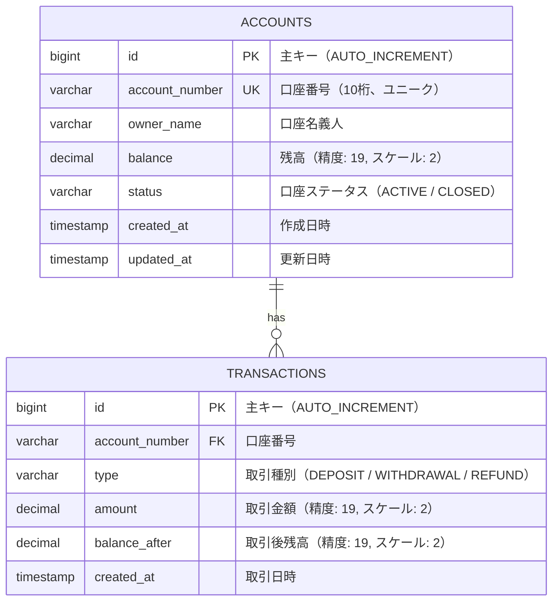

# 口座解約機能 システム設計書

## 1. 概要

### 1.1 目的
銀行システムの口座管理ドメインに口座解約機能を追加し、口座のライフサイクル管理を完成させる。解約時の残高処理、状態遷移管理、フィーチャーフラグ制御を含む。

### 1.2 関連ADR
- [ADR-0002: 口座解約機能の追加](./01-adr.md)
- [ADR-0001: 銀行システムサンプルプロジェクトのアーキテクチャ](../0001-bank-system-tbd-sample/01-adr.md)

### 1.3 スコープ
- **対象**: 口座解約API、AccountStatusの導入、解約時の残高払い戻し処理、CLOSED口座への操作制限、フィーチャーフラグ `account-closure`
- **対象外**: 口座の再開（CLOSED→ACTIVE）、解約手数料、解約理由の記録、バッチによる自動解約

## 2. コンポーネント設計

### 2.1 コンポーネント図



### 2.2 各コンポーネントの責務

| コンポーネント | 層 | 種別 | 責務 |
|------------|------|------|------|
| CloseAccountUseCase | Application | 新規 | 口座解約のユースケース実行制御（フィーチャーフラグチェック、残高払い戻し、ステータス変更） |
| AccountStatus | Domain | 新規 | 口座の状態を表す列挙型（ACTIVE / CLOSED） |
| AccountAlreadyClosedException | Domain | 新規 | 解約済み口座への操作時にスローされるドメイン例外 |
| Account（拡張） | Domain | 既存変更 | `status` フィールドの追加、`close()` メソッド、ステータスガード条件 |
| TransactionType（拡張） | Domain | 既存変更 | `REFUND` の追加（解約時の残高払い戻し記録用） |
| AccountController（拡張） | Presentation | 既存変更 | 解約エンドポイントの追加 |
| GlobalExceptionHandler（拡張） | Presentation | 既存変更 | `AccountAlreadyClosedException` のハンドリング追加 |
| AccountJpaEntity（拡張） | Infrastructure | 既存変更 | `status` カラムの追加、マッピング変更 |

### 2.3 ドメインモデル変更詳細

#### AccountStatus（新規enum）
```
AccountStatus
├── ACTIVE   — 有効な口座
└── CLOSED   — 解約済みの口座
```

#### Account（変更）
```
Account
├── id: AccountId（既存）
├── accountNumber: AccountNumber（既存）
├── ownerName: String（既存）
├── balance: Money（既存）
├── status: AccountStatus（新規）
├── createdAt: LocalDateTime（既存）
└── メソッド:
    ├── create(ownerName): Account           ← status = ACTIVE で生成
    ├── reconstruct(..., status): Account    ← status パラメータ追加
    ├── deposit(amount: Money): Account      ← CLOSED時にAccountAlreadyClosedException
    ├── withdraw(amount: Money): Account     ← CLOSED時にAccountAlreadyClosedException
    ├── canWithdraw(amount: Money): boolean  （既存）
    ├── close(): Account                     ← 新規。CLOSED時にAccountAlreadyClosedException
    └── isClosed(): boolean                  ← 新規
```

#### TransactionType（変更）
```
TransactionType
├── DEPOSIT      （既存）
├── WITHDRAWAL   （既存）
└── REFUND       （新規）— 解約時の残高払い戻し
```

#### Transaction（変更）
```
Transaction
└── メソッド:
    ├── deposit(...)      （既存）
    ├── withdrawal(...)   （既存）
    └── refund(accountNumber, amount, balanceAfter)  ← 新規ファクトリメソッド
```

## 3. シーケンス設計

### 3.1 口座解約（正常系: 残高あり）



### 3.2 口座解約（正常系: 残高ゼロ）



### 3.3 口座解約（異常系: フィーチャーフラグOFF）



### 3.4 口座解約（異常系: 解約済み口座）



### 3.5 既存機能への影響（異常系: CLOSED口座への入出金）



## 4. API設計

### 4.1 エンドポイント一覧（新規・変更分のみ）

| メソッド | パス | 説明 | 種別 | 認証 |
|---------|------|------|------|------|
| DELETE | /api/v1/accounts/{accountNumber} | 口座解約 | 新規 | 不要 |

### 4.2 リクエスト/レスポンス仕様

#### DELETE /api/v1/accounts/{accountNumber}（口座解約）

**パスパラメータ:**
- `accountNumber`: string — 口座番号（10桁数字）

**リクエストボディ:** なし

**レスポンス（200 OK）:**
```json
{
  "accountNumber": "string — 口座番号",
  "ownerName": "string — 口座名義人",
  "balance": 0
}
```

**レスポンス（エラー）:**

| HTTPステータス | エラーコード | 条件 |
|--------------|------------|------|
| 404 | ACCOUNT_NOT_FOUND | 指定された口座番号が存在しない |
| 422 | ACCOUNT_ALREADY_CLOSED | 既に解約済みの口座 |
| 501 | FEATURE_DISABLED | フィーチャーフラグ `account-closure` がOFF |

```json
{
  "code": "ACCOUNT_ALREADY_CLOSED",
  "message": "Account is already closed"
}
```

### 4.3 既存APIレスポンスへの影響

既存の口座情報取得API `GET /api/v1/accounts/{accountNumber}` のレスポンスに `status` フィールドを追加する。

**レスポンス（200 OK）変更後:**
```json
{
  "accountNumber": "string — 口座番号",
  "ownerName": "string — 口座名義人",
  "balance": "number — 残高",
  "status": "string — ACTIVE | CLOSED"
}
```

既存の入出金・取引履歴APIは、CLOSED口座に対して操作した場合に以下を返す:

| API | CLOSED口座時のレスポンス |
|-----|----------------------|
| POST .../deposit | 422 ACCOUNT_ALREADY_CLOSED |
| POST .../withdraw | 422 ACCOUNT_ALREADY_CLOSED |
| GET .../transactions | 200 OK（取引履歴は参照可能） |

## 5. データモデル

### 5.1 ER図



### 5.2 テーブル変更

#### ACCOUNTSテーブル（変更）

**追加カラム:**

| カラム名 | 型 | NULL | デフォルト | 説明 |
|---------|------|------|----------|------|
| status | VARCHAR(20) | NO | 'ACTIVE' | 口座ステータス（ACTIVE / CLOSED） |

**既存データへの影響:**
- マイグレーション時に既存レコードの `status` を `ACTIVE` に設定する
- H2インメモリDBのため、`schema.sql` または `data.sql` でのDDL変更で対応

#### TRANSACTIONSテーブル（変更なし）

`type` カラムの許容値に `REFUND` を追加する（DDL変更不要。アプリケーション側で制御）。

## 6. エラーハンドリング

### 6.1 エラー分類（新規・変更分のみ）

| エラーコード | HTTPステータス | 説明 | リトライ可否 |
|------------|--------------|------|------------|
| ACCOUNT_ALREADY_CLOSED | 422 | 解約済み口座への操作（解約・入金・出金） | 不可 |
| FEATURE_DISABLED | 501 | フィーチャーフラグがOFF（既存） | 不可（フラグ変更が必要） |
| ACCOUNT_NOT_FOUND | 404 | 口座不存在（既存） | 不可 |

### 6.2 例外クラスの追加

| 例外クラス | 層 | 説明 |
|-----------|------|------|
| AccountAlreadyClosedException | Domain | 解約済み口座への操作時にスロー。DomainExceptionのsealed classに追加 |

### 6.3 ErrorCode enum への追加

`ErrorCode` に `ACCOUNT_ALREADY_CLOSED` を追加する。

## 7. 非機能要件

### 7.1 パフォーマンス
- 目標レスポンスタイム: 200ms以内（既存APIと同等）
- 解約処理はトランザクション内で口座更新とREFUNDトランザクション記録を実行するため、2回のDB書き込みが発生

### 7.2 セキュリティ
- 認証方式: なし（学習用サンプル。既存と同等）
- 解約操作は不可逆操作のため、将来的にはconfirmation（確認）ステップの追加を検討する余地がある

## 8. フィーチャーフラグ設計

### 8.1 フラグ定義

```yaml
# application.yml への追加
bank:
  features:
    account-closure: false  # 初期値: false（OFFでmainにマージ）
```

### 8.2 フラグ適用パターン

| フラグ名 | 対象機能 | 適用レベル | OFF時の動作 |
|---------|---------|-----------|------------|
| account-closure | 口座解約 | UseCase | 501 Not Implemented を返却 |

既存の `FeatureFlagService` をそのまま使用する。`CloseAccountUseCase` の先頭で `featureFlagService.isEnabled("account-closure")` をチェックし、`false` の場合は `FeatureDisabledException` をスローする。

### 8.3 段階的リリースフロー

```
1. フラグ account-closure: false でmainにマージ（コードは存在するが無効）
2. テスト環境でフラグをtrueに変更して検証
3. 本番でフラグをtrueに変更（リリース）
4. 安定稼働確認後、フラグとガード条件を削除（クリーンアップ）
```

### 8.4 フラグの影響範囲

- **CloseAccountUseCase のみ**: フラグはCloseAccountUseCaseの実行を制御する
- **既存ユースケースへの影響なし**: DepositUseCase・WithdrawUseCaseのステータスチェックはフラグに依存しない。ステータスチェックはAccountドメインモデルのガード条件として常に有効

## 9. テスト戦略

### 9.1 テスト一覧

| テスト種別 | 対象 | テスト内容 |
|-----------|------|-----------|
| ユニットテスト | AccountStatus | ACTIVE/CLOSEDの値の検証 |
| ユニットテスト | Account.close() | 正常系: ACTIVE→CLOSEDの遷移、残高ゼロ化 |
| ユニットテスト | Account.close() | 異常系: CLOSED→CLOSEDでAccountAlreadyClosedException |
| ユニットテスト | Account.deposit() | 異常系: CLOSED状態でAccountAlreadyClosedException |
| ユニットテスト | Account.withdraw() | 異常系: CLOSED状態でAccountAlreadyClosedException |
| ユニットテスト | Transaction.refund() | REFUNDトランザクションの生成 |
| ユニットテスト | CloseAccountUseCase | 正常系: 残高あり口座の解約（REFUND記録あり） |
| ユニットテスト | CloseAccountUseCase | 正常系: 残高ゼロ口座の解約（REFUND記録なし） |
| ユニットテスト | CloseAccountUseCase | 異常系: フラグOFFでFeatureDisabledException |
| ユニットテスト | CloseAccountUseCase | 異常系: 口座不存在でAccountNotFoundException |
| ユニットテスト | CloseAccountUseCase | 異常系: 解約済み口座でAccountAlreadyClosedException |
| インテグレーションテスト | AccountRepositoryImpl | status付きAccountの保存・取得 |
| APIテスト | DELETE /api/v1/accounts/{accountNumber} | 正常系・異常系のHTTPレスポンス検証 |
| APIテスト | POST .../deposit（CLOSED口座） | 422レスポンスの検証 |
| APIテスト | POST .../withdraw（CLOSED口座） | 422レスポンスの検証 |
| フィーチャーフラグテスト | CloseAccountUseCase | フラグON/OFFでの動作切替 |
| アーキテクチャテスト | 全体 | ArchUnit依存関係ルールのパス（既存テストの継続パス） |

### 9.2 既存テストへの影響

- `Account.create()` で生成されるAccountに `status=ACTIVE` が追加されるため、既存のAccountテストは変更不要（createメソッドの戻り値にstatusが含まれるだけで、既存のassertionは壊れない）
- `AccountJpaEntity` の `fromDomain()` / `toDomain()` に `status` のマッピングが追加されるため、インフラ層のテストは更新が必要
- `AccountResponse` に `status` フィールドが追加されるため、APIテストのレスポンス検証に影響する可能性がある
