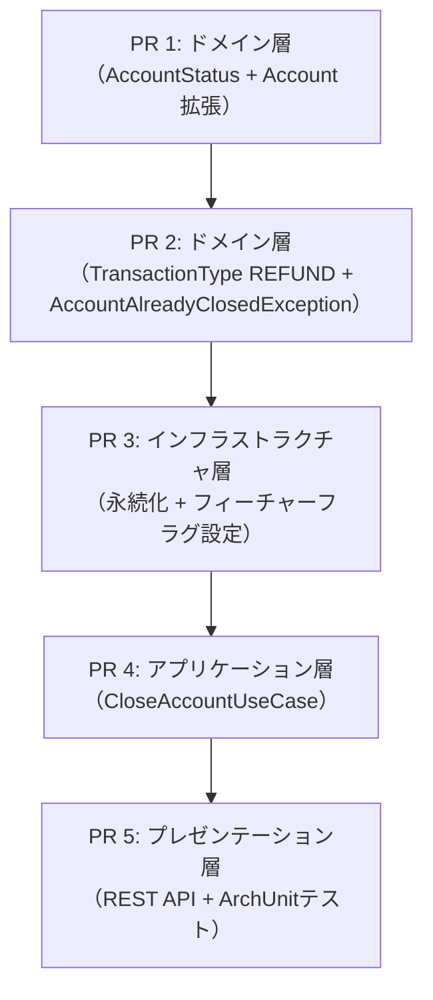
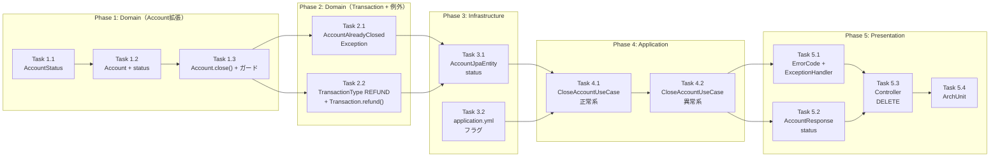

# 口座解約機能 実装計画書

## 1. 概要

### 1.1 関連ドキュメント
- ADR: [ADR-0002: 口座解約機能の追加](./01-adr.md)
- 仕様書: [口座解約機能 システム設計書](./02-spec.md)

### 1.2 実装目標
口座解約機能を既存の銀行システムにフィーチャーフラグ制御付きで追加する。AccountStatusの導入による状態管理、論理削除方式の解約処理、CLOSED口座への操作制限を、TDDとスタックPR方式で段階的に実装する。

### 1.3 前提条件
- Java 17 / Spring Boot 3.5 / Gradle / H2（ADR-0001で決定、実装済み）
- 既存のドメインモデル（Account, Transaction, Money, AccountNumber）が実装済み
- 既存のフィーチャーフラグ基盤（FeatureFlagService）が実装済み
- テストフレームワーク: JUnit 5 + Mockito + ArchUnit
- 検証コマンド: `./gradlew test`（個別テスト: `./gradlew test --tests "{TestClass}"`）

## 2. スタックPR構成

### 2.1 PR依存関係



### 2.2 PR一覧

| PR | 名称 | 親PR | 対象層 | 推定規模 |
|----|------|------|--------|---------|
| PR 1 | ドメイン層（AccountStatus + Account拡張） | main | Domain | S |
| PR 2 | ドメイン層（TransactionType REFUND + 例外クラス） | PR 1 | Domain | S |
| PR 3 | インフラストラクチャ層（永続化 + フィーチャーフラグ設定） | PR 2 | Infrastructure | S |
| PR 4 | アプリケーション層（CloseAccountUseCase） | PR 3 | Application | M |
| PR 5 | プレゼンテーション層（REST API + ArchUnitテスト） | PR 4 | Presentation / 横断 | M |

## 3. 実装フェーズ

---

### Phase 1（PR 1）: ドメイン層 — AccountStatus + Account拡張

**目標**: AccountStatus enumを導入し、Accountモデルにstatus・close()・ステータスガード条件を追加する
**親ブランチ**: `main`
**推定規模**: S

#### Task 1.1: AccountStatus enum

**TDDステップ:**

1. **RED** - テスト作成
   - テストファイル: `src/test/java/com/example/bank/domain/model/AccountStatusTest.java`
   - テストケース:
     - [ ] ACTIVEとCLOSEDの2つの値が存在すること
   ```pseudo
   // Given: AccountStatus enum
   // When: values() を取得
   // Then: ACTIVE, CLOSED の2値が存在する
   ```

2. **GREEN** - 最小実装
   - 実装ファイル: `src/main/java/com/example/bank/domain/model/AccountStatus.java`
   - 実装内容:
     - [ ] AccountStatus enum を作成する（ACTIVE, CLOSED）

3. **REFACTOR** - リファクタリング
   - [ ] なし

**検証コマンド:**
```bash
./gradlew test --tests "com.example.bank.domain.model.AccountStatusTest"
```

#### Task 1.2: Account モデルに status フィールドを追加

**TDDステップ:**

1. **RED** - テスト作成
   - テストファイル: `src/test/java/com/example/bank/domain/model/AccountTest.java`（既存ファイルにテストケース追加）
   - テストケース:
     - [ ] Account.create() で生成された口座のステータスがACTIVEであること
     - [ ] Account.reconstruct() でステータスを復元できること
     - [ ] isClosed() がACTIVE口座でfalseを返すこと
     - [ ] isClosed() がCLOSED口座でtrueを返すこと
   ```pseudo
   // Given: Account.create("テスト太郎")
   // When: getStatus()
   // Then: AccountStatus.ACTIVE

   // Given: Account.reconstruct(..., AccountStatus.CLOSED)
   // When: isClosed()
   // Then: true
   ```

2. **GREEN** - 最小実装
   - 実装ファイル: `src/main/java/com/example/bank/domain/model/Account.java`（既存ファイルを変更）
   - 実装内容:
     - [ ] `status` フィールド（AccountStatus型）を追加する
     - [ ] コンストラクタに `status` パラメータを追加する
     - [ ] `create()` で `AccountStatus.ACTIVE` を設定する
     - [ ] `reconstruct()` に `status` パラメータを追加する
     - [ ] `getStatus()` ゲッターを追加する
     - [ ] `isClosed()` メソッドを追加する
     - [ ] `deposit()` / `withdraw()` の戻り値で `status` を引き継ぐ

3. **REFACTOR** - リファクタリング
   - [ ] なし

**検証コマンド:**
```bash
./gradlew test --tests "com.example.bank.domain.model.AccountTest"
```

#### Task 1.3: Account.close() メソッドとステータスガード条件

**TDDステップ:**

1. **RED** - テスト作成
   - テストファイル: `src/test/java/com/example/bank/domain/model/AccountTest.java`（テストケース追加）
   - テストケース:
     - [ ] ACTIVE口座でclose()するとCLOSED状態のAccountが返されること
     - [ ] close()で残高がゼロになること
     - [ ] CLOSED口座でclose()するとAccountAlreadyClosedExceptionがスローされること
     - [ ] CLOSED口座でdeposit()するとAccountAlreadyClosedExceptionがスローされること
     - [ ] CLOSED口座でwithdraw()するとAccountAlreadyClosedExceptionがスローされること
   ```pseudo
   // Given: ACTIVE口座（残高5000円）
   // When: close()
   // Then: status=CLOSED, balance=0

   // Given: CLOSED口座
   // When: close()
   // Then: AccountAlreadyClosedException

   // Given: CLOSED口座
   // When: deposit(Money.of(1000))
   // Then: AccountAlreadyClosedException
   ```

2. **GREEN** - 最小実装
   - 実装ファイル: `src/main/java/com/example/bank/domain/model/Account.java`（既存ファイルを変更）
   - 実装内容:
     - [ ] `close()` メソッドを追加する（ACTIVE→CLOSED遷移、残高ゼロ化）
     - [ ] `deposit()` にステータスガード条件を追加する
     - [ ] `withdraw()` にステータスガード条件を追加する

3. **REFACTOR** - リファクタリング
   - [ ] ステータスチェックを `ensureActive()` プライベートメソッドに抽出する

**検証コマンド:**
```bash
./gradlew test --tests "com.example.bank.domain.model.AccountTest"
```

---

### Phase 1 品質チェックポイント

- [ ] AccountStatus enum が ACTIVE, CLOSED の2値を持つ
- [ ] Account.create() で ACTIVE ステータスが設定される
- [ ] Account.close() が ACTIVE→CLOSED の遷移と残高ゼロ化を行う
- [ ] CLOSED口座への deposit/withdraw/close が例外をスローする
- [ ] 既存のAccountテスト（deposit/withdraw正常系）が引き続きパスする
- [ ] `./gradlew test` が全テストパス

---

### Phase 2（PR 2）: ドメイン層 — TransactionType REFUND + 例外クラス

**目標**: TransactionTypeにREFUNDを追加し、AccountAlreadyClosedExceptionを定義する
**親ブランチ**: PR 1 のブランチ
**推定規模**: S

#### Task 2.1: AccountAlreadyClosedException

**TDDステップ:**

1. **RED** - テスト作成
   - テストファイル: `src/test/java/com/example/bank/domain/model/AccountAlreadyClosedExceptionTest.java`
   - テストケース:
     - [ ] 例外メッセージに口座番号が含まれること
     - [ ] DomainExceptionのサブクラスであること
   ```pseudo
   // Given: AccountAlreadyClosedException("1234567890")
   // When: getMessage()
   // Then: 口座番号 "1234567890" を含むメッセージ
   ```

2. **GREEN** - 最小実装
   - 実装ファイル:
     - `src/main/java/com/example/bank/domain/model/AccountAlreadyClosedException.java` — 例外クラス
     - `src/main/java/com/example/bank/domain/model/DomainException.java` — sealed class の permits に追加
   - 実装内容:
     - [ ] AccountAlreadyClosedException クラスを作成する
     - [ ] DomainException の permits に AccountAlreadyClosedException を追加する

3. **REFACTOR** - リファクタリング
   - [ ] なし

**検証コマンド:**
```bash
./gradlew test --tests "com.example.bank.domain.model.AccountAlreadyClosedExceptionTest"
```

#### Task 2.2: TransactionType に REFUND を追加 + Transaction.refund() ファクトリメソッド

**TDDステップ:**

1. **RED** - テスト作成
   - テストファイル: `src/test/java/com/example/bank/domain/model/TransactionTest.java`（既存ファイルにテストケース追加）
   - テストケース:
     - [ ] TransactionType.REFUND が存在すること
     - [ ] Transaction.refund() で REFUND タイプのトランザクションが生成されること
     - [ ] refund トランザクションの金額と残高が正しいこと
   ```pseudo
   // Given: accountNumber, amount=5000, balanceAfter=0
   // When: Transaction.refund(accountNumber, amount, balanceAfter)
   // Then: type=REFUND, amount=5000, balanceAfter=0
   ```

2. **GREEN** - 最小実装
   - 実装ファイル:
     - `src/main/java/com/example/bank/domain/model/TransactionType.java` — REFUND を追加
     - `src/main/java/com/example/bank/domain/model/Transaction.java` — refund() ファクトリメソッドを追加
   - 実装内容:
     - [ ] TransactionType に `REFUND` を追加する
     - [ ] Transaction に `refund()` 静的ファクトリメソッドを追加する

3. **REFACTOR** - リファクタリング
   - [ ] なし

**検証コマンド:**
```bash
./gradlew test --tests "com.example.bank.domain.model.TransactionTest"
```

---

### Phase 2 品質チェックポイント

- [ ] AccountAlreadyClosedException が DomainException の sealed permits に含まれる
- [ ] TransactionType.REFUND が存在する
- [ ] Transaction.refund() が正しく REFUND トランザクションを生成する
- [ ] 既存の TransactionType.DEPOSIT / WITHDRAWAL に影響がない
- [ ] `./gradlew test` が全テストパス

---

### Phase 3（PR 3）: インフラストラクチャ層 — 永続化 + フィーチャーフラグ設定

**目標**: AccountJpaEntityにstatusカラムを追加し、application.ymlにaccount-closureフラグを追加する
**親ブランチ**: PR 2 のブランチ
**推定規模**: S

#### Task 3.1: AccountJpaEntity に status カラムを追加

**TDDステップ:**

1. **RED** - テスト作成
   - テストファイル: `src/test/java/com/example/bank/infrastructure/persistence/AccountRepositoryImplTest.java`（既存ファイルにテストケース追加）
   - テストケース:
     - [ ] ACTIVE ステータスの Account を保存・取得できること
     - [ ] CLOSED ステータスの Account を保存・取得できること
     - [ ] ステータスが正しく永続化されていること
   ```pseudo
   // Given: Account（status=ACTIVE）を保存
   // When: findByAccountNumber() で取得
   // Then: status が ACTIVE

   // Given: Account（status=CLOSED）を保存
   // When: findByAccountNumber() で取得
   // Then: status が CLOSED
   ```

2. **GREEN** - 最小実装
   - 実装ファイル:
     - `src/main/java/com/example/bank/infrastructure/persistence/AccountJpaEntity.java` — status フィールド追加、fromDomain/toDomain 変更
   - 実装内容:
     - [ ] `status` フィールド（VARCHAR(20)）を追加する
     - [ ] `fromDomain()` で Account の status をマッピングする
     - [ ] `toDomain()` で status を復元する（Account.reconstruct に status パラメータを渡す）

3. **REFACTOR** - リファクタリング
   - [ ] なし

**検証コマンド:**
```bash
./gradlew test --tests "com.example.bank.infrastructure.persistence.AccountRepositoryImplTest"
```

#### Task 3.2: application.yml にフィーチャーフラグを追加

**TDDステップ:**

1. **RED** - テスト作成
   - テストファイル: `src/test/java/com/example/bank/infrastructure/feature/FeatureFlagServiceImplTest.java`（既存ファイルにテストケース追加）
   - テストケース:
     - [ ] account-closure フラグがデフォルトでfalseであること
   ```pseudo
   // Given: application.yml の bank.features.account-closure が false
   // When: isEnabled("account-closure")
   // Then: false
   ```

2. **GREEN** - 最小実装
   - 実装ファイル:
     - `src/main/resources/application.yml` — `account-closure: false` を追加
   - 実装内容:
     - [ ] `bank.features.account-closure: false` を追加する

3. **REFACTOR** - リファクタリング
   - [ ] なし

**検証コマンド:**
```bash
./gradlew test --tests "com.example.bank.infrastructure.feature.FeatureFlagServiceImplTest"
```

---

### Phase 3 品質チェックポイント

- [ ] AccountJpaEntity が status カラムを正しくマッピングする
- [ ] 既存の Account 保存・取得テストが引き続きパスする（status=ACTIVE がデフォルト）
- [ ] application.yml に account-closure フラグが追加されている
- [ ] `./gradlew test` が全テストパス

---

### Phase 4（PR 4）: アプリケーション層 — CloseAccountUseCase

**目標**: フィーチャーフラグ制御付きのCloseAccountUseCaseを実装する（残高あり/なしの分岐、REFUNDトランザクション記録）
**親ブランチ**: PR 3 のブランチ
**推定規模**: M

#### Task 4.1: CloseAccountUseCase — 正常系

**TDDステップ:**

1. **RED** - テスト作成
   - テストファイル: `src/test/java/com/example/bank/application/usecase/CloseAccountUseCaseTest.java`
   - テストケース:
     - [ ] フラグON＋残高ゼロの口座を解約できること（REFUNDトランザクションなし）
     - [ ] フラグON＋残高ありの口座を解約できること（REFUNDトランザクションあり）
     - [ ] 解約後の口座がCLOSEDステータスであること
     - [ ] 解約後の口座残高がゼロであること
     - [ ] 残高あり時にREFUNDトランザクションが正しい金額で記録されること
   ```pseudo
   // Given: フラグON, ACTIVE口座（残高5000円）
   // When: execute(accountNumber)
   // Then: 返却AccountがCLOSED, balance=0
   //       TransactionRepository.save() が REFUND(5000, balanceAfter=0) で呼ばれる
   //       AccountRepository.save() が CLOSED口座で呼ばれる

   // Given: フラグON, ACTIVE口座（残高0円）
   // When: execute(accountNumber)
   // Then: 返却AccountがCLOSED, balance=0
   //       TransactionRepository.save() は呼ばれない
   ```

2. **GREEN** - 最小実装
   - 実装ファイル: `src/main/java/com/example/bank/application/usecase/CloseAccountUseCase.java`
   - 実装内容:
     - [ ] CloseAccountUseCase クラスを作成する（@Service, @Transactional）
     - [ ] コンストラクタで AccountRepository, TransactionRepository, FeatureFlagService を注入する
     - [ ] execute(AccountNumber) メソッドを実装する
     - [ ] フィーチャーフラグチェックを実装する
     - [ ] 口座取得 → close() → 残高払い戻し判定 → REFUND記録 → 保存の流れを実装する

3. **REFACTOR** - リファクタリング
   - [ ] なし

**検証コマンド:**
```bash
./gradlew test --tests "com.example.bank.application.usecase.CloseAccountUseCaseTest"
```

#### Task 4.2: CloseAccountUseCase — 異常系

**TDDステップ:**

1. **RED** - テスト作成
   - テストファイル: `src/test/java/com/example/bank/application/usecase/CloseAccountUseCaseTest.java`（テストケース追加）
   - テストケース:
     - [ ] フラグOFFの場合にFeatureDisabledExceptionがスローされること
     - [ ] 口座が存在しない場合にAccountNotFoundExceptionがスローされること
     - [ ] 解約済み口座の場合にAccountAlreadyClosedExceptionがスローされること
   ```pseudo
   // Given: フラグOFF
   // When: execute(accountNumber)
   // Then: FeatureDisabledException

   // Given: フラグON, 口座不存在
   // When: execute(accountNumber)
   // Then: AccountNotFoundException

   // Given: フラグON, CLOSED口座
   // When: execute(accountNumber)
   // Then: AccountAlreadyClosedException
   ```

2. **GREEN** - 最小実装
   - 実装ファイル: `src/main/java/com/example/bank/application/usecase/CloseAccountUseCase.java`（異常系は正常系の実装で既にカバーされている想定。不足があれば追加）
   - 実装内容:
     - [ ] フラグOFF時の FeatureDisabledException スローを確認する
     - [ ] 口座不存在時の AccountNotFoundException スローを確認する（AccountRepository.findByAccountNumber の戻り値処理）

3. **REFACTOR** - リファクタリング
   - [ ] なし

**検証コマンド:**
```bash
./gradlew test --tests "com.example.bank.application.usecase.CloseAccountUseCaseTest"
```

---

### Phase 4 品質チェックポイント

- [ ] CloseAccountUseCase がフィーチャーフラグで制御されている
- [ ] 残高ありの場合にREFUNDトランザクションが記録される
- [ ] 残高ゼロの場合にREFUNDトランザクションが記録されない
- [ ] 異常系（フラグOFF、口座不存在、解約済み）がすべてテストされている
- [ ] 仕様書のシーケンス図と一致した処理フローであること
- [ ] `./gradlew test` が全テストパス

---

### Phase 5（PR 5）: プレゼンテーション層 — REST API + ArchUnitテスト

**目標**: DELETE APIエンドポイント、AccountResponseのstatus追加、例外ハンドリング、ArchUnitテストを実装する
**親ブランチ**: PR 4 のブランチ
**推定規模**: M

#### Task 5.1: ErrorCode + AccountAlreadyClosedException ハンドリング

**TDDステップ:**

1. **RED** - テスト作成
   - テストファイル: `src/test/java/com/example/bank/presentation/controller/GlobalExceptionHandlerTest.java`（既存ファイルにテストケース追加。存在しない場合は新規作成）
   - テストケース:
     - [ ] AccountAlreadyClosedException が 422 + ACCOUNT_ALREADY_CLOSED で返されること
   ```pseudo
   // Given: AccountAlreadyClosedException("1234567890")
   // When: handleAccountAlreadyClosed()
   // Then: 422, code=ACCOUNT_ALREADY_CLOSED
   ```

2. **GREEN** - 最小実装
   - 実装ファイル:
     - `src/main/java/com/example/bank/presentation/response/ErrorCode.java` — ACCOUNT_ALREADY_CLOSED 追加
     - `src/main/java/com/example/bank/presentation/controller/GlobalExceptionHandler.java` — ハンドラ追加
   - 実装内容:
     - [ ] ErrorCode に `ACCOUNT_ALREADY_CLOSED` を追加する
     - [ ] GlobalExceptionHandler に `handleAccountAlreadyClosed()` メソッドを追加する（422 Unprocessable Entity）

3. **REFACTOR** - リファクタリング
   - [ ] なし

**検証コマンド:**
```bash
./gradlew test --tests "com.example.bank.presentation.controller.GlobalExceptionHandlerTest"
```

#### Task 5.2: AccountResponse に status フィールドを追加

**TDDステップ:**

1. **RED** - テスト作成
   - テストファイル: `src/test/java/com/example/bank/presentation/response/AccountResponseTest.java`（新規作成）
   - テストケース:
     - [ ] AccountResponse.from() が status を含むこと
     - [ ] ACTIVE口座のレスポンスに "ACTIVE" が含まれること
     - [ ] CLOSED口座のレスポンスに "CLOSED" が含まれること
   ```pseudo
   // Given: Account（status=ACTIVE）
   // When: AccountResponse.from(account)
   // Then: status = "ACTIVE"
   ```

2. **GREEN** - 最小実装
   - 実装ファイル: `src/main/java/com/example/bank/presentation/response/AccountResponse.java`（既存ファイルを変更）
   - 実装内容:
     - [ ] record に `String status` フィールドを追加する
     - [ ] `from()` メソッドで `account.getStatus().name()` をマッピングする

3. **REFACTOR** - リファクタリング
   - [ ] なし

**検証コマンド:**
```bash
./gradlew test --tests "com.example.bank.presentation.response.AccountResponseTest"
```

#### Task 5.3: AccountController に DELETE エンドポイントを追加

**TDDステップ:**

1. **RED** - テスト作成
   - テストファイル: `src/test/java/com/example/bank/presentation/controller/AccountControllerTest.java`（既存ファイルにテストケース追加）
   - テストケース:
     - [ ] DELETE /api/v1/accounts/{accountNumber} で200が返されること（正常系）
     - [ ] レスポンスにCLOSEDステータスとbalance=0が含まれること
     - [ ] 口座不存在で404が返されること
     - [ ] 解約済み口座で422が返されること
     - [ ] フラグOFFで501が返されること
   ```pseudo
   // Given: ACTIVE口座が存在する
   // When: DELETE /api/v1/accounts/{accountNumber}
   // Then: 200 OK, status=CLOSED, balance=0

   // Given: フラグOFF
   // When: DELETE /api/v1/accounts/{accountNumber}
   // Then: 501 Not Implemented
   ```

2. **GREEN** - 最小実装
   - 実装ファイル: `src/main/java/com/example/bank/presentation/controller/AccountController.java`（既存ファイルを変更）
   - 実装内容:
     - [ ] コンストラクタに `CloseAccountUseCase` を追加する
     - [ ] `@DeleteMapping("/{accountNumber}")` エンドポイントを追加する
     - [ ] CloseAccountUseCase.execute() を呼び出し、AccountResponse を返す

3. **REFACTOR** - リファクタリング
   - [ ] なし

**検証コマンド:**
```bash
./gradlew test --tests "com.example.bank.presentation.controller.AccountControllerTest"
```

#### Task 5.4: ArchUnit アーキテクチャテスト

**TDDステップ:**

1. **RED** - テスト作成
   - テストファイル: `src/test/java/com/example/bank/ArchitectureTest.java`（既存ファイルにテストケース追加）
   - テストケース:
     - [ ] 新しいドメインクラス（AccountStatus, AccountAlreadyClosedException）がSpringに依存していないこと
     - [ ] CloseAccountUseCase がドメイン層のインターフェースのみに依存していること
   ```pseudo
   // Given: 既存のArchUnitルール
   // When: 全アーキテクチャテストを実行
   // Then: 新規クラスを含めすべてパスする
   ```

2. **GREEN** - 最小実装
   - 実装内容:
     - [ ] 既存のArchUnitテストが新規クラスをカバーしていることを確認する（テスト追加が必要な場合のみ追加）

3. **REFACTOR** - リファクタリング
   - [ ] なし

**検証コマンド:**
```bash
./gradlew test --tests "com.example.bank.ArchitectureTest"
```

---

### Phase 5 品質チェックポイント

- [ ] DELETE /api/v1/accounts/{accountNumber} が正常に動作する
- [ ] AccountResponse に status フィールドが含まれる
- [ ] AccountAlreadyClosedException が 422 にマッピングされる
- [ ] 既存のAPIテスト（口座作成・照会・入出金）が引き続きパスする
- [ ] ArchUnitテストが全パスする（依存関係ルール維持）
- [ ] `./gradlew test` が全テストパス

---

## 4. 依存関係



## 5. テスト戦略

### 5.1 テスト種別

| 種別 | 対象 | フレームワーク | カバレッジ目標 |
|------|------|-------------|-------------|
| Unit | AccountStatus, Account, Transaction, 例外 | JUnit 5 | 80%以上 |
| Unit | CloseAccountUseCase | JUnit 5 + Mockito | 80%以上 |
| Integration | AccountRepositoryImpl（status対応） | @DataJpaTest + H2 | 主要パス |
| API | AccountController DELETE | @SpringBootTest + MockMvc | 正常系 + 全異常系 |
| Architecture | 依存関係ルール | ArchUnit | 全ルールパス |

### 5.2 テストデータ
- テストデータ方式: ファクトリメソッド（Account.create(), Account.reconstruct()）
- テストDB: H2 インメモリ（@DataJpaTest）
- フィーチャーフラグ制御: `@TestPropertySource` で `bank.features.account-closure=true/false` を切替

## 6. 完了条件

- [ ] すべてのTask（1.1〜5.4）が完了
- [ ] テストカバレッジ80%以上（新規コード）
- [ ] 品質チェックポイント（Phase 1〜5）すべてクリア
- [ ] 既存テストがすべてパス（リグレッションなし）
- [ ] `./gradlew test` が全テストパス
- [ ] ArchUnitテストがパス（アーキテクチャ整合性維持）
- [ ] フィーチャーフラグ account-closure のON/OFFテストが両方パス
