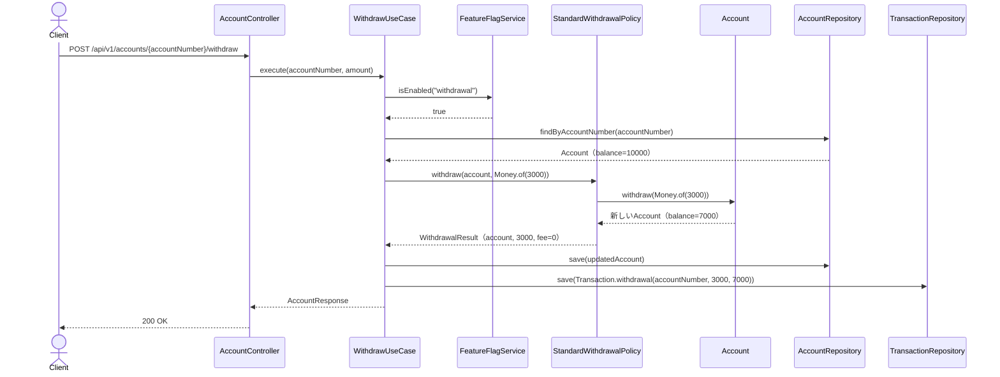
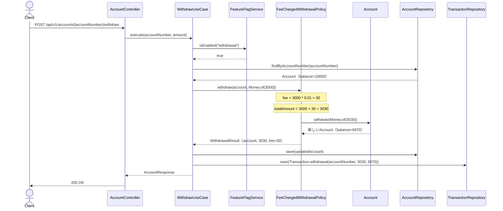
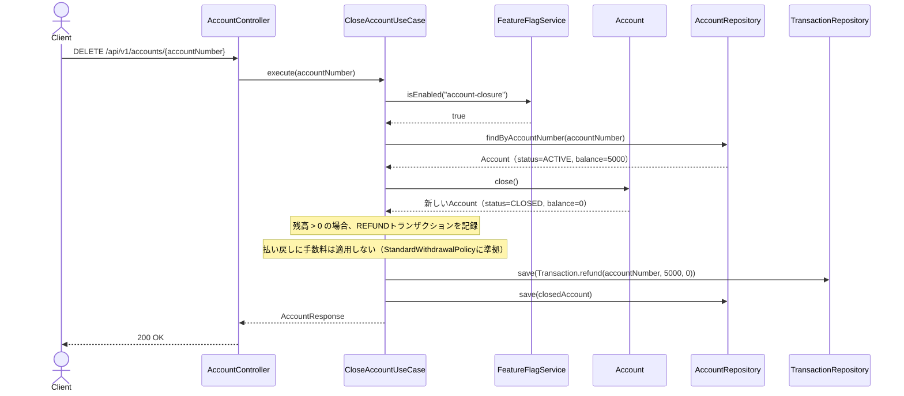
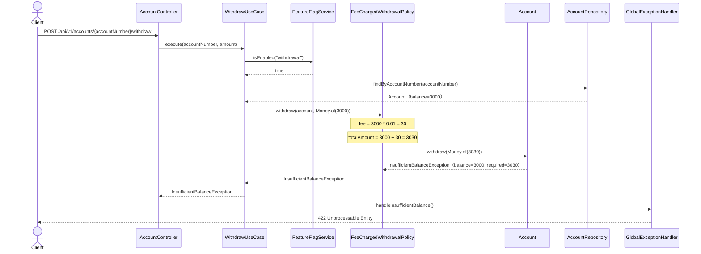
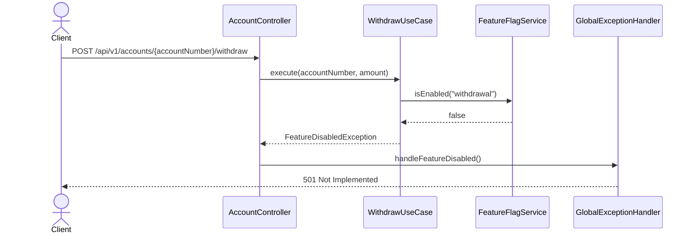
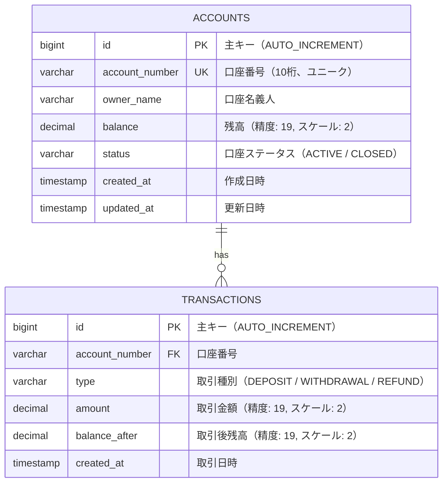
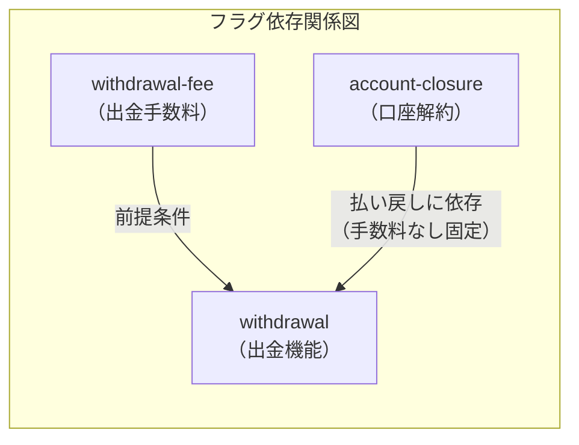

# 機能フラグ競合解決 システム設計書

## 1. 概要

### 1.1 目的
トランクベース開発（TBD）において、複数の機能フラグが同一ドメインモデルに影響する場合のコード分離パターンを導入する。Branch by Abstraction（抽象化による分岐）パターンにより、`WithdrawalPolicy` インターフェースを用いて出金処理のバリエーション（通常出金・手数料付き出金）をフラグに応じて切り替え可能にし、口座解約時の払い戻しとの競合を構造的に解決する。

### 1.2 関連ADR
- [ADR-0003: 機能フラグ競合時のコード分離パターン](./01-adr.md)
- [ADR-0002: 口座解約機能の追加](../0002-account-closure/01-adr.md)
- [ADR-0001: 銀行システムサンプルプロジェクトのアーキテクチャ](../0001-bank-system-tbd-sample/01-adr.md)

### 1.3 スコープ
- **対象**: `WithdrawalPolicy` インターフェースの導入、`StandardWithdrawalPolicy`/`FeeChargedWithdrawalPolicy` の実装、`WithdrawUseCase`/`CloseAccountUseCase` のPolicy適用、フラグ `withdrawal-fee` の追加、DI設定によるPolicy切り替え
- **対象外**: 手数料率の動的変更、手数料の外部マスタ管理、新規APIエンドポイントの追加、ドメインモデル（Account.java）の変更、DBスキーマの変更

## 2. コンポーネント設計

### 2.1 コンポーネント図

```mermaid
graph TB
    subgraph Presentation["プレゼンテーション層"]
        AccountController["AccountController\n（既存・変更なし）"]
        GlobalExceptionHandler["GlobalExceptionHandler\n（既存・変更なし）"]
    end

    subgraph Application["アプリケーション層"]
        subgraph Port["application.port"]
            FeatureFlagService["FeatureFlagService\n（既存インターフェース）"]
            WithdrawalPolicy["WithdrawalPolicy\n（新規インターフェース）"]
        end
        subgraph Policy["application.policy"]
            StandardWithdrawalPolicy["StandardWithdrawalPolicy\n（新規：現行動作）"]
            FeeChargedWithdrawalPolicy["FeeChargedWithdrawalPolicy\n（新規：手数料付き）"]
        end
        subgraph UseCase["application.usecase"]
            WithdrawUseCase["WithdrawUseCase\n（既存・Policy適用に変更）"]
            CloseAccountUseCase["CloseAccountUseCase\n（既存・Policy適用に変更）"]
            DepositUseCase["DepositUseCase\n（既存・変更なし）"]
        end
    end

    subgraph Domain["ドメイン層（Pure Java）"]
        Account["Account\n（既存・変更なし）"]
        Transaction["Transaction\n（既存・変更なし）"]
        AccountRepository["AccountRepository\n（既存）"]
        TransactionRepository["TransactionRepository\n（既存）"]
    end

    subgraph Infrastructure["インフラストラクチャ層"]
        subgraph Config["infrastructure.config"]
            WithdrawalPolicyConfig["WithdrawalPolicyConfig\n（新規@Configuration）"]
        end
        FeatureFlagServiceImpl["FeatureFlagServiceImpl\n（既存）"]
        AccountRepositoryImpl["AccountRepositoryImpl\n（既存）"]
        DB[(H2 Database)]
    end

    AccountController --> WithdrawUseCase
    AccountController --> CloseAccountUseCase

    WithdrawUseCase --> WithdrawalPolicy
    WithdrawUseCase --> FeatureFlagService
    WithdrawUseCase --> AccountRepository
    WithdrawUseCase --> TransactionRepository

    CloseAccountUseCase --> WithdrawalPolicy
    CloseAccountUseCase --> FeatureFlagService
    CloseAccountUseCase --> AccountRepository
    CloseAccountUseCase --> TransactionRepository

    StandardWithdrawalPolicy -.->|implements| WithdrawalPolicy
    FeeChargedWithdrawalPolicy -.->|implements| WithdrawalPolicy

    StandardWithdrawalPolicy --> Account
    FeeChargedWithdrawalPolicy --> Account

    WithdrawalPolicyConfig --> FeatureFlagService
    WithdrawalPolicyConfig --> StandardWithdrawalPolicy
    WithdrawalPolicyConfig --> FeeChargedWithdrawalPolicy

    FeatureFlagServiceImpl -.->|implements| FeatureFlagService
    AccountRepositoryImpl -.->|implements| AccountRepository
    AccountRepositoryImpl --> DB
```



### 2.2 各コンポーネントの責務

| コンポーネント | 層 | パッケージ | 種別 | 責務 |
|------------|------|----------|------|------|
| WithdrawalPolicy | Application | application.port | 新規 | 出金処理のStrategyインターフェース。出金方法のバリエーションを抽象化する |
| StandardWithdrawalPolicy | Application | application.policy | 新規 | 現行の出金処理（手数料なし）。`Account.withdraw()` をそのまま呼び出す |
| FeeChargedWithdrawalPolicy | Application | application.policy | 新規 | 手数料付き出金処理。手数料を加算した金額で `Account.withdraw()` を呼び出す |
| WithdrawalPolicyConfig | Infrastructure | infrastructure.config | 新規 | `withdrawal-fee` フラグに応じて `WithdrawalPolicy` のBean切り替えを行う@Configurationクラス |
| WithdrawUseCase（変更） | Application | application.usecase | 既存変更 | `WithdrawalPolicy` を注入し、Policyに出金処理を委譲する |
| CloseAccountUseCase（変更） | Application | application.usecase | 既存変更 | 払い戻し処理に `StandardWithdrawalPolicy` を常に使用する（手数料を適用しない） |

### 2.3 WithdrawalPolicy インターフェース設計

```
WithdrawalPolicy (application.port)
└── withdraw(account: Account, amount: Money): WithdrawalResult
```

#### WithdrawalResult（値オブジェクト）
```
WithdrawalResult (application.port)
├── updatedAccount: Account    — 出金後の口座
├── withdrawnAmount: Money     — 実際の出金額（手数料込み）
└── fee: Money                 — 適用された手数料（0の場合あり）
```

`WithdrawalResult` を導入する理由:
- 手数料の有無に関わらず、呼び出し元が出金結果を統一的に扱える
- トランザクション記録時に手数料額を参照できる
- Policyの実装詳細（手数料計算の有無）を呼び出し元から隠蔽する

### 2.4 Policy実装の詳細

#### StandardWithdrawalPolicy
```
StandardWithdrawalPolicy (application.policy)
├── withdraw(account, amount):
│   ├── account.withdraw(amount) を呼び出す
│   └── WithdrawalResult(updatedAccount, amount, Money.ZERO) を返す
└── 依存: なし（ドメインモデルのみ使用）
```

#### FeeChargedWithdrawalPolicy
```
FeeChargedWithdrawalPolicy (application.policy)
├── feeRate: BigDecimal        — 手数料率（コンストラクタで注入）
├── withdraw(account, amount):
│   ├── fee = amount * feeRate を計算する
│   ├── totalAmount = amount + fee を計算する
│   ├── account.withdraw(totalAmount) を呼び出す
│   └── WithdrawalResult(updatedAccount, totalAmount, fee) を返す
└── 依存: なし（ドメインモデルのみ使用）
```

手数料率は `application.yml` の `bank.withdrawal.fee-rate` プロパティから注入する（デフォルト: `0.01` = 1%）。

### 2.5 依存関係ルールの遵守

```
Presentation → Application → Domain
                    ↑
              Infrastructure
```

- **Domain層**: 変更なし。`Account.withdraw()` は純粋な出金ロジックのみを担う
- **Application層**: `WithdrawalPolicy` インターフェースと `WithdrawalResult` は `application.port` に配置。Policy実装は `application.policy` に配置。いずれもDomain層への依存のみ（application→domain方向）
- **Infrastructure層**: `WithdrawalPolicyConfig` が `FeatureFlagService` を参照してPolicy Beanを生成する

## 3. シーケンス設計

### 3.1 通常出金（正常系: withdrawal-fee=false、手数料なし）



### 3.2 手数料付き出金（正常系: withdrawal-fee=true）



### 3.3 口座解約時の払い戻し（正常系: 常にStandardWithdrawalPolicyを使用）



### 3.4 手数料付き出金（異常系: 手数料込みで残高不足）



### 3.5 出金機能フラグOFF（異常系: withdrawal=false）



## 4. API設計

### 4.1 新規APIエンドポイント

新規APIエンドポイントの追加はなし。

### 4.2 既存APIの動作変更

| メソッド | パス | 変更内容 |
|---------|------|---------|
| POST | /api/v1/accounts/{accountNumber}/withdraw | `withdrawal-fee` フラグがONの場合、出金額に手数料が加算される |

#### POST /api/v1/accounts/{accountNumber}/withdraw の動作変更

**リクエスト:** 変更なし
```json
{
  "amount": "number -- 出金額（1以上、必須）"
}
```

**レスポンス（200 OK）:** 変更なし（`balance` は手数料込みの出金後残高を反映）
```json
{
  "accountNumber": "string -- 口座番号",
  "ownerName": "string -- 口座名義人",
  "balance": "number -- 出金後残高（手数料込み）",
  "status": "string -- ACTIVE | CLOSED"
}
```

**動作の違い:**

| 条件 | 出金額 | 手数料 | 実際の引き落とし額 | 残高への影響 |
|------|--------|--------|----------------|------------|
| withdrawal-fee=false | 3000 | 0 | 3000 | -3000 |
| withdrawal-fee=true（rate=1%） | 3000 | 30 | 3030 | -3030 |

**エラーレスポンスへの影響:**
- `withdrawal-fee=true` の場合、手数料込みの金額が残高を超えると `INSUFFICIENT_BALANCE` エラーが返る
- エラーレスポンスのフォーマットは既存と同一

### 4.3 DELETE /api/v1/accounts/{accountNumber} への影響

変更なし。口座解約時の払い戻しには手数料を適用しない。`withdrawal-fee` フラグの状態に関わらず、`CloseAccountUseCase` は `StandardWithdrawalPolicy` 相当の動作（手数料なし）を維持する。

## 5. データモデル

### 5.1 ER図

DBスキーマの変更はなし。既存のER図をそのまま参照する。



### 5.2 テーブル変更

テーブル定義の変更はなし。手数料込みの出金額は既存の `amount` カラムにそのまま記録される（手数料を含む合計額がWITHDRAWALトランザクションのamountとなる）。

**将来的な考慮**: 手数料を独立して記録する要件が発生した場合は、TRANSACTIONSテーブルへの `fee` カラム追加、または手数料専用テーブルの導入を検討する。本設計では手数料の内訳をDB上で分離しない。

## 6. エラーハンドリング

### 6.1 エラー分類（新規・変更分のみ）

新規の例外クラスの追加はなし。既存のエラーハンドリングで対応できる。

| エラーケース | 例外クラス | HTTPステータス | 説明 |
|------------|-----------|--------------|------|
| 手数料込み残高不足 | InsufficientBalanceException（既存） | 422 | 手数料を加算した出金額が残高を超過 |
| 出金機能無効 | FeatureDisabledException（既存） | 501 | `withdrawal` フラグがOFF |
| 口座解約機能無効 | FeatureDisabledException（既存） | 501 | `account-closure` フラグがOFF |

### 6.2 手数料込み残高不足時のエラーメッセージ

`FeeChargedWithdrawalPolicy` が `Account.withdraw(totalAmount)` を呼び出した際に `InsufficientBalanceException` が発生するケースでは、ドメイン層のエラーメッセージがそのまま返る。エラーメッセージには手数料込みの合計額が `required` として含まれる。

```json
{
  "code": "INSUFFICIENT_BALANCE",
  "message": "Insufficient balance: current=3000, required=3030"
}
```

クライアントは `required` と `amount`（リクエストで送った出金額）の差分から手数料額を推測できるが、明示的な手数料情報はレスポンスに含まない。手数料の明示的な通知が必要になった場合は、レスポンスフォーマットの拡張を別途検討する。

## 7. 非機能要件

### 7.1 パフォーマンス
- 目標レスポンスタイム: 200ms以内（既存APIと同等）
- Policy選択はDIコンテナによるBean注入で行われるため、リクエスト時のオーバーヘッドはない
- 手数料計算は `BigDecimal` の乗算・加算のみであり、パフォーマンスへの影響は無視できる

### 7.2 セキュリティ
- 認証方式: なし（学習用サンプル。既存と同等）
- 手数料率は `application.yml` で管理され、外部からの変更はできない

### 7.3 保守性
- フラグ `withdrawal-fee` が恒久的にONになった場合のクリーンアップ手順:
  1. `StandardWithdrawalPolicy` を削除する
  2. `FeeChargedWithdrawalPolicy` を `WithdrawalPolicy` の唯一の実装とする
  3. `WithdrawalPolicyConfig` のフラグ分岐を削除し、直接 `FeeChargedWithdrawalPolicy` をBean登録する
  4. インターフェースが単一実装のみの場合は、インターフェース自体を削除してインライン化を検討する
- フラグ `withdrawal-fee` が恒久的にOFFのまま廃止される場合:
  1. `FeeChargedWithdrawalPolicy` を削除する
  2. `WithdrawalPolicyConfig` を削除する
  3. `WithdrawUseCase` が直接 `Account.withdraw()` を呼び出すように戻す（インターフェース削除）

## 8. フィーチャーフラグ設計

### 8.1 フラグ定義

```yaml
# application.yml への追加
bank:
  features:
    account-creation: true
    deposit: true
    withdrawal: true
    transaction-history: true
    account-closure: false
    withdrawal-fee: false  # 新規追加: 出金手数料の有効/無効（デフォルト: false）
  withdrawal:
    fee-rate: 0.01         # 新規追加: 手数料率（デフォルト: 1%）
```

### 8.2 フラグ適用パターン

| フラグ名 | 対象機能 | 適用レベル | OFF時の動作 | ON時の動作 |
|---------|---------|-----------|------------|-----------|
| withdrawal | 出金機能全体 | UseCase | 501 Not Implemented | 出金処理を実行 |
| withdrawal-fee | 出金手数料 | DI（Bean切替） | StandardWithdrawalPolicyを使用 | FeeChargedWithdrawalPolicyを使用 |
| account-closure | 口座解約 | UseCase | 501 Not Implemented | 解約処理を実行 |

### 8.3 フラグ間の依存関係



**依存関係の説明:**

| 依存元 | 依存先 | 関係 | 説明 |
|--------|--------|------|------|
| withdrawal-fee | withdrawal | 前提条件 | `withdrawal-fee` は `withdrawal` がONの場合にのみ意味を持つ。`withdrawal` がOFFの場合、出金自体が無効なので手数料フラグは影響しない |
| account-closure | withdrawal | 暗黙的依存 | 口座解約時の払い戻しは `Account.close()` で行われ、`WithdrawUseCase` を経由しない。ただし、払い戻しのビジネスルール（手数料を適用しない）は `withdrawal` 機能のPolicyと関連する |

### 8.4 フラグ組み合わせマトリクス

| withdrawal | withdrawal-fee | account-closure | WithdrawUseCase の動作 | CloseAccountUseCase の動作 |
|-----------|---------------|----------------|----------------------|--------------------------|
| ON | OFF | ON | 手数料なし出金 | 解約＋手数料なし払い戻し |
| ON | ON | ON | 手数料付き出金 | 解約＋手数料なし払い戻し |
| ON | OFF | OFF | 手数料なし出金 | 501 Not Implemented |
| ON | ON | OFF | 手数料付き出金 | 501 Not Implemented |
| OFF | OFF | ON | 501 Not Implemented | 解約＋手数料なし払い戻し |
| OFF | ON | ON | 501 Not Implemented | 解約＋手数料なし払い戻し |
| OFF | OFF | OFF | 501 Not Implemented | 501 Not Implemented |
| OFF | ON | OFF | 501 Not Implemented | 501 Not Implemented |

**重要な設計判断**: `CloseAccountUseCase` の払い戻し動作は `withdrawal-fee` フラグの状態に依存しない。口座解約時の払い戻しは常に手数料なしで行われる。これは、解約払い戻しが出金とは異なるビジネスコンテキスト（口座のライフサイクル終了に伴う残高返還）であるためである。

### 8.5 DI設定によるPolicy切り替え

`WithdrawalPolicyConfig`（infrastructure.config パッケージ）で、フラグに応じたBean登録を行う。

```
WithdrawalPolicyConfig (@Configuration)
├── withdrawalPolicy():
│   ├── featureFlagService.isEnabled("withdrawal-fee") をチェック
│   ├── true  → FeeChargedWithdrawalPolicy(feeRate) を返す
│   └── false → StandardWithdrawalPolicy() を返す
├── standardWithdrawalPolicy():
│   └── CloseAccountUseCase専用のQualifier付きBean
└── 依存: FeatureFlagService, bank.withdrawal.fee-rate プロパティ
```

`WithdrawUseCase` には `@Primary` なPolicy Bean が注入される。`CloseAccountUseCase` には `@Qualifier("standardWithdrawalPolicy")` で明示的に `StandardWithdrawalPolicy` が注入される。

### 8.6 段階的リリースフロー

```
1. withdrawal-fee: false でmainにマージ
   - WithdrawalPolicy インターフェースと両Policy実装がコードベースに存在
   - StandardWithdrawalPolicy が有効（現行動作と同一）
2. テスト環境で withdrawal-fee: true に変更して検証
   - FeeChargedWithdrawalPolicy が有効になり、手数料付き出金を検証
   - CloseAccountUseCase が手数料の影響を受けないことを確認
3. 本番で withdrawal-fee: true に変更（リリース）
4. 安定稼働確認後、クリーンアップ（セクション 7.3 参照）
```

## 9. テスト戦略

### 9.1 テスト一覧

| テスト種別 | 対象 | テスト内容 |
|-----------|------|-----------|
| ユニットテスト | WithdrawalPolicy | インターフェースの契約確認（コンパイルレベル） |
| ユニットテスト | StandardWithdrawalPolicy | 正常系: 指定額がそのまま出金される、fee=0 |
| ユニットテスト | StandardWithdrawalPolicy | 異常系: 残高不足でInsufficientBalanceException |
| ユニットテスト | FeeChargedWithdrawalPolicy | 正常系: 手数料込みの出金、fee > 0 |
| ユニットテスト | FeeChargedWithdrawalPolicy | 正常系: 手数料率による正確な手数料計算 |
| ユニットテスト | FeeChargedWithdrawalPolicy | 異常系: 手数料込みで残高不足 |
| ユニットテスト | WithdrawUseCase | 正常系: Policyに出金を委譲し、結果を保存 |
| ユニットテスト | WithdrawUseCase | 異常系: withdrawalフラグOFFでFeatureDisabledException |
| ユニットテスト | WithdrawUseCase | 異常系: 口座不存在でAccountNotFoundException |
| ユニットテスト | CloseAccountUseCase | 正常系: 残高あり口座の解約（手数料なし払い戻し） |
| ユニットテスト | CloseAccountUseCase | 正常系: 残高ゼロ口座の解約 |
| ユニットテスト | CloseAccountUseCase | 異常系: account-closureフラグOFFでFeatureDisabledException |
| インテグレーションテスト | WithdrawalPolicyConfig | withdrawal-fee=false で StandardWithdrawalPolicy がBeanとして生成される |
| インテグレーションテスト | WithdrawalPolicyConfig | withdrawal-fee=true で FeeChargedWithdrawalPolicy がBeanとして生成される |
| インテグレーションテスト | WithdrawUseCase + Policy | フラグON/OFFでのPolicy切替とDB保存の検証 |

### 9.2 フラグ組み合わせマトリクステスト

フラグの主要な組み合わせに対するインテグレーションテスト:

| テストケース | withdrawal | withdrawal-fee | account-closure | 期待動作 |
|------------|-----------|---------------|----------------|---------|
| 全機能ON（手数料あり） | ON | ON | ON | 出金は手数料付き、解約は手数料なし払い戻し |
| 全機能ON（手数料なし） | ON | OFF | ON | 出金は手数料なし、解約は手数料なし払い戻し |
| 出金OFF・解約ON | OFF | - | ON | 出金は501、解約は手数料なし払い戻し |
| 出金ON・解約OFF | ON | ON | OFF | 出金は手数料付き、解約は501 |
| 全機能OFF | OFF | - | OFF | 両方501 |

### 9.3 Policy独立性テスト

各Policy実装が以下の条件を満たすことを検証する:
- `FeatureFlagService` に依存しない（Policyはフラグを参照しない）
- `Account.withdraw()` のみに依存する（他のリポジトリ等に依存しない）
- テスト時にDIコンテナが不要（Pure Javaでインスタンス化できる）

### 9.4 アーキテクチャテスト（ArchUnit）

既存のArchUnitテストに加えて、以下のルールを検証する:
- `application.policy` パッケージは `domain` パッケージにのみ依存する
- `application.port.WithdrawalPolicy` は `infrastructure` パッケージから参照されない（DI設定を除く）
- `domain` パッケージは `application.policy` パッケージに依存しない

### 9.5 既存テストへの影響

- `WithdrawUseCaseTest`: Policyの注入に対応するようモック設定を変更する必要がある
- `CloseAccountUseCaseTest`: `StandardWithdrawalPolicy` 相当の動作を維持していることの確認を追加する
- 既存のAPIテスト（`/withdraw` エンドポイント）: `withdrawal-fee=false` の状態では動作が変わらないため、既存テストは変更不要
- `withdrawal-fee=true` 用のAPIテストを新規追加する
