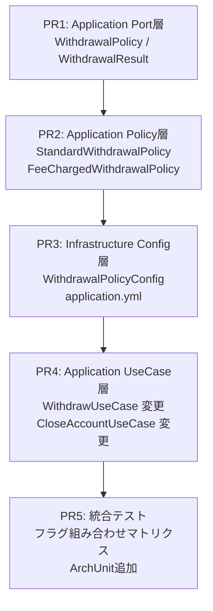
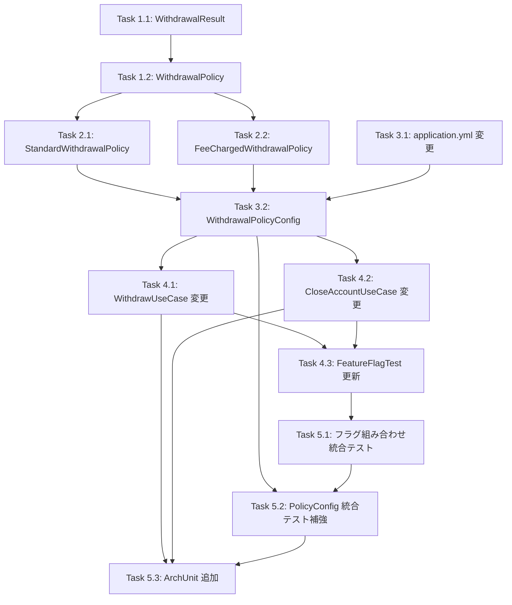

# 実装計画書: 機能フラグ競合解決（Branch by Abstraction）

## 関連ドキュメント

- [ADR-0003: 機能フラグ競合時のコード分離パターン](./01-adr.md)
- [システム設計書](./02-spec.md)
- [ADR-0001: 銀行システムサンプルプロジェクトのアーキテクチャ](../0001-bank-system-tbd-sample/01-adr.md)
- [ADR-0002: 口座解約機能の追加](../0002-account-closure/01-adr.md)

## スタックPR構成

```
main
 └── PR1: Application Port層（WithdrawalPolicy / WithdrawalResult）
      └── PR2: Application Policy層（StandardWithdrawalPolicy / FeeChargedWithdrawalPolicy）
           └── PR3: Infrastructure Config層（WithdrawalPolicyConfig / application.yml）
                └── PR4: Application UseCase層（WithdrawUseCase / CloseAccountUseCase 変更）
                     └── PR5: 統合テスト（フラグ組み合わせマトリクス / ArchUnit追加）
```

## 依存関係図



---

## Phase 1: Application Port層

**対応PR**: PR1（親ブランチ: `main`）
**目的**: `WithdrawalPolicy` インターフェースと `WithdrawalResult` 値オブジェクトを `application.port` パッケージに追加する。後続の実装が依存する抽象層の確立。

### Task 1.1: WithdrawalResult 値オブジェクトの追加

#### RED: テストの作成

**テストファイル**: `src/test/java/com/example/bank/application/port/WithdrawalResultTest.java`

```java
// テストケース
// Given: updatedAccount=残高500の口座, withdrawnAmount=500, fee=0
// When: WithdrawalResult を生成する
// Then: 各フィールドが正しく保持される

// Given: updatedAccount=残高6970の口座, withdrawnAmount=3030, fee=30
// When: WithdrawalResult を生成する
// Then: fee > 0 のケースでも各フィールドが正しく保持される

// Given: fee=0 のWithdrawalResult
// When: fee を取得する
// Then: Money.ZERO と等しい
```

テストケース一覧:
- `shouldHoldUpdatedAccountAndWithdrawnAmountAndFeeZero()`: 手数料なしケースの値保持確認
- `shouldHoldFeeGreaterThanZero()`: 手数料ありケースの値保持確認
- `shouldReturnMoneyZeroAsFeeWhenNoFeeApplied()`: fee=Money.ZERO の等値確認

#### GREEN: 最小実装

**実装ファイル**: `src/main/java/com/example/bank/application/port/WithdrawalResult.java`

実装項目:
- `Account updatedAccount` フィールド
- `Money withdrawnAmount` フィールド（手数料込みの実際引き落とし額）
- `Money fee` フィールド（適用された手数料、手数料なし時は Money.ZERO）
- イミュータブルなコンストラクタ
- ゲッターメソッド（`getUpdatedAccount()`, `getWithdrawnAmount()`, `getFee()`）

#### REFACTOR

- `record` 構文への変換を検討（Java 16+）
- Javadoc コメントの追加

**検証コマンド**: `./gradlew test --tests "com.example.bank.application.port.WithdrawalResultTest"`

---

### Task 1.2: WithdrawalPolicy インターフェースの追加

#### RED: テストの作成

`WithdrawalPolicy` はインターフェースのため、直接のユニットテストは不要。ただし、インターフェース契約をコンパイルレベルで保証するために、Task 2.1 / 2.2 のテストが RED 段階の役割を担う。

本 Task では、インターフェースの存在を前提とした最小限のコンパイル確認テストを作成する。

**テストファイル**: `src/test/java/com/example/bank/application/port/WithdrawalPolicyTest.java`

```java
// Given: WithdrawalPolicy の匿名実装
// When: withdraw() を呼び出す
// Then: WithdrawalResult が返ること（コンパイルレベルの契約確認）
```

テストケース一覧:
- `shouldBeImplementableAsLambdaOrAnonymousClass()`: インターフェースが実装可能であることの確認

#### GREEN: 最小実装

**実装ファイル**: `src/main/java/com/example/bank/application/port/WithdrawalPolicy.java`

実装項目:
- `@FunctionalInterface` アノテーション（任意）
- `WithdrawalResult withdraw(Account account, Money amount)` メソッドシグネチャ
- Javadoc コメント

#### REFACTOR

- Javadoc にパラメータ説明と例外のドキュメントを追加

**検証コマンド**: `./gradlew test --tests "com.example.bank.application.port.WithdrawalPolicyTest"`

---

### Phase 1 品質チェックポイント

```
[ ] WithdrawalResult が不変オブジェクトとして実装されている（フィールドが final）
[ ] WithdrawalPolicy インターフェースが application.port パッケージに配置されている
[ ] WithdrawalResult が application.port パッケージに配置されている
[ ] domain パッケージ以外への依存がない（FeatureFlagService 等への依存なし）
[ ] ADR-0003「抽象化の配置: Strategy/Policy インターフェースは application 層に配置」に準拠している
[ ] テストが Pure Java でインスタンス化できること（DI コンテナ不要）
[ ] ./gradlew test でビルドが通ること
```

---

## Phase 2: Application Policy層

**対応PR**: PR2（親ブランチ: `feature/0003-pr1-application-port`）
**目的**: `WithdrawalPolicy` インターフェースの2つの実装を `application.policy` パッケージに追加する。各実装は Pure Java で独立してテスト可能であること。

### Task 2.1: StandardWithdrawalPolicy の実装

#### RED: テストの作成

**テストファイル**: `src/test/java/com/example/bank/application/policy/StandardWithdrawalPolicyTest.java`

テストケース一覧:

```
// 正常系: 指定額がそのまま出金される
// Given: 残高 1000 の ACTIVE 口座、出金額 500
// When: standardPolicy.withdraw(account, Money.of(500)) を呼び出す
// Then: result.getUpdatedAccount().getBalance() == Money.of(500)
// Then: result.getWithdrawnAmount() == Money.of(500)
// Then: result.getFee() == Money.ZERO

// 正常系: 全額出金（残高ゼロになる）
// Given: 残高 1000 の ACTIVE 口座、出金額 1000
// When: standardPolicy.withdraw(account, Money.of(1000)) を呼び出す
// Then: result.getUpdatedAccount().getBalance() == Money.of(0)
// Then: result.getFee() == Money.ZERO

// 異常系: 残高不足
// Given: 残高 500 の ACTIVE 口座、出金額 1000
// When: standardPolicy.withdraw(account, Money.of(1000)) を呼び出す
// Then: InsufficientBalanceException がスローされること
```

- `shouldWithdrawAndReturnFeeZero()`: 正常系 - 手数料なし出金
- `shouldWithdrawAllBalance()`: 正常系 - 全額出金
- `shouldThrowInsufficientBalanceException()`: 異常系 - 残高不足

#### GREEN: 最小実装

**実装ファイル**: `src/main/java/com/example/bank/application/policy/StandardWithdrawalPolicy.java`

実装項目:
- `WithdrawalPolicy` インターフェースの実装
- `withdraw(account, amount)`: `account.withdraw(amount)` を呼び出す
- `WithdrawalResult(updatedAccount, amount, Money.ZERO)` を返す
- Spring アノテーション不要（Pure Java）

#### REFACTOR

- クラスレベルの Javadoc（「現行の出金処理。手数料なし。」の説明）
- `@Component` の追加は PR3（Config層）で行うため、本 Task では不要

**検証コマンド**: `./gradlew test --tests "com.example.bank.application.policy.StandardWithdrawalPolicyTest"`

---

### Task 2.2: FeeChargedWithdrawalPolicy の実装

#### RED: テストの作成

**テストファイル**: `src/test/java/com/example/bank/application/policy/FeeChargedWithdrawalPolicyTest.java`

テストケース一覧:

```
// 正常系: 手数料込みの出金（feeRate=0.01）
// Given: 残高 10000 の ACTIVE 口座、出金額 3000、feeRate=0.01
// When: feePolicy.withdraw(account, Money.of(3000)) を呼び出す
// Then: result.getFee() == Money.of(BigDecimal.valueOf(30))
// Then: result.getWithdrawnAmount() == Money.of(BigDecimal.valueOf(3030))
// Then: result.getUpdatedAccount().getBalance() == Money.of(BigDecimal.valueOf(6970))

// 正常系: 手数料率による正確な手数料計算（feeRate=0.05）
// Given: 残高 10000 の ACTIVE 口座、出金額 2000、feeRate=0.05
// When: feePolicy.withdraw(account, Money.of(2000)) を呼び出す
// Then: result.getFee() == Money.of(BigDecimal.valueOf(100))
// Then: result.getWithdrawnAmount() == Money.of(BigDecimal.valueOf(2100))

// 異常系: 手数料込みで残高不足
// Given: 残高 3000 の ACTIVE 口座、出金額 3000、feeRate=0.01
// When: feePolicy.withdraw(account, Money.of(3000)) を呼び出す
// Then: totalAmount = 3030 > balance 3000 のため InsufficientBalanceException
```

- `shouldChargesFeeAndWithdraw()`: 正常系 - 1% 手数料の計算と出金
- `shouldCalculateFeeCorrectlyWithDifferentRate()`: 正常系 - 異なる手数料率での計算
- `shouldThrowInsufficientBalanceWhenFeeAddedExceedsBalance()`: 異常系 - 手数料込みで残高不足

#### GREEN: 最小実装

**実装ファイル**: `src/main/java/com/example/bank/application/policy/FeeChargedWithdrawalPolicy.java`

実装項目:
- `WithdrawalPolicy` インターフェースの実装
- `BigDecimal feeRate` フィールド（コンストラクタで注入）
- `fee = amount.getAmount().multiply(feeRate)` の計算
- `totalAmount = amount + fee` の計算
- `account.withdraw(totalAmount)` の呼び出し
- `WithdrawalResult(updatedAccount, totalAmount, fee)` を返す

#### REFACTOR

- `BigDecimal` の丸めモード（`HALF_UP`、スケール 2）を `Money` クラスに合わせて明示
- `feeRate` の妥当性チェック（0未満や1超えを拒否）の検討

**検証コマンド**: `./gradlew test --tests "com.example.bank.application.policy.FeeChargedWithdrawalPolicyTest"`

---

### Phase 2 品質チェックポイント

```
[ ] StandardWithdrawalPolicy が FeatureFlagService に依存していない
[ ] FeeChargedWithdrawalPolicy が FeatureFlagService に依存していない
[ ] 両 Policy が Pure Java でインスタンス化できる（DIコンテナ不要）
[ ] 両 Policy が domain パッケージ以外に依存していない
[ ] FeeChargedWithdrawalPolicy の手数料計算が Money.ZERO.add() / subtract() の安全な演算を使用している
[ ] ADR-0003「各 Policy が独立してユニットテスト可能」に準拠している
[ ] ./gradlew test でビルドが通ること
[ ] 仕様書 2.4「Policy 実装の詳細」と実装が一致している
```

---

## Phase 3: Infrastructure Config層

**対応PR**: PR3（親ブランチ: `feature/0003-pr2-application-policy`）
**目的**: `WithdrawalPolicyConfig` で `withdrawal-fee` フラグに応じた Bean 切替を実装し、`application.yml` に新規フラグと手数料率を追加する。

### Task 3.1: application.yml へのフラグ・プロパティ追加

#### RED: テストの作成

**テストファイル**: `src/test/java/com/example/bank/infrastructure/feature/FeatureFlagServiceImplTest.java`（既存ファイルに追記）

テストケース一覧:
- `shouldReturnFalseForWithdrawalFeeByDefault()`: `withdrawal-fee` フラグのデフォルト値が `false` であること

#### GREEN: 最小実装

**実装ファイル**: `src/main/resources/application.yml`

追加項目:
```yaml
bank:
  features:
    withdrawal-fee: false  # 出金手数料の有効/無効（デフォルト: false）
  withdrawal:
    fee-rate: 0.01         # 手数料率（デフォルト: 1%）
```

#### REFACTOR

- コメントで `withdrawal-fee` と `withdrawal` フラグの依存関係を明記

**検証コマンド**: `./gradlew test --tests "com.example.bank.infrastructure.feature.FeatureFlagServiceImplTest"`

---

### Task 3.2: WithdrawalPolicyConfig の実装

#### RED: テストの作成

**テストファイル**: `src/test/java/com/example/bank/infrastructure/config/WithdrawalPolicyConfigTest.java`

テストケース一覧:

```
// withdrawal-fee=false の場合、@Primary Bean が StandardWithdrawalPolicy であること
// Given: @SpringBootTest, bank.features.withdrawal-fee=false
// When: ApplicationContext から WithdrawalPolicy Bean を取得
// Then: Bean のクラスが StandardWithdrawalPolicy である

// withdrawal-fee=true の場合、@Primary Bean が FeeChargedWithdrawalPolicy であること
// Given: @SpringBootTest, bank.features.withdrawal-fee=true
// When: ApplicationContext から WithdrawalPolicy Bean を取得
// Then: Bean のクラスが FeeChargedWithdrawalPolicy である

// @Qualifier("standardWithdrawalPolicy") の Bean が常に StandardWithdrawalPolicy であること
// Given: @SpringBootTest, bank.features.withdrawal-fee=true
// When: @Qualifier("standardWithdrawalPolicy") で WithdrawalPolicy Bean を取得
// Then: Bean のクラスが StandardWithdrawalPolicy である
```

- `shouldRegisterStandardPolicyWhenWithdrawalFeeDisabled()`: フラグ OFF 時に Standard Bean が @Primary
- `shouldRegisterFeeChargedPolicyWhenWithdrawalFeeEnabled()`: フラグ ON 時に FeeCharged Bean が @Primary
- `shouldAlwaysRegisterStandardPolicyWithQualifier()`: Qualifier 付き Bean が常に Standard

#### GREEN: 最小実装

**実装ファイル**: `src/main/java/com/example/bank/infrastructure/config/WithdrawalPolicyConfig.java`

実装項目:
- `@Configuration` アノテーション
- `featureFlagService.isEnabled("withdrawal-fee")` によるフラグチェック
- フラグ ON 時: `new FeeChargedWithdrawalPolicy(feeRate)` を `@Primary` Bean として返す
- フラグ OFF 時: `new StandardWithdrawalPolicy()` を `@Primary` Bean として返す
- `@Qualifier("standardWithdrawalPolicy")`: 常に `new StandardWithdrawalPolicy()` を返す Bean
- `@Value("${bank.withdrawal.fee-rate:0.01}")` で `feeRate` を注入

#### REFACTOR

- `@Bean` メソッドの命名を整理（`withdrawalPolicy()`, `standardWithdrawalPolicy()`）
- Javadoc でフラグの依存関係を明記

**検証コマンド**: `./gradlew test --tests "com.example.bank.infrastructure.config.WithdrawalPolicyConfigTest"`

---

### Phase 3 品質チェックポイント

```
[ ] application.yml に withdrawal-fee フラグと fee-rate プロパティが追加されている
[ ] withdrawal-fee のデフォルト値が false であること（安全なデフォルト）
[ ] WithdrawalPolicyConfig が infrastructure.config パッケージに配置されている
[ ] @Qualifier("standardWithdrawalPolicy") の Bean が withdrawal-fee フラグに依存していない
[ ] FeeChargedWithdrawalPolicy に fee-rate が正しく注入されること
[ ] ADR-0003「DI 設定による Policy 切替」の設計と一致していること
[ ] 仕様書 8.5「DI 設定による Policy 切り替え」の @Primary / @Qualifier 設計に準拠
[ ] ./gradlew test でビルドが通ること
```

---

## Phase 4: Application UseCase層

**対応PR**: PR4（親ブランチ: `feature/0003-pr3-infrastructure-config`）
**目的**: `WithdrawUseCase` と `CloseAccountUseCase` を `WithdrawalPolicy` を使用する形に変更する。既存テストを Policy モックに対応させ、新規テストを追加する。

### Task 4.1: WithdrawUseCase の Policy 委譲への変更

#### RED: テストの作成

**テストファイル**: `src/test/java/com/example/bank/application/usecase/WithdrawUseCaseTest.java`（既存ファイルを Policy モックに対応するよう修正）

テストケース一覧:

```
// 正常系: Policy に出金を委譲し、WithdrawalResult を使って保存する
// Given: featureFlagService.isEnabled("withdrawal") = true
// Given: accountRepository.findByAccountNumber → 残高 1000 の口座
// Given: withdrawalPolicy.withdraw(account, Money.of(500)) → WithdrawalResult(balance=500, withdrawn=500, fee=0)
// When: withdrawUseCase.execute(accountNumber, Money.of(500))
// Then: accountRepository.save() が updatedAccount で呼ばれる
// Then: transactionRepository.save() が WITHDRAWAL トランザクション(amount=500)で呼ばれる
// Then: 戻り値の balance が 500 である

// 正常系: 手数料付き Policy からの結果を正しく記録する
// Given: withdrawalPolicy.withdraw(...) → WithdrawalResult(balance=6970, withdrawn=3030, fee=30)
// When: withdrawUseCase.execute(accountNumber, Money.of(3000))
// Then: transactionRepository.save() の amount が 3030（手数料込み）である

// 異常系: withdrawal フラグ OFF で FeatureDisabledException
// Given: featureFlagService.isEnabled("withdrawal") = false
// When: withdrawUseCase.execute(accountNumber, Money.of(500))
// Then: FeatureDisabledException がスローされる

// 異常系: 口座不存在で AccountNotFoundException
// Given: accountRepository.findByAccountNumber → Optional.empty()
// When: withdrawUseCase.execute(accountNumber, Money.of(500))
// Then: AccountNotFoundException がスローされる
```

- `shouldDelegateToWithdrawalPolicyAndSaveResult()`: 正常系 - Policy への委譲と保存
- `shouldSaveFeeIncludedAmountAsTransactionAmount()`: 正常系 - 手数料込み金額の記録
- `shouldThrowFeatureDisabledExceptionWhenFlagOff()`: 異常系 - フラグ OFF
- `shouldThrowAccountNotFoundExceptionForNonExistentAccount()`: 異常系 - 口座不存在

#### GREEN: 最小実装

**実装ファイル**: `src/main/java/com/example/bank/application/usecase/WithdrawUseCase.java`（既存ファイルの変更）

変更項目:
- コンストラクタに `WithdrawalPolicy withdrawalPolicy` を追加
- `account.withdraw(amount)` の直接呼び出しを `withdrawalPolicy.withdraw(account, amount)` に変更
- `WithdrawalResult` から `updatedAccount` と `withdrawnAmount` を取得して保存
- `Transaction.withdrawal(accountNumber, result.getWithdrawnAmount(), result.getUpdatedAccount().getBalance())`

#### REFACTOR

- コンストラクタの引数順序の整理
- 変数名の明確化（`withdrawn` → `result`、`result.getUpdatedAccount()` など）

**検証コマンド**: `./gradlew test --tests "com.example.bank.application.usecase.WithdrawUseCaseTest"`

---

### Task 4.2: CloseAccountUseCase の StandardWithdrawalPolicy 適用

#### RED: テストの作成

**テストファイル**: `src/test/java/com/example/bank/application/usecase/CloseAccountUseCaseTest.java`（既存ファイルに追記）

テストケース一覧（新規追加分）:

```
// 正常系: 払い戻しに手数料が適用されないことの確認
// Given: 残高 5000 の ACTIVE 口座
// Given: withdrawal-fee フラグが ON（StandardWithdrawalPolicy が注入されている）
// When: closeAccountUseCase.execute(accountNumber)
// Then: REFUND トランザクションの amount が 5000（手数料なし）
// Then: 口座の status が CLOSED

// 正常系: @Qualifier("standardWithdrawalPolicy") で Standard が注入されている確認
// Given: standardWithdrawalPolicy（Mock）が注入されている
// When: closeAccountUseCase.execute(accountNumber)
// Then: standardWithdrawalPolicy.withdraw() が呼ばれない（払い戻しは account.close() で行う）
```

注: `CloseAccountUseCase` の払い戻しロジックは `account.close()` で行われ、`WithdrawalPolicy` を経由しない。仕様書 3.3 の設計通り、コメントでその意図を明示するテストとする。

- `shouldRefundWithoutFeeWhenClosingAccount()`: 払い戻しに手数料が適用されないことの確認
- 既存テスト `shouldCloseAccountWithBalanceAndRecordRefund()` の動作確認（変更なし）

#### GREEN: 最小実装

**実装ファイル**: `src/main/java/com/example/bank/application/usecase/CloseAccountUseCase.java`（既存ファイルのコメント追加）

変更項目:
- コンストラクタに `@Qualifier("standardWithdrawalPolicy") WithdrawalPolicy standardWithdrawalPolicy` パラメータを追加
- 払い戻しロジックは `account.close()` のまま変更しない
- コードコメントで「払い戻しは Account.close() が担う。手数料は適用しない」を明記
- `standardWithdrawalPolicy` フィールドは将来の拡張のために保持（現時点では未使用）

注: 仕様書では `CloseAccountUseCase` に `@Qualifier` で `StandardWithdrawalPolicy` を注入するとされているが、払い戻しは `Account.close()` で実装されている。Qualifier の注入は「将来 Policy 経由に変更する際の準備」として実装し、現時点では実際には使用しない。

#### REFACTOR

- 将来の Policy 経由への移行を容易にするため、払い戻し処理を private メソッドとして抽出

**検証コマンド**: `./gradlew test --tests "com.example.bank.application.usecase.CloseAccountUseCaseTest"`

---

### Task 4.3: WithdrawUseCaseFeatureFlagTest の更新

#### RED: テストの作成（既存テストの更新）

**テストファイル**: `src/test/java/com/example/bank/application/usecase/WithdrawUseCaseFeatureFlagTest.java`（既存ファイルの修正）

変更項目:
- `WithdrawUseCase` のコンストラクタ呼び出しに `WithdrawalPolicy` モックを追加
- 既存の2テストケースを Policy モックに対応させる

#### GREEN: 最小実装

`WithdrawUseCase` のコンストラクタ変更に追随して既存テストを修正。

#### REFACTOR

なし

**検証コマンド**: `./gradlew test --tests "com.example.bank.application.usecase.WithdrawUseCaseFeatureFlagTest"`

---

### Phase 4 品質チェックポイント

```
[ ] WithdrawUseCase が WithdrawalPolicy に出金処理を委譲している
[ ] WithdrawUseCase が account.withdraw() を直接呼び出していない
[ ] Transaction の amount が WithdrawalResult.getWithdrawnAmount()（手数料込み）を使用している
[ ] CloseAccountUseCase の払い戻し動作が withdrawal-fee フラグの状態に依存していない
[ ] 既存の WithdrawUseCaseTest / CloseAccountUseCaseTest が全件パスすること
[ ] ADR-0003「WithdrawUseCase は WithdrawalPolicy を注入し、Policy に出金処理を委譲する」に準拠
[ ] 仕様書 3.1〜3.4 のシーケンス設計と実装が一致している
[ ] ./gradlew test でビルドが通ること
```

---

## Phase 5: 統合テスト

**対応PR**: PR5（親ブランチ: `feature/0003-pr4-application-usecase`）
**目的**: フラグ組み合わせマトリクスのインテグレーションテストと ArchUnit ルールの追加により、システム全体の品質を担保する。

### Task 5.1: フラグ組み合わせマトリクス インテグレーションテスト

#### RED: テストの作成

**テストファイル**: `src/test/java/com/example/bank/integration/FeatureFlagCombinationTest.java`

テストケース一覧:

```
// ケース1: withdrawal=ON, withdrawal-fee=OFF, account-closure=ON
// Given: @SpringBootTest, properties={bank.features.withdrawal=true, bank.features.withdrawal-fee=false, bank.features.account-closure=true}
// When: POST /api/v1/accounts/{number}/withdraw (amount=3000)
// Then: 200 OK, balance が 7000（手数料なし）
// When: DELETE /api/v1/accounts/{number}
// Then: 200 OK, status が CLOSED

// ケース2: withdrawal=ON, withdrawal-fee=ON, account-closure=ON
// Given: @SpringBootTest, properties={bank.features.withdrawal=true, bank.features.withdrawal-fee=true, bank.features.account-closure=true}
// When: POST /api/v1/accounts/{number}/withdraw (amount=3000)
// Then: 200 OK, balance が 6970（手数料 30 込み）
// When: DELETE /api/v1/accounts/{number}
// Then: 200 OK, REFUND の amount が手数料なし

// ケース3: withdrawal=OFF, account-closure=ON
// Given: @SpringBootTest, properties={bank.features.withdrawal=false, bank.features.account-closure=true}
// When: POST /api/v1/accounts/{number}/withdraw
// Then: 501 Not Implemented
// When: DELETE /api/v1/accounts/{number}
// Then: 200 OK（解約は成功）

// ケース4: withdrawal=ON, withdrawal-fee=ON, account-closure=OFF
// Given: @SpringBootTest, properties={bank.features.withdrawal=true, bank.features.withdrawal-fee=true, bank.features.account-closure=false}
// When: POST /api/v1/accounts/{number}/withdraw (amount=3000)
// Then: 200 OK, balance が 6970（手数料付き）
// When: DELETE /api/v1/accounts/{number}
// Then: 501 Not Implemented

// ケース5: withdrawal=OFF, account-closure=OFF
// Given: @SpringBootTest, properties={bank.features.withdrawal=false, bank.features.account-closure=false}
// When: POST /api/v1/accounts/{number}/withdraw
// Then: 501 Not Implemented
// When: DELETE /api/v1/accounts/{number}
// Then: 501 Not Implemented
```

- `shouldWithdrawWithoutFeeAndCloseAccount()`: ケース1
- `shouldWithdrawWithFeeAndCloseAccountWithoutFee()`: ケース2
- `shouldReturnNotImplementedForWithdrawWhenFlagOff()`: ケース3
- `shouldWithdrawWithFeeButCloseAccountDisabled()`: ケース4
- `shouldReturnNotImplementedForBothWhenAllFlagsOff()`: ケース5

#### GREEN: 最小実装

テストコードのみ（実装は PR1〜PR4 で完了済み）。`@SpringBootTest` + `MockMvc` パターンを使用。テスト用口座作成のセットアップを `@BeforeEach` で実装。

#### REFACTOR

- `@ParameterizedTest` + `@MethodSource` によるマトリクステストへのリファクタリング検討

**検証コマンド**: `./gradlew test --tests "com.example.bank.integration.FeatureFlagCombinationTest"`

---

### Task 5.2: WithdrawalPolicyConfig インテグレーションテストの補強

#### RED: テストの作成

**テストファイル**: `src/test/java/com/example/bank/infrastructure/config/WithdrawalPolicyConfigTest.java`（PR3 で作成済み。本 Task では E2E シナリオを追加）

追加テストケース:

```
// withdrawal-fee=false → StandardWithdrawalPolicy が @Primary Bean として登録される
// withdrawal-fee=true  → FeeChargedWithdrawalPolicy が @Primary Bean として登録される
// @Qualifier 付き Bean は常に StandardWithdrawalPolicy である
// feeRate が application.yml の bank.withdrawal.fee-rate を読み込んでいる
```

- `shouldInjectCorrectFeeRateIntoFeeChargedPolicy()`: fee-rate プロパティが正しく注入されることの確認

#### GREEN: 最小実装

テストコードのみ。

#### REFACTOR

なし

**検証コマンド**: `./gradlew test --tests "com.example.bank.infrastructure.config.WithdrawalPolicyConfigTest"`

---

### Task 5.3: ArchUnit テストの追加

#### RED: テストの作成

**テストファイル**: `src/test/java/com/example/bank/ArchitectureTest.java`（既存ファイルに追記）

追加テストケース:

```
// application.policy パッケージは domain パッケージにのみ依存する
// Given: ArchUnit でパッケージ間の依存を解析
// When: application.policy パッケージのクラスの依存先を確認
// Then: domain パッケージ以外への依存がない（infrastructure / presentation への依存なし）

// domain パッケージは application.policy パッケージに依存しない
// Given: ArchUnit でパッケージ間の依存を解析
// When: domain パッケージのクラスの依存先を確認
// Then: application.policy パッケージへの依存がない

// application.policy パッケージは FeatureFlagService に依存しない
// Given: ArchUnit でパッケージ間の依存を解析
// When: application.policy パッケージのクラスの依存先を確認
// Then: FeatureFlagService への依存がない
```

- `application_policy_should_only_depend_on_domain()`: Policy層の依存ルール
- `domain_should_not_depend_on_application_policy()`: Domain の純粋性確認
- `application_policy_should_not_depend_on_feature_flag_service()`: Policy の独立性確認

#### GREEN: 最小実装

**実装ファイル**: `src/test/java/com/example/bank/ArchitectureTest.java`（既存ファイルへの追記）

追加項目:
```java
@ArchTest
static final ArchRule application_policy_should_only_depend_on_domain =
    noClasses().that().resideInAPackage("..application.policy..")
        .should().dependOnClassesThat()
        .resideInAnyPackage("..infrastructure..", "..presentation..", "..application.port.FeatureFlagService");

@ArchTest
static final ArchRule domain_should_not_depend_on_application_policy =
    noClasses().that().resideInAPackage("..domain..")
        .should().dependOnClassesThat()
        .resideInAPackage("..application.policy..");
```

#### REFACTOR

- 既存の ArchUnit テストと命名規則を統一

**検証コマンド**: `./gradlew test --tests "com.example.bank.ArchitectureTest"`

---

### Phase 5 品質チェックポイント

```
[ ] フラグ組み合わせマトリクス（仕様書 8.4 の全8パターン）のうち主要5パターンがテストされている
[ ] CloseAccountUseCase の払い戻しが withdrawal-fee フラグに依存しないことがインテグレーションテストで確認されている
[ ] ArchUnit テストが application.policy の依存関係を自動検証している
[ ] 既存の ArchUnit ルールがすべてパスしている
[ ] ./gradlew test で全テストが通ること
[ ] ADR-0003「フラグ組み合わせインテグレーションテスト」「ArchUnit による依存関係検証」「DI 切り替えテスト」「Policy 独立性テスト」がすべてカバーされている
[ ] 仕様書 9.2「フラグ組み合わせマトリクステスト」の全テストケースが実装されている
[ ] 仕様書 9.4「アーキテクチャテスト（ArchUnit）」の全ルールが実装されている
```

---

## 全体依存関係とタスク順序



---

## 新規ファイル一覧

| PR | ファイルパス | 種別 |
|----|------------|------|
| PR1 | `src/main/java/com/example/bank/application/port/WithdrawalResult.java` | 新規 |
| PR1 | `src/main/java/com/example/bank/application/port/WithdrawalPolicy.java` | 新規 |
| PR1 | `src/test/java/com/example/bank/application/port/WithdrawalResultTest.java` | 新規 |
| PR1 | `src/test/java/com/example/bank/application/port/WithdrawalPolicyTest.java` | 新規 |
| PR2 | `src/main/java/com/example/bank/application/policy/StandardWithdrawalPolicy.java` | 新規 |
| PR2 | `src/main/java/com/example/bank/application/policy/FeeChargedWithdrawalPolicy.java` | 新規 |
| PR2 | `src/test/java/com/example/bank/application/policy/StandardWithdrawalPolicyTest.java` | 新規 |
| PR2 | `src/test/java/com/example/bank/application/policy/FeeChargedWithdrawalPolicyTest.java` | 新規 |
| PR3 | `src/main/java/com/example/bank/infrastructure/config/WithdrawalPolicyConfig.java` | 新規 |
| PR3 | `src/test/java/com/example/bank/infrastructure/config/WithdrawalPolicyConfigTest.java` | 新規 |
| PR5 | `src/test/java/com/example/bank/integration/FeatureFlagCombinationTest.java` | 新規 |

## 変更ファイル一覧

| PR | ファイルパス | 変更内容 |
|----|------------|---------|
| PR3 | `src/main/resources/application.yml` | `withdrawal-fee` フラグ、`fee-rate` プロパティ追加 |
| PR4 | `src/main/java/com/example/bank/application/usecase/WithdrawUseCase.java` | WithdrawalPolicy 委譲に変更 |
| PR4 | `src/main/java/com/example/bank/application/usecase/CloseAccountUseCase.java` | Qualifier 注入・コメント追加 |
| PR4 | `src/test/java/com/example/bank/application/usecase/WithdrawUseCaseTest.java` | Policy モック対応 |
| PR4 | `src/test/java/com/example/bank/application/usecase/WithdrawUseCaseFeatureFlagTest.java` | Policy モック対応 |
| PR4 | `src/test/java/com/example/bank/application/usecase/CloseAccountUseCaseTest.java` | 手数料なし確認テスト追加 |
| PR5 | `src/test/java/com/example/bank/ArchitectureTest.java` | application.policy 依存ルール追加 |
| PR5 | `src/test/java/com/example/bank/infrastructure/config/WithdrawalPolicyConfigTest.java` | fee-rate 注入テスト追加 |
