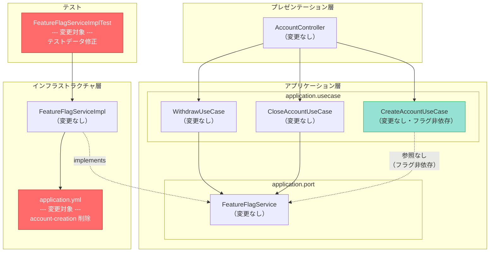
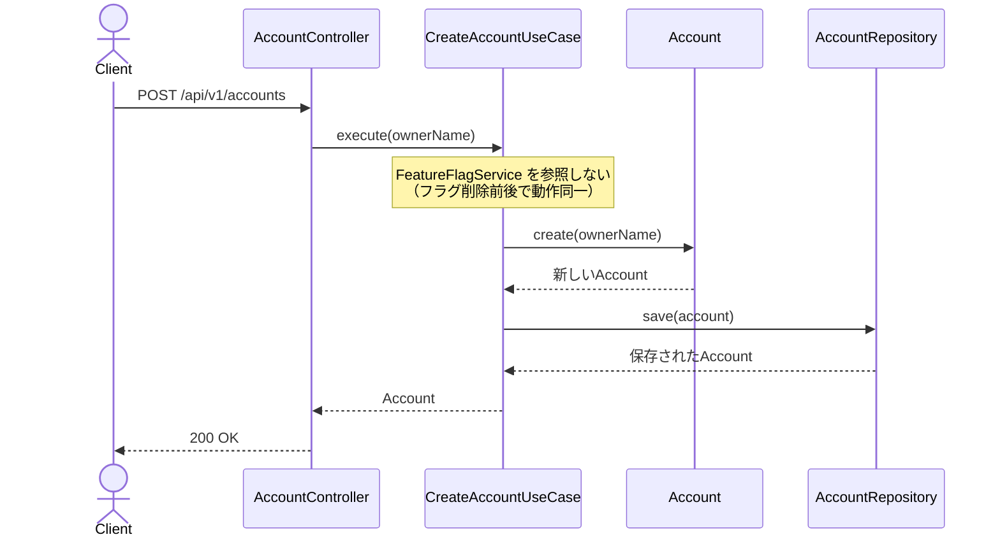
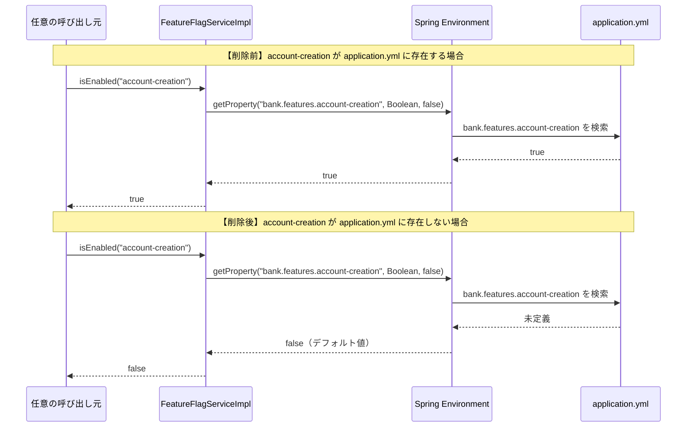
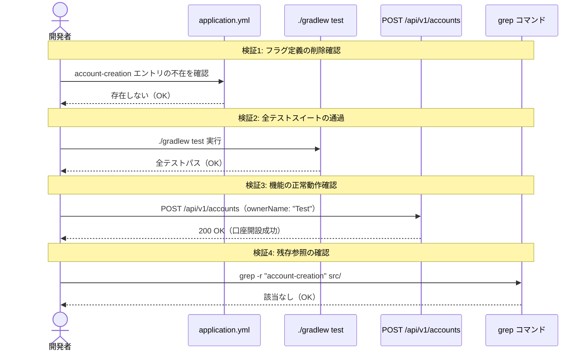
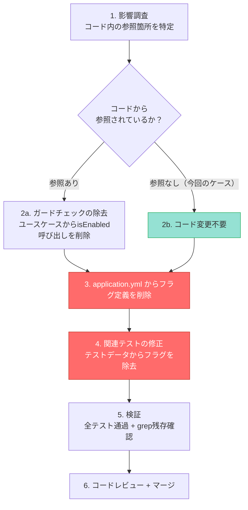

# account-creation フィーチャーフラグの削除 システム設計書

## 1. 概要

### 1.1 目的

`account-creation` フィーチャーフラグは `application.yml` に `true` で定義されているが、`CreateAccountUseCase` では `FeatureFlagService.isEnabled()` を一切呼び出しておらず、フラグ定義自体が死コードとなっている。本設計書では、この死コードの削除と関連テストの修正を行い、フラグ削除プロセスのパイロットケースを確立する。

### 1.2 関連ADR

- [ADR-0004: account-creation フィーチャーフラグの削除](./01-adr.md)
- [ADR-0001: 銀行システムサンプルプロジェクトのアーキテクチャ](../0001-bank-system-tbd-sample/01-adr.md)（フラグライフサイクルの根拠）
- [ADR-0003: 機能フラグ競合時のコード分離パターン](../0003-feature-flag-conflict-resolution/01-adr.md)（フラグ状態の一覧記載あり）

### 1.3 スコープ

- **対象**: `application.yml` の `bank.features.account-creation: true` 定義の削除、`FeatureFlagServiceImplTest` のテストデータ修正
- **対象外**: `CreateAccountUseCase` のコード変更（フラグ非依存のため不要）、他の5フラグ（`deposit`, `withdrawal`, `transaction-history`, `account-closure`, `withdrawal-fee`）への変更、ドメインモデル・API・DBスキーマの変更

### 1.4 変更規模

変更対象は2ファイルのみであり、機能的な影響はゼロである。

| 変更対象 | 変更内容 | リスク |
|---------|---------|-------|
| `src/main/resources/application.yml` | `account-creation: true` の1行を削除 | 極めて低い（コードから参照されていない） |
| `FeatureFlagServiceImplTest.java` | テストデータから `account-creation` を除去し、`deposit` に置き換え | 極めて低い（テストの意図は維持される） |

## 2. コンポーネント設計

### 2.1 コンポーネント図（変更箇所ハイライト）



### 2.2 各コンポーネントの責務と変更有無

| コンポーネント | パッケージ | 変更有無 | 説明 |
|------------|----------|---------|------|
| `application.yml` | resources | **変更あり** | `account-creation: true` の定義を削除する |
| `FeatureFlagServiceImplTest` | infrastructure.feature | **変更あり** | テストデータの `account-creation` を `deposit` に置き換える |
| `CreateAccountUseCase` | application.usecase | 変更なし | `FeatureFlagService` に依存しておらず、フラグ削除の影響を受けない |
| `FeatureFlagServiceImpl` | infrastructure.feature | 変更なし | `Environment.getProperty()` で動的にフラグを解決するため、定義が消えた場合はデフォルト値 `false` を返す |
| `FeatureFlagService` | application.port | 変更なし | インターフェースに変更なし |
| `AccountController` | presentation.controller | 変更なし | 口座開設エンドポイントの動作に影響なし |

### 2.3 フラグ非依存の証拠

`CreateAccountUseCase` のコード全文を以下に示す。`FeatureFlagService` への依存が存在しないことが確認できる。

```java
@Service
public class CreateAccountUseCase {
    private final AccountRepository accountRepository;

    public CreateAccountUseCase(AccountRepository accountRepository) {
        this.accountRepository = accountRepository;
    }

    public Account execute(String ownerName) {
        Account account = Account.create(ownerName);
        return accountRepository.save(account);
    }
}
```

コンストラクタに `FeatureFlagService` の注入がなく、`execute()` メソッド内で `isEnabled()` を呼び出していない。したがって、`application.yml` から `account-creation` フラグを削除しても、口座開設機能の動作は一切変わらない。

## 3. シーケンス設計

### 3.1 正常系: フラグ削除後の口座開設フロー（変更なし）

フラグ削除前後で口座開設のシーケンスに変化がないことを示す。



### 3.2 正常系: フラグ解決フロー（削除後の他フラグの動作確認）

`FeatureFlagServiceImpl` が `account-creation` の問い合わせを受けた場合の動作変化を示す。ただし、現在のコードベースでこの問い合わせを行う箇所は存在しない。



### 3.3 検証フロー: フラグ削除の安全性確認

ADR-0004の確認方法に対応する検証手順をシーケンスとして示す。



## 4. データモデル設計

### 4.1 ER図

DBスキーマの変更はなし。該当なしとする。

理由: `account-creation` フラグはデータベースに格納されておらず（`application.yml` で管理）、`CreateAccountUseCase` はフラグに依存していないため、フラグ削除がデータモデルに影響することはない。

### 4.2 application.yml の変更前後

#### 変更前

```yaml
bank:
  features:
    account-creation: true    # <-- 削除対象（死コード）
    deposit: true
    withdrawal: true
    transaction-history: true
    account-closure: true
    withdrawal-fee: true
  withdrawal:
    fee-rate: 0.01
```

#### 変更後

```yaml
bank:
  features:
    deposit: true
    withdrawal: true
    transaction-history: true
    account-closure: true
    withdrawal-fee: true
  withdrawal:
    fee-rate: 0.01
```

### 4.3 フラグ一覧の変更

| フラグ名 | 変更前 | 変更後 | 理由 |
|---------|-------|-------|------|
| `account-creation` | `true` | **削除** | コードから参照されていない死コード |
| `deposit` | `true` | `true`（変更なし） | - |
| `withdrawal` | `true` | `true`（変更なし） | - |
| `transaction-history` | `true` | `true`（変更なし） | - |
| `account-closure` | `true` | `true`（変更なし） | - |
| `withdrawal-fee` | `true` | `true`（変更なし） | - |

## 5. テスト設計

### 5.1 修正対象テスト

#### FeatureFlagServiceImplTest のテストデータ修正

**変更前:**

```java
@TestPropertySource(properties = {
        "bank.features.account-creation=true",    // <-- 削除対象
        "bank.features.withdrawal=false",
        "bank.features.account-closure=false",
        "bank.features.withdrawal-fee=false"
})
```

**変更後:**

```java
@TestPropertySource(properties = {
        "bank.features.deposit=true",             // <-- deposit に置き換え
        "bank.features.withdrawal=false",
        "bank.features.account-closure=false",
        "bank.features.withdrawal-fee=false"
})
```

#### テストメソッドの修正

**変更前:**

```java
@Test
@DisplayName("フラグがONの場合isEnabled()がtrueを返すこと")
void shouldReturnTrueWhenFlagIsEnabled() {
    assertThat(featureFlagService.isEnabled("account-creation")).isTrue();
}
```

**変更後:**

```java
@Test
@DisplayName("フラグがONの場合isEnabled()がtrueを返すこと")
void shouldReturnTrueWhenFlagIsEnabled() {
    assertThat(featureFlagService.isEnabled("deposit")).isTrue();
}
```

### 5.2 テストの意図の保持

修正後もテストの意図は変わらない。

| テストメソッド | テストの意図 | 変更前のデータ | 変更後のデータ | 意図の保持 |
|-------------|-----------|-------------|-------------|-----------|
| `shouldReturnTrueWhenFlagIsEnabled` | ONのフラグが `true` を返す | `account-creation=true` | `deposit=true` | 保持される（ONフラグの挙動テスト） |
| `shouldReturnFalseWhenFlagIsDisabled` | OFFのフラグが `false` を返す | `withdrawal=false` | `withdrawal=false`（変更なし） | 保持される |
| `shouldReturnFalseForUnknownFlag` | 未定義フラグが `false` を返す | `unknown-feature` | `unknown-feature`（変更なし） | 保持される |
| `shouldReturnFalseForAccountClosureByDefault` | `account-closure` がOFF | `account-closure=false` | `account-closure=false`（変更なし） | 保持される |
| `shouldReturnFalseForWithdrawalFeeByDefault` | `withdrawal-fee` がOFF | `withdrawal-fee=false` | `withdrawal-fee=false`（変更なし） | 保持される |

### 5.3 検証項目（ADR-0004 フィットネス関数対応）

ADR-0004の「確認方法」に対応する検証手順を以下に示す。

| # | 確認方法（ADR-0004） | 検証手順 | 期待結果 |
|---|-------------------|---------|---------|
| 1 | フラグ定義の削除確認 | `application.yml` を目視確認、または `grep "account-creation" src/main/resources/application.yml` | `account-creation` のエントリが存在しない |
| 2 | 全テストスイートの通過 | `./gradlew test` を実行 | 全テスト（ユニット・インテグレーション・ArchUnit）がパス |
| 3 | 機能の正常動作確認 | `POST /api/v1/accounts` を実行（アプリケーション起動後） | 200 OK で口座が正常に開設される |
| 4 | grep による残存確認 | `grep -r "account-creation" src/` を実行 | 該当なし（0件） |

### 5.4 既存テストへの影響

| テストクラス | 影響 | 理由 |
|------------|------|------|
| `FeatureFlagServiceImplTest` | **修正が必要** | テストデータに `account-creation` を使用している |
| `CreateAccountUseCaseTest`（存在する場合） | 影響なし | `FeatureFlagService` に依存していない |
| `FeatureFlagCombinationIntegrationTest` | 要確認 | `account-creation` をテストデータに含んでいる可能性がある |
| その他のユースケーステスト | 影響なし | `account-creation` フラグを参照していない |

### 5.5 回帰テスト戦略

フラグ削除後の回帰テストとして、以下を順に実行する。

1. `./gradlew test` -- 全テストがパスすることを確認
2. `grep -r "account-creation" src/` -- ソースコード内に残存参照がないことを確認
3. `grep -r "account-creation" src/test/` -- テストコード内に残存参照がないことを確認

## 6. フラグ削除プロセスの標準化

### 6.1 本ADRで確立するフラグ削除手順

本設計はフラグ削除プロセスのパイロットケースである。以下の手順を今後のフラグ削除の標準プロセスとして確立する。



### 6.2 account-creation フラグの削除が最もリスクが低い理由

| 要因 | account-creation | 他のフラグ（例: withdrawal） |
|------|-----------------|--------------------------|
| コードでの参照 | なし（死コード） | あり（`WithdrawUseCase` でガードチェック） |
| 削除時のコード変更 | `application.yml` + テストのみ | ユースケース + コントローラー + テスト |
| 機能への影響 | ゼロ | フラグ削除によりガードが外れる |
| 回帰リスク | 極めて低い | 中程度（動作変更を伴う） |

## 7. 非機能要件

### 7.1 パフォーマンス

影響なし。設定ファイルから1行削除するだけであり、アプリケーションの起動時間やレスポンスタイムに影響しない。

### 7.2 セキュリティ

影響なし。フラグが削除されても口座開設機能の認証・認可に変更はない（本プロジェクトでは認証機構は未実装）。

### 7.3 保守性

- ポジティブ: `application.yml` から死コードが除去され、設定ファイルの正確性と可読性が向上する
- ポジティブ: 新規参画者が「`account-creation` フラグはどこで使われているのか」を調査する無駄な時間がなくなる
- ポジティブ: フラグ削除プロセスの標準手順が確立される
