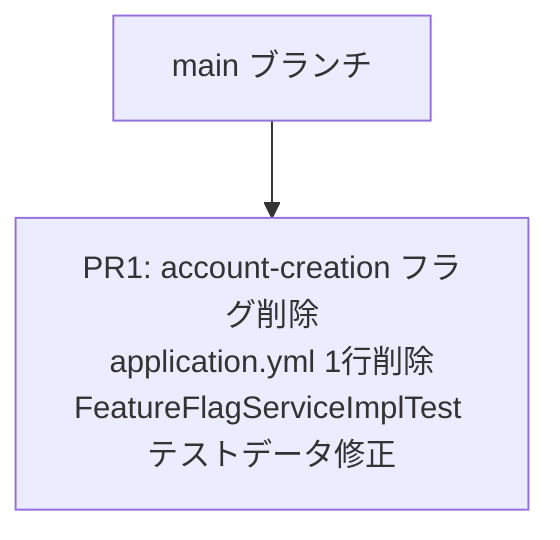

# 実装計画書: account-creation フィーチャーフラグの削除

## 関連ドキュメント

- [ADR-0004: account-creation フィーチャーフラグの削除](./01-adr.md)
- [システム設計書](./02-spec.md)
- [ADR-0001: 銀行システムサンプルプロジェクトのアーキテクチャ](../0001-bank-system-tbd-sample/01-adr.md)
- [ADR-0003: 機能フラグ競合時のコード分離パターン](../0003-feature-flag-conflict-resolution/01-adr.md)

## 変更規模と方針

変更対象は2ファイル・実質3行の修正であり、機能的な影響はゼロである。この規模に対して複数PRに分割することは無意味なオーバーヘッドとなるため、**PRは1つ**とする。

ADR-0004の決定に従い、以下のみを変更する:

| 変更対象 | 変更内容 |
|---------|---------|
| `src/main/resources/application.yml` | `account-creation: true` の1行を削除 |
| `src/test/java/com/example/bank/infrastructure/feature/FeatureFlagServiceImplTest.java` | テストデータの `account-creation=true` を `deposit=true` に置き換え、アサーションの `account-creation` を `deposit` に変更 |

## スタックPR構成

```
main
 └── PR1: account-creation フラグ削除（設定ファイル + テスト修正）
```

## 依存関係図



---

## Phase 1: account-creation フラグ削除

**対応PR**: PR1（親ブランチ: `main`）
**目的**: `application.yml` から死コードとなっている `account-creation` フラグ定義を削除し、`FeatureFlagServiceImplTest` のテストデータを有効なフラグ（`deposit`）に置き換える。フラグ削除プロセスのパイロットケースを完遂し、今後のフラグ削除手順を確立する。

### Task 1.1: FeatureFlagServiceImplTest のテストデータ修正（RED → GREEN）

#### RED: テストの修正

**テストファイル**: `src/test/java/com/example/bank/infrastructure/feature/FeatureFlagServiceImplTest.java`

現在のテストは `account-creation=true` をON側のテストデータとして使用しているが、このフラグを `application.yml` から削除すると `isEnabled("account-creation")` が `false` を返すようになり、テストが失敗する。

**失敗するテスト**: `shouldReturnTrueWhenFlagIsEnabled()`

失敗の再現手順:
1. `application.yml` の `account-creation: true` を削除する（Task 1.2）
2. `./gradlew test --tests "com.example.bank.infrastructure.feature.FeatureFlagServiceImplTest"` を実行
3. `shouldReturnTrueWhenFlagIsEnabled()` が失敗することを確認する

テストケース（修正後の期待動作）:

| テストメソッド | Given | When | Then |
|------------|-------|------|------|
| `shouldReturnTrueWhenFlagIsEnabled` | `bank.features.deposit=true` がプロパティに設定されている | `featureFlagService.isEnabled("deposit")` を呼ぶ | `true` を返す |
| `shouldReturnFalseWhenFlagIsDisabled` | `bank.features.withdrawal=false` が設定されている | `featureFlagService.isEnabled("withdrawal")` を呼ぶ | `false` を返す（変更なし） |
| `shouldReturnFalseForUnknownFlag` | `unknown-feature` プロパティが未定義 | `featureFlagService.isEnabled("unknown-feature")` を呼ぶ | `false` を返す（変更なし） |
| `shouldReturnFalseForAccountClosureByDefault` | `bank.features.account-closure=false` が設定されている | `featureFlagService.isEnabled("account-closure")` を呼ぶ | `false` を返す（変更なし） |
| `shouldReturnFalseForWithdrawalFeeByDefault` | `bank.features.withdrawal-fee=false` が設定されている | `featureFlagService.isEnabled("withdrawal-fee")` を呼ぶ | `false` を返す（変更なし） |

**修正内容**:

```java
// 変更前
@TestPropertySource(properties = {
        "bank.features.account-creation=true",
        "bank.features.withdrawal=false",
        "bank.features.account-closure=false",
        "bank.features.withdrawal-fee=false"
})
// ...
void shouldReturnTrueWhenFlagIsEnabled() {
    assertThat(featureFlagService.isEnabled("account-creation")).isTrue();
}

// 変更後
@TestPropertySource(properties = {
        "bank.features.deposit=true",
        "bank.features.withdrawal=false",
        "bank.features.account-closure=false",
        "bank.features.withdrawal-fee=false"
})
// ...
void shouldReturnTrueWhenFlagIsEnabled() {
    assertThat(featureFlagService.isEnabled("deposit")).isTrue();
}
```

**検証コマンド（RED確認 — application.yml 削除前に実行）**:

```bash
# Task 1.2 の application.yml 変更を先に行い、テストが失敗することを確認する
./gradlew test --tests "com.example.bank.infrastructure.feature.FeatureFlagServiceImplTest"
```

#### GREEN: テストを通す修正

**修正ファイル**: `src/test/java/com/example/bank/infrastructure/feature/FeatureFlagServiceImplTest.java`

実装項目:
- `@TestPropertySource` の `bank.features.account-creation=true` を `bank.features.deposit=true` に変更する
- `shouldReturnTrueWhenFlagIsEnabled()` 内の `featureFlagService.isEnabled("account-creation")` を `featureFlagService.isEnabled("deposit")` に変更する
- 他の4つのテストメソッドは変更しない

**検証コマンド（GREEN確認）**:

```bash
./gradlew test --tests "com.example.bank.infrastructure.feature.FeatureFlagServiceImplTest"
```

#### REFACTOR: リファクタリング

- テストの意図（ONフラグが `true` を返すこと）がコメントや `@DisplayName` で明確に伝わるか確認する
- 現在の `@DisplayName("フラグがONの場合isEnabled()がtrueを返すこと")` はフラグ名に依存しておらず、修正後もそのまま維持できる
- リファクタリング対象なし（`@DisplayName` は変更不要）

---

### Task 1.2: application.yml の account-creation フラグ定義削除

#### RED: 失敗の再現

`application.yml` から `account-creation: true` を削除すると、`FeatureFlagServiceImplTest.shouldReturnTrueWhenFlagIsEnabled()` が失敗する。これがREDステートである（Task 1.1のテスト修正前に実行すると確認できる）。

Task 1.1 と Task 1.2 は同一コミットにまとめるため、実際の作業順序は以下とする:
1. `application.yml` から `account-creation: true` を削除する（Task 1.2）
2. `FeatureFlagServiceImplTest` のテストデータを修正する（Task 1.1）
3. テストを実行し、全件パスすることを確認する（GREEN）

#### GREEN: 設定ファイルの修正

**修正ファイル**: `src/main/resources/application.yml`

実装項目:
- `bank.features.account-creation: true` の1行を削除する
- 前後の行（`deposit: true`）との整合性を確認する
- インデントが崩れていないことを確認する

```yaml
# 変更前
bank:
  features:
    account-creation: true
    deposit: true
    withdrawal: true
    transaction-history: true
    account-closure: true
    withdrawal-fee: true
  withdrawal:
    fee-rate: 0.01

# 変更後
bank:
  features:
    deposit: true
    withdrawal: true
    transaction-history: true
    account-closure: true
    withdrawal-fee: true
  withdrawal:
    fee-rate: 0.01
```

**検証コマンド（GREEN確認）**:

```bash
# 全テストスイートの実行
./gradlew test

# 残存参照の確認（0件であること）
grep -r "account-creation" src/
```

#### REFACTOR: リファクタリング

- `application.yml` のフラグ一覧が `deposit` から始まる自然な順序になっているか確認する
- コメントが必要な場合は `withdrawal-fee` の行コメント（`# 出金手数料の有効/無効（withdrawal フラグに依存）`）のみ残す
- `account-creation` に関するコメントが他箇所に残っていないか確認する

---

## 品質チェックポイント（Phase 1 完了時）

### ADR-0004 フィットネス関数

| # | 確認内容 | 検証コマンド / 方法 | 期待結果 |
|---|---------|-------------------|---------|
| 1 | `application.yml` に `account-creation` が存在しないこと | `grep "account-creation" src/main/resources/application.yml` | 0件（該当なし） |
| 2 | 全テストスイートがパスすること | `./gradlew test` | BUILD SUCCESS、全テストGREEN |
| 3 | ソースコード全体に `account-creation` の残存参照がないこと | `grep -r "account-creation" src/` | 0件（該当なし） |
| 4 | テストコードにも残存参照がないこと | `grep -r "account-creation" src/test/` | 0件（該当なし） |

### 仕様書との整合性

- [ ] `application.yml` の変更後フォーマットが仕様書「4.2 application.yml の変更前後」の「変更後」と一致している
- [ ] `FeatureFlagServiceImplTest` の `@TestPropertySource` が仕様書「5.1 修正対象テスト」の「変更後」と一致している
- [ ] `shouldReturnTrueWhenFlagIsEnabled()` のアサーションが `deposit` を参照している

### ADR決定事項への準拠

- [ ] `CreateAccountUseCase` に変更が加えられていないこと（ADR-0004: ユースケース変更なし）
- [ ] `deposit`, `withdrawal`, `transaction-history`, `account-closure`, `withdrawal-fee` の5フラグが `application.yml` に残存していること（ADR-0004: 他フラグへの影響なし）
- [ ] `FeatureFlagService` / `FeatureFlagServiceImpl` が削除されていないこと（ADR-0004: フラグ基盤の保持）

### テストカバレッジの確認

- [ ] `FeatureFlagServiceImplTest` の5テストメソッドが全件パスすること
- [ ] フラグ削除後の `shouldReturnTrueWhenFlagIsEnabled()` が `deposit` フラグで正常にアサートされること
- [ ] `FeatureFlagCombinationIntegrationTest`（存在する場合）が全件パスすること

### コーディング規約の遵守

- [ ] `application.yml` のインデント（2スペース）が統一されていること
- [ ] テストの `@DisplayName` が日本語で記述されていること（既存規約）
- [ ] 変更行数が最小限（2〜3行）であること

---

## PR情報

### PR1: account-creation フラグ削除（設定ファイル + テスト修正）

**親ブランチ**: `main`
**推定変更行数**: 削除3行（application.yml 1行 + テスト2行）
**ブランチ命名例**: `feature/0004-feature-flag-removal-after-release`

**コミットメッセージ（案）**:

```
chore: remove account-creation feature flag (pilot flag cleanup)

application.ymlからaccount-creation: trueの定義を削除する。
CreateAccountUseCaseはFeatureFlagServiceを参照していないため
コード変更不要。FeatureFlagServiceImplTestのテストデータを
account-creation=trueからdeposit=trueに置き換える。

This is the pilot case for the flag cleanup process (ADR-0004).
Closes #(issue番号)
```

**PRレビュー観点**:

1. `application.yml` から `account-creation: true` の1行のみ削除されていること
2. `FeatureFlagServiceImplTest` のテストデータと1つのアサーションのみ変更されていること
3. `CreateAccountUseCase` に変更が加えられていないこと
4. 他の5フラグ（`deposit`, `withdrawal`, `transaction-history`, `account-closure`, `withdrawal-fee`）が `application.yml` に残存していること

---

## フラグ削除プロセスの標準化（本ADRで確立）

本計画の実施により、以下のフラグ削除標準手順が確立される。

```
1. 影響調査: grep -r "{flag-name}" src/ でコード内参照を確認
2. コード変更（参照ありの場合）: ユースケースのガードチェックを除去
3. 設定削除: application.yml からフラグ定義を削除
4. テスト修正: テストデータからフラグを除去・代替フラグに置き換え
5. 検証: ./gradlew test && grep -r "{flag-name}" src/
6. レビュー & マージ
```

`account-creation` はステップ2（コード変更）が不要なため、最もリスクの低いパイロットケースとして最適である。
