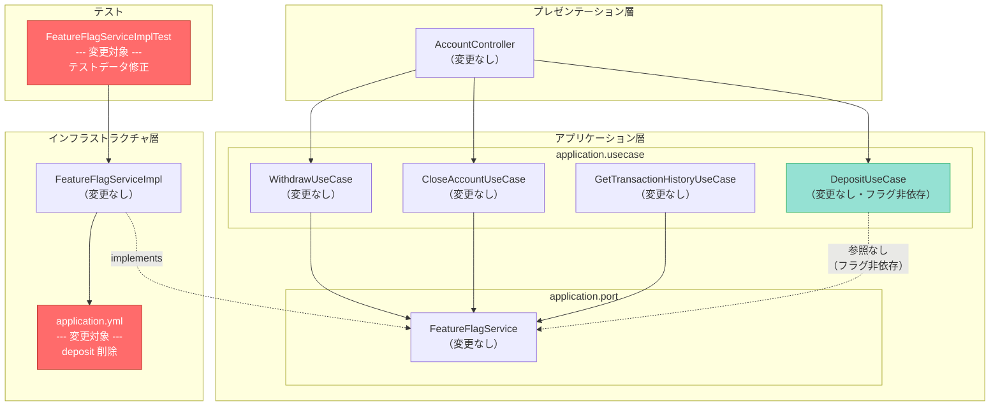
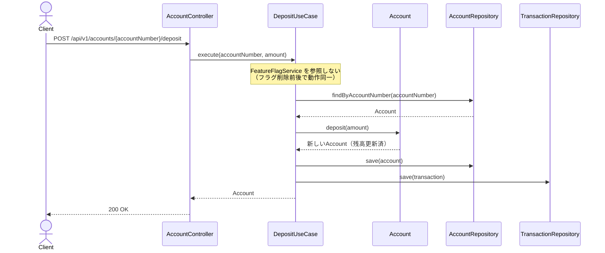
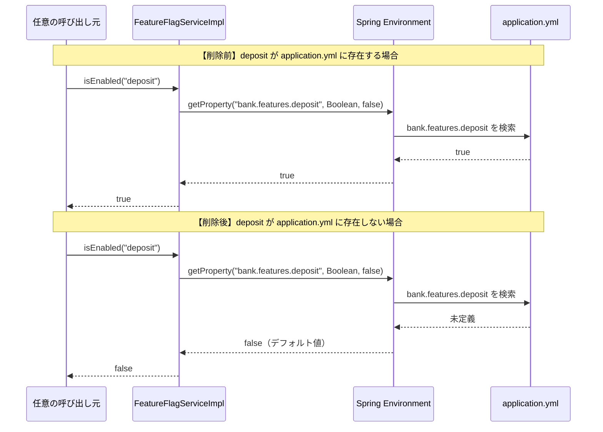
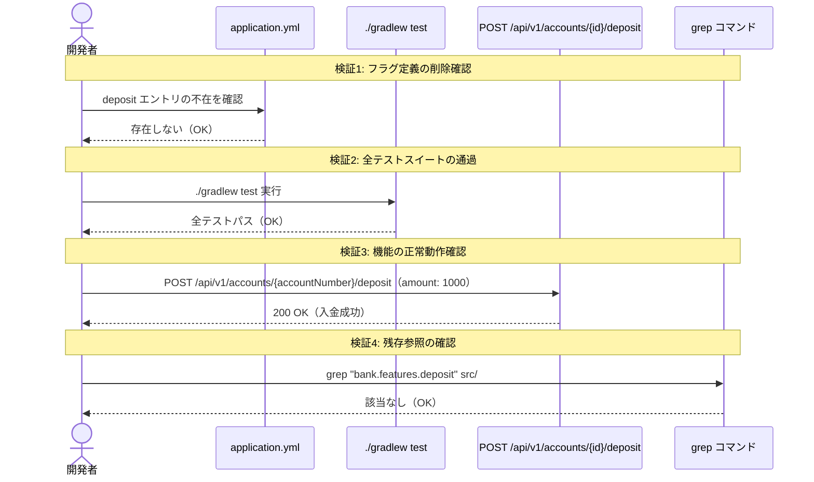
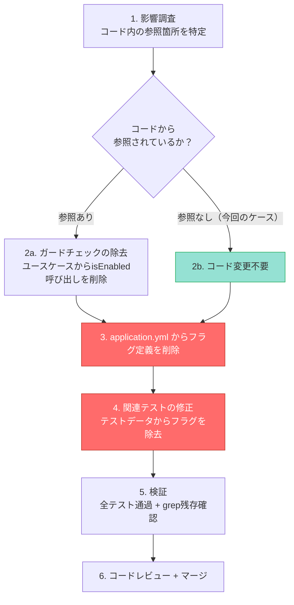

# deposit フィーチャーフラグの削除 システム設計書

## 1. 概要

### 1.1 目的

`deposit` フィーチャーフラグは `application.yml` に `true` で定義されているが、`DepositUseCase` では `FeatureFlagService.isEnabled()` を一切呼び出しておらず、フラグ定義自体が死コードとなっている。本設計書では、ADR-0004で確立したフラグ削除プロセスを再適用し、`deposit` フラグの削除と関連テストの修正を行う。

### 1.2 関連ADR

- [ADR-0005: deposit フィーチャーフラグの削除](./01-adr.md)
- [ADR-0004: account-creation フィーチャーフラグの削除](../0004-feature-flag-removal-after-release/01-adr.md)（パイロットケース）
- [ADR-0001: 銀行システムサンプルプロジェクトのアーキテクチャ](../0001-bank-system-tbd-sample/01-adr.md)（フラグライフサイクルの根拠）

### 1.3 スコープ

- **対象**: `application.yml` の `bank.features.deposit: true` 定義の削除、`FeatureFlagServiceImplTest` のテストデータ修正
- **対象外**: `DepositUseCase` のコード変更（フラグ非依存のため不要）、他の4フラグ（`withdrawal`, `transaction-history`, `account-closure`, `withdrawal-fee`）への変更、ドメインモデル・API・DBスキーマの変更

### 1.4 変更規模

変更対象は2ファイルのみであり、機能的な影響はゼロである。

| 変更対象 | 変更内容 | リスク |
|---------|---------|-------|
| `src/main/resources/application.yml` | `deposit: true` の1行を削除 | 極めて低い（コードから参照されていない） |
| `FeatureFlagServiceImplTest.java` | テストデータの `deposit=true` を `withdrawal=true` に置き換え、`withdrawal=false` を `transaction-history=false` に置き換え | 極めて低い（テストの意図は維持される） |

## 2. コンポーネント設計

### 2.1 コンポーネント図（変更箇所ハイライト）



### 2.2 各コンポーネントの責務と変更有無

| コンポーネント | パッケージ | 変更有無 | 説明 |
|------------|----------|---------|------|
| `application.yml` | resources | **変更あり** | `deposit: true` の定義を削除する |
| `FeatureFlagServiceImplTest` | infrastructure.feature | **変更あり** | テストデータの `deposit` を別のフラグに置き換える |
| `DepositUseCase` | application.usecase | 変更なし | `FeatureFlagService` に依存しておらず、フラグ削除の影響を受けない |
| `FeatureFlagServiceImpl` | infrastructure.feature | 変更なし | `Environment.getProperty()` で動的にフラグを解決するため、定義が消えた場合はデフォルト値 `false` を返す |
| `FeatureFlagService` | application.port | 変更なし | インターフェースに変更なし |
| `AccountController` | presentation.controller | 変更なし | 入金エンドポイントの動作に影響なし |

### 2.3 フラグ非依存の証拠

`DepositUseCase` のコード全文を以下に示す。`FeatureFlagService` への依存が存在しないことが確認できる。

```java
@Service
public class DepositUseCase {
    private final AccountRepository accountRepository;
    private final TransactionRepository transactionRepository;

    public DepositUseCase(AccountRepository accountRepository,
                          TransactionRepository transactionRepository) {
        this.accountRepository = accountRepository;
        this.transactionRepository = transactionRepository;
    }

    @Transactional
    public Account execute(AccountNumber accountNumber, Money amount) {
        Account account = accountRepository.findByAccountNumber(accountNumber)
                .orElseThrow(() -> new AccountNotFoundException(accountNumber));

        Account deposited = account.deposit(amount);
        accountRepository.save(deposited);

        Transaction transaction = Transaction.deposit(
                accountNumber, amount, deposited.getBalance());
        transactionRepository.save(transaction);

        return deposited;
    }
}
```

コンストラクタに `FeatureFlagService` の注入がなく、`execute()` メソッド内で `isEnabled()` を呼び出していない。したがって、`application.yml` から `deposit` フラグを削除しても、入金機能の動作は一切変わらない。

## 3. シーケンス設計

### 3.1 正常系: フラグ削除後の入金フロー（変更なし）

フラグ削除前後で入金のシーケンスに変化がないことを示す。



### 3.2 正常系: フラグ解決フロー（削除後の動作変化）

`FeatureFlagServiceImpl` が `deposit` の問い合わせを受けた場合の動作変化を示す。ただし、現在のコードベースでこの問い合わせを行う箇所は存在しない。



### 3.3 検証フロー: フラグ削除の安全性確認



## 4. データモデル設計

### 4.1 ER図

DBスキーマの変更はなし。該当なしとする。

理由: `deposit` フラグはデータベースに格納されておらず（`application.yml` で管理）、`DepositUseCase` はフラグに依存していないため、フラグ削除がデータモデルに影響することはない。

### 4.2 application.yml の変更前後

#### 変更前

```yaml
bank:
  features:
    deposit: true              # <-- 削除対象（死コード）
    withdrawal: true
    transaction-history: true
    account-closure: false
    withdrawal-fee: false
  withdrawal:
    fee-rate: 0.01
```

#### 変更後

```yaml
bank:
  features:
    withdrawal: true
    transaction-history: true
    account-closure: false
    withdrawal-fee: false
  withdrawal:
    fee-rate: 0.01
```

### 4.3 フラグ一覧の変更

| フラグ名 | 変更前 | 変更後 | 理由 |
|---------|-------|-------|------|
| `deposit` | `true` | **削除** | コードから参照されていない死コード |
| `withdrawal` | `true` | `true`（変更なし） | `WithdrawUseCase` で参照中 |
| `transaction-history` | `true` | `true`（変更なし） | `GetTransactionHistoryUseCase` で参照中 |
| `account-closure` | `false` | `false`（変更なし） | `CloseAccountUseCase` で参照中 |
| `withdrawal-fee` | `false` | `false`（変更なし） | `WithdrawalPolicyConfig` で参照中 |

## 5. テスト設計

### 5.1 修正対象テスト

#### FeatureFlagServiceImplTest のテストデータ修正

`deposit` フラグ削除後、ON側のテストデータとして `withdrawal`（現在 `application.yml` で `true`）を使用する。それに伴い、OFF側のテストデータも調整する。

**変更前:**

```java
@TestPropertySource(properties = {
        "bank.features.deposit=true",          // <-- 削除対象
        "bank.features.withdrawal=false",
        "bank.features.account-closure=false",
        "bank.features.withdrawal-fee=false"
})
```

**変更後:**

```java
@TestPropertySource(properties = {
        "bank.features.withdrawal=true",       // <-- ON側テストデータに変更
        "bank.features.transaction-history=false",
        "bank.features.account-closure=false",
        "bank.features.withdrawal-fee=false"
})
```

#### テストメソッドの修正

**変更前:**

```java
@Test
@DisplayName("フラグがONの場合isEnabled()がtrueを返すこと")
void shouldReturnTrueWhenFlagIsEnabled() {
    assertThat(featureFlagService.isEnabled("deposit")).isTrue();
}

@Test
@DisplayName("フラグがOFFの場合isEnabled()がfalseを返すこと")
void shouldReturnFalseWhenFlagIsDisabled() {
    assertThat(featureFlagService.isEnabled("withdrawal")).isFalse();
}
```

**変更後:**

```java
@Test
@DisplayName("フラグがONの場合isEnabled()がtrueを返すこと")
void shouldReturnTrueWhenFlagIsEnabled() {
    assertThat(featureFlagService.isEnabled("withdrawal")).isTrue();
}

@Test
@DisplayName("フラグがOFFの場合isEnabled()がfalseを返すこと")
void shouldReturnFalseWhenFlagIsDisabled() {
    assertThat(featureFlagService.isEnabled("transaction-history")).isFalse();
}
```

### 5.2 テストの意図の保持

修正後もテストの意図は変わらない。

| テストメソッド | テストの意図 | 変更前のデータ | 変更後のデータ | 意図の保持 |
|-------------|-----------|-------------|-------------|-----------|
| `shouldReturnTrueWhenFlagIsEnabled` | ONのフラグが `true` を返す | `deposit=true` | `withdrawal=true` | 保持される（ONフラグの挙動テスト） |
| `shouldReturnFalseWhenFlagIsDisabled` | OFFのフラグが `false` を返す | `withdrawal=false` | `transaction-history=false` | 保持される（OFFフラグの挙動テスト） |
| `shouldReturnFalseForUnknownFlag` | 未定義フラグが `false` を返す | `unknown-feature` | `unknown-feature`（変更なし） | 保持される |
| `shouldReturnFalseForAccountClosureByDefault` | `account-closure` がOFF | `account-closure=false` | `account-closure=false`（変更なし） | 保持される |
| `shouldReturnFalseForWithdrawalFeeByDefault` | `withdrawal-fee` がOFF | `withdrawal-fee=false` | `withdrawal-fee=false`（変更なし） | 保持される |

### 5.3 検証項目（ADR-0005 フィットネス関数対応）

| # | 確認方法（ADR-0005） | 検証手順 | 期待結果 |
|---|-------------------|---------|---------|
| 1 | フラグ定義の削除確認 | `application.yml` を目視確認、または `grep "deposit" src/main/resources/application.yml` | `bank.features.deposit` のエントリが存在しない |
| 2 | 全テストスイートの通過 | `./gradlew test` を実行 | 全テスト（ユニット・インテグレーション・ArchUnit）がパス |
| 3 | 機能の正常動作確認 | `POST /api/v1/accounts/{accountNumber}/deposit` を実行 | 200 OK で入金が正常に処理される |
| 4 | grep による残存確認 | `grep "bank.features.deposit" src/` を実行 | 該当なし（0件）。注: `deposit` はドメイン用語として正当に使用されるため、検索対象は `bank.features.deposit` に限定する |

### 5.4 既存テストへの影響

| テストクラス | 影響 | 理由 |
|------------|------|------|
| `FeatureFlagServiceImplTest` | **修正が必要** | テストデータに `deposit=true` を使用している |
| `DepositUseCaseTest`（存在する場合） | 影響なし | `FeatureFlagService` に依存していない |
| `FeatureFlagCombinationTest` | 影響なし | `deposit` はドメイン操作（入金API呼び出し）として使用されており、フラグ名としては参照していない |
| その他のユースケーステスト | 影響なし | `deposit` フラグを参照していない |

### 5.5 回帰テスト戦略

フラグ削除後の回帰テストとして、以下を順に実行する。

1. `./gradlew test` -- 全テストがパスすることを確認
2. `grep "bank.features.deposit" src/` -- ソースコード内にフラグ定義の残存参照がないことを確認
3. `grep "bank.features.deposit" src/test/` -- テストコード内にフラグ定義の残存参照がないことを確認

## 6. フラグ削除プロセスの再適用

### 6.1 ADR-0004で確立した標準手順の適用

本設計はADR-0004（パイロット）で確立したフラグ削除プロセスの2件目の適用である。



### 6.2 パイロット（ADR-0004）との比較

| 項目 | ADR-0004 (account-creation) | ADR-0005 (deposit) |
|------|---------------------------|-------------------|
| フラグの状態 | `true`（死コード） | `true`（死コード） |
| ユースケースの依存 | なし | なし |
| 変更ファイル数 | 2（yml + test） | 2（yml + test） |
| テスト修正の内容 | `account-creation` → `deposit` | `deposit` → `withdrawal` |
| リスクレベル | 極めて低い | 極めて低い |

### 6.3 残りのフラグ削除ロードマップ

| フェーズ | フラグ | パターン | リスク | ステータス |
|---------|-------|---------|-------|-----------|
| Phase 1（完了） | `account-creation` | 死コード（コード参照なし） | 極低 | ADR-0004で削除済 |
| **Phase 2（本ADR）** | **`deposit`** | **死コード（コード参照なし）** | **極低** | **本設計で対応** |
| Phase 3（次回以降） | `withdrawal` | アクティブON（ガードチェック除去要） | 中 | 未着手 |
| Phase 3（次回以降） | `transaction-history` | アクティブON（ガードチェック除去要） | 中 | 未着手 |
| Phase 4（最後） | `account-closure` / `withdrawal-fee` | アクティブOFF（機能統合要） | 高 | 未着手 |

## 7. 非機能要件

### 7.1 パフォーマンス

影響なし。設定ファイルから1行削除するだけであり、アプリケーションの起動時間やレスポンスタイムに影響しない。

### 7.2 セキュリティ

影響なし。フラグが削除されても入金機能の認証・認可に変更はない（本プロジェクトでは認証機構は未実装）。

### 7.3 保守性

- ポジティブ: `application.yml` から2つ目の死コードフラグが除去され、設定ファイルの正確性と可読性がさらに向上する
- ポジティブ: ADR-0004プロセスの再現性が実証され、残りのフラグ削除への信頼性が高まる
- ポジティブ: 新規参画者が「`deposit` フラグはどこで使われているのか」を調査する無駄な時間がなくなる
