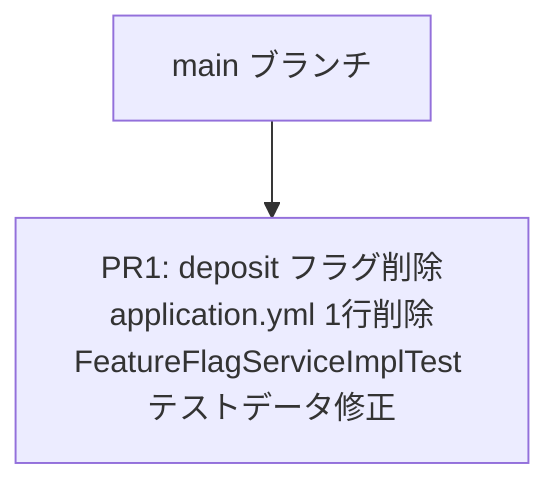

# 実装計画書: deposit フィーチャーフラグの削除

## 関連ドキュメント

- [ADR-0005: deposit フィーチャーフラグの削除](./01-adr.md)
- [システム設計書](./02-spec.md)
- [ADR-0004: account-creation フィーチャーフラグの削除](../0004-feature-flag-removal-after-release/01-adr.md)（パイロットケース）
- [ADR-0001: 銀行システムサンプルプロジェクトのアーキテクチャ](../0001-bank-system-tbd-sample/01-adr.md)

## 変更規模と方針

変更対象は2ファイル・実質数行の修正であり、機能的な影響はゼロである。ADR-0004と同一パターンのため、**PRは1つ**とする。

ADR-0005の決定に従い、以下のみを変更する:

| 変更対象 | 変更内容 |
|---------|---------|
| `src/main/resources/application.yml` | `deposit: true` の1行を削除 |
| `src/test/java/com/example/bank/infrastructure/feature/FeatureFlagServiceImplTest.java` | テストデータの `deposit=true` を `withdrawal=true` に置き換え、OFF側テストデータと関連アサーションを調整 |

## スタックPR構成

```
main
 └── PR1: deposit フラグ削除（設定ファイル + テスト修正）
```

## 依存関係図



---

## Phase 1: deposit フラグ削除

**対応PR**: PR1（親ブランチ: `main`）
**目的**: `application.yml` から死コードとなっている `deposit` フラグ定義を削除し、`FeatureFlagServiceImplTest` のテストデータを有効なフラグに置き換える。ADR-0004で確立したフラグ削除プロセスの再現性を実証する。

### Task 1.1: FeatureFlagServiceImplTest のテストデータ修正（RED → GREEN）

#### RED: テストの失敗を確認

**テストファイル**: `src/test/java/com/example/bank/infrastructure/feature/FeatureFlagServiceImplTest.java`

現在のテストは `deposit=true` をON側のテストデータとして使用している。`application.yml` から `deposit: true` を削除すると、テストの `@TestPropertySource` で明示的に `deposit=true` を設定しているため直接は失敗しないが、**テストデータが削除済みフラグを参照し続ける**ことは不整合である。

Task 1.1 と Task 1.2 は同一コミットにまとめるため、実際の作業順序は以下とする:
1. `application.yml` から `deposit: true` を削除する（Task 1.2）
2. `FeatureFlagServiceImplTest` のテストデータを修正する（Task 1.1）
3. テストを実行し、全件パスすることを確認する（GREEN）

テストケース（修正後の期待動作）:

| テストメソッド | Given | When | Then |
|------------|-------|------|------|
| `shouldReturnTrueWhenFlagIsEnabled` | `bank.features.withdrawal=true` がプロパティに設定されている | `featureFlagService.isEnabled("withdrawal")` を呼ぶ | `true` を返す |
| `shouldReturnFalseWhenFlagIsDisabled` | `bank.features.transaction-history=false` が設定されている | `featureFlagService.isEnabled("transaction-history")` を呼ぶ | `false` を返す |
| `shouldReturnFalseForUnknownFlag` | `unknown-feature` プロパティが未定義 | `featureFlagService.isEnabled("unknown-feature")` を呼ぶ | `false` を返す（変更なし） |
| `shouldReturnFalseForAccountClosureByDefault` | `bank.features.account-closure=false` が設定されている | `featureFlagService.isEnabled("account-closure")` を呼ぶ | `false` を返す（変更なし） |
| `shouldReturnFalseForWithdrawalFeeByDefault` | `bank.features.withdrawal-fee=false` が設定されている | `featureFlagService.isEnabled("withdrawal-fee")` を呼ぶ | `false` を返す（変更なし） |

**修正内容**:

```java
// 変更前
@TestPropertySource(properties = {
        "bank.features.deposit=true",
        "bank.features.withdrawal=false",
        "bank.features.account-closure=false",
        "bank.features.withdrawal-fee=false"
})
// ...
void shouldReturnTrueWhenFlagIsEnabled() {
    assertThat(featureFlagService.isEnabled("deposit")).isTrue();
}

void shouldReturnFalseWhenFlagIsDisabled() {
    assertThat(featureFlagService.isEnabled("withdrawal")).isFalse();
}

// 変更後
@TestPropertySource(properties = {
        "bank.features.withdrawal=true",
        "bank.features.transaction-history=false",
        "bank.features.account-closure=false",
        "bank.features.withdrawal-fee=false"
})
// ...
void shouldReturnTrueWhenFlagIsEnabled() {
    assertThat(featureFlagService.isEnabled("withdrawal")).isTrue();
}

void shouldReturnFalseWhenFlagIsDisabled() {
    assertThat(featureFlagService.isEnabled("transaction-history")).isFalse();
}
```

#### GREEN: テストを通す修正

**修正ファイル**: `src/test/java/com/example/bank/infrastructure/feature/FeatureFlagServiceImplTest.java`

実装項目:
- `@TestPropertySource` の `bank.features.deposit=true` を `bank.features.withdrawal=true` に変更する
- `@TestPropertySource` の `bank.features.withdrawal=false` を `bank.features.transaction-history=false` に変更する
- `shouldReturnTrueWhenFlagIsEnabled()` 内の `isEnabled("deposit")` を `isEnabled("withdrawal")` に変更する
- `shouldReturnFalseWhenFlagIsDisabled()` 内の `isEnabled("withdrawal")` を `isEnabled("transaction-history")` に変更する
- 他の3つのテストメソッドは変更しない

**検証コマンド（GREEN確認）**:

```bash
./gradlew test --tests "com.example.bank.infrastructure.feature.FeatureFlagServiceImplTest"
```

#### REFACTOR: リファクタリング

- テストの意図（ONフラグが `true` を返すこと）が `@DisplayName` で明確に伝わるか確認する
- 現在の `@DisplayName` はフラグ名に依存しておらず、修正後もそのまま維持できる
- リファクタリング対象なし

---

### Task 1.2: application.yml の deposit フラグ定義削除

#### RED: 削除対象の確認

`application.yml` から `deposit: true` を削除する。Task 1.1と同一コミットで実施する。

#### GREEN: 設定ファイルの修正

**修正ファイル**: `src/main/resources/application.yml`

実装項目:
- `bank.features.deposit: true` の1行を削除する
- 前後の行との整合性を確認する
- インデントが崩れていないことを確認する

```yaml
# 変更前
bank:
  features:
    deposit: true
    withdrawal: true
    transaction-history: true
    account-closure: false
    withdrawal-fee: false  # 出金手数料の有効/無効（withdrawal フラグに依存）
  withdrawal:
    fee-rate: 0.01

# 変更後
bank:
  features:
    withdrawal: true
    transaction-history: true
    account-closure: false
    withdrawal-fee: false  # 出金手数料の有効/無効（withdrawal フラグに依存）
  withdrawal:
    fee-rate: 0.01
```

**検証コマンド（GREEN確認）**:

```bash
# 全テストスイートの実行
./gradlew test

# 残存参照の確認（フラグ定義としての deposit が 0件であること）
grep "bank.features.deposit" src/
```

#### REFACTOR: リファクタリング

- `application.yml` のフラグ一覧が `withdrawal` から始まる自然な順序になっているか確認する
- `deposit` に関するコメントが残っていないか確認する

---

## 品質チェックポイント（Phase 1 完了時）

### ADR-0005 フィットネス関数

| # | 確認内容 | 検証コマンド / 方法 | 期待結果 |
|---|---------|-------------------|---------|
| 1 | `application.yml` に `deposit` フラグ定義が存在しないこと | `grep "bank.features.deposit" src/main/resources/application.yml` | 0件（該当なし） |
| 2 | 全テストスイートがパスすること | `./gradlew test` | BUILD SUCCESS、全テストGREEN |
| 3 | 入金機能が正常に動作すること | `POST /api/v1/accounts/{accountNumber}/deposit` | 200 OK |
| 4 | テストコードに `deposit` フラグの残存参照がないこと | `grep "bank.features.deposit" src/test/` | 0件（該当なし） |

### 仕様書との整合性

- [ ] `application.yml` の変更後フォーマットが仕様書「4.2 application.yml の変更前後」の「変更後」と一致している
- [ ] `FeatureFlagServiceImplTest` の `@TestPropertySource` が仕様書「5.1 修正対象テスト」の「変更後」と一致している
- [ ] `shouldReturnTrueWhenFlagIsEnabled()` のアサーションが `withdrawal` を参照している
- [ ] `shouldReturnFalseWhenFlagIsDisabled()` のアサーションが `transaction-history` を参照している

### ADR決定事項への準拠

- [ ] `DepositUseCase` に変更が加えられていないこと（ADR-0005: ユースケース変更なし）
- [ ] `withdrawal`, `transaction-history`, `account-closure`, `withdrawal-fee` の4フラグが `application.yml` に残存していること（ADR-0005: 他フラグへの影響なし）
- [ ] `FeatureFlagService` / `FeatureFlagServiceImpl` が削除されていないこと

### テストカバレッジの確認

- [ ] `FeatureFlagServiceImplTest` の5テストメソッドが全件パスすること
- [ ] `FeatureFlagCombinationTest` が全件パスすること（入金操作はドメイン操作として影響なし）

### コーディング規約の遵守

- [ ] `application.yml` のインデント（4スペース）が統一されていること
- [ ] テストの `@DisplayName` が日本語で記述されていること（既存規約）
- [ ] 変更行数が最小限であること

---

## PR情報

### PR1: deposit フラグ削除（設定ファイル + テスト修正）

**親ブランチ**: `main`
**推定変更行数**: 約6行（application.yml 1行削除 + テスト4行変更）
**ブランチ命名例**: `feature/0005-deposit-feature-flag-removal`

**コミットメッセージ（案）**:

```
chore: remove deposit feature flag (flag cleanup #2)

application.ymlからbank.features.deposit: trueの定義を削除する。
DepositUseCaseはFeatureFlagServiceを参照していないため
コード変更不要。FeatureFlagServiceImplTestのテストデータを
deposit=trueからwithdrawal=trueに置き換える。

Follows the flag cleanup process established in ADR-0004.
Refs: ADR-0005
```

**PRレビュー観点**:

1. `application.yml` から `deposit: true` の1行のみ削除されていること
2. `FeatureFlagServiceImplTest` のテストデータとアサーションのみ変更されていること
3. `DepositUseCase` に変更が加えられていないこと
4. 他の4フラグ（`withdrawal`, `transaction-history`, `account-closure`, `withdrawal-fee`）が `application.yml` に残存していること

---

## 完了条件

- [ ] Task 1.1 / Task 1.2 が完了
- [ ] 品質チェックポイントすべてクリア
- [ ] `./gradlew test` がBUILD SUCCESS
- [ ] `grep "bank.features.deposit" src/` が0件
